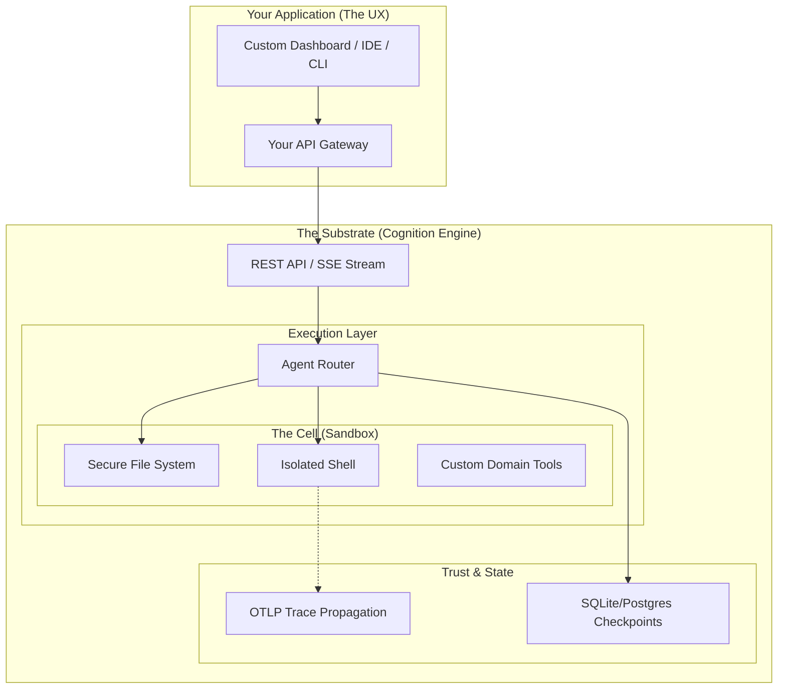

# Cognition

> Secure execution, durable state, and audit trails for AI agents.

[](https://opensource.org/licenses/MIT)
[](https://www.python.org/downloads/release/python-3110/)
[](#)

Cognition is the open-source **Agent Substrate** — a hardened runtime engine that handles the critical infrastructure AI platforms need, but shouldn't have to build. Execution safety, durable persistence, and compliance-ready auditability come out of the box so you can focus on building your domain logic.

## The Platform Paradox

We are in the midst of a platform shift. Every industry—from Cybersecurity to BioTech—is rushing to build "AI Agents" into their core workflows. 

But building a production-grade Agent Platform requires solving three incredibly hard infrastructure problems that have nothing to do with the AI model itself:

1.  **Isolation (Execution):** How do you let an AI run code or tools safely without endangering your production infrastructure?
2.  **State (Persistence):** How do you ensure an investigation or workflow survives server restarts and remains resumable for weeks?
3.  **Trust (Auditability):** How do you prove to a regulator or legal team *exactly* what data the AI accessed and why it made a decision?

Most teams waste months building this scaffolding. **Cognition is that scaffolding.**

## Core Primitives

Cognition provides four fundamental primitives that you compose to build your platform:

*   🏗️ **The Cell (Execution)**: A secure, sandboxed environment (local process or hardened container) where "Thought" becomes "Action". Bring the code to the data safely.
*   🧬 **The Thread (State)**: Durable, checkpoint-based memory. Every step is saved; if the server crashes, the agent picks up *exactly* where it left off.
*   🔍 **The Trace (Audit)**: Native OpenTelemetry integration. Immutable audit trail of every file read, API call, and reasoning step.
*   🔌 **The Plug (Extensibility)**: A five-tier extensibility model from simple no-code instructions to deep Python middleware.

## Quick Start

### 1. Install Cognition
```bash
pip install cognition
```

### 2. Try the Reference CLI
Start the engine and chat with a local agent in your terminal. The server will automatically start in the background.
```bash
cognition-cli chat
> Analyze this project for security vulnerabilities.
```

### 3. Integrate the API
Cognition is a "headless" engine. You build the UI; we provide the REST/SSE backbone.

**Start the Server:**
```bash
cognition-server
```

**Create a Session:**
```bash
curl -X POST http://localhost:8000/sessions \
  -H "Content-Type: application/json" \
  -d '{"title": "Security Investigation"}'
```

**Stream a Response (SSE):**
```bash
curl -N -X POST http://localhost:8000/sessions/{id}/messages \
  -H "Content-Type: application/json" \
  -d '{"content": "Scan the breach logs in /data/incident-404"}'
```

## Architecture

Cognition acts as the unified backend for your AI application. You build the specialized UX; Cognition handles the containment, persistence, and audit.



## Extend Your Agent

Cognition uses a "Convention over Configuration" model. Most customizations require zero code.

| Level | Mechanism | Effort | Example |
|---|---|---|---|
| **Memory** | `AGENTS.md` | No Code | Project-specific rules & style |
| **Skills** | `SKILL.md` files | No Code | Reusable runbooks (e.g., "how to deploy") |
| **Subagents** | YAML Config | Config | Delegated specialists (e.g., "security-expert") |
| **Tools** | Python Functions | Code | Proprietary API integrations |
| **Middleware** | Python Classes | Code | Approval gates, custom telemetry |

## Blueprints

The CLI is just one example of what you can build on Cognition. See our [Blueprints](./docs/v2/README.md#blueprints) for reference architectures:

*   **[Cognition CLI](./docs/v2/blueprints/cognition-cli.md)**: A high-fidelity terminal assistant.
*   **[BreachLens](./docs/v2/blueprints/cyber-investigation.md)**: Security analysis for cybersecurity investigations.
*   **[GeneSmith](./docs/v2/blueprints/genesmith.md)**: Secure biological foundry for protein design.
*   **[DataLens](./docs/v2/blueprints/data-analyst.md)**: Headless data science for sensitive datasets.
*   **[StarKeep](./docs/v2/blueprints/starkeep.md)**: SpaceOps administrator for satellite repair.

## Documentation

*   📖 **[Core Concepts](./docs/v2/README.md)**: Cells, Threads, Traces, and Plugs.
*   🛠️ **[Extending Agents](./docs/v2/guides/extending-agents.md)**: How to add memory, skills, and tools.
*   ⚙️ **[Configuration Reference](./docs/v2/guides/configuration.md)**: YAML and Environment variable details.
*   🚀 **[Deployment Guide](./docs/v2/guides/deployment.md)**: Running in Docker and Kubernetes.

## License

MIT © [CognicellAI](LICENSE)
