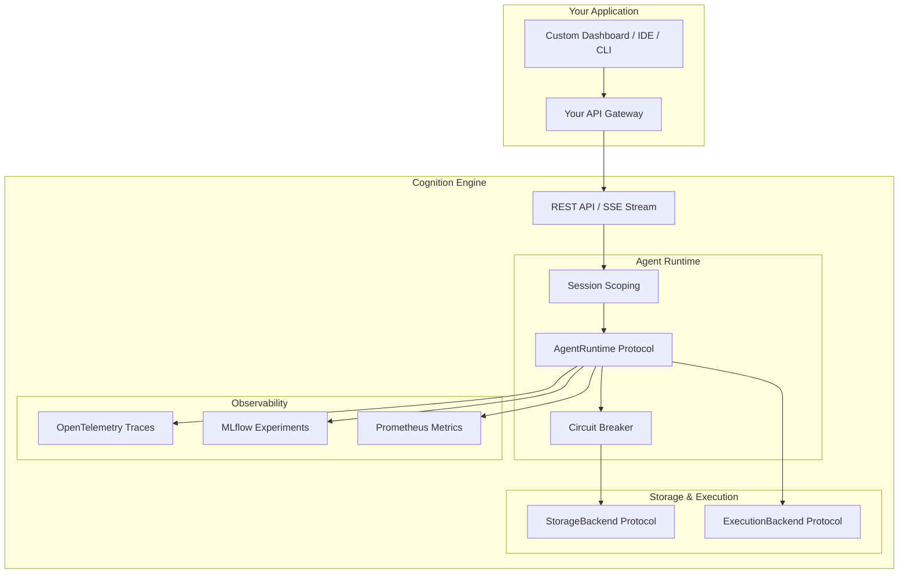

# Cognition

> A batteries-included backend for building production AI agent platforms. Define your agent; get REST API, streaming, persistence, sandboxing, and observability automatically.

[](https://opensource.org/licenses/MIT)
[](https://www.python.org/downloads/release/python-3110/)

Cognition is a headless backend that handles the hard infrastructure problems of production AI agents: sandboxed execution, durable session state, and full observability. Built on [Deep Agents](https://github.com/CognicellAI/deepagents) and [LangGraph](https://langchain-ai.github.io/langgraph/), it provides a declarative model where you define agents and tools, and Cognition provides the runtime, API, and operational infrastructure.

## The Problem Cognition Solves

Building a production AI agent platform requires solving infrastructure problems that have nothing to do with the model itself:

- **Isolation:** How do you let an agent run code or shell commands without endangering your infrastructure?
- **State:** How do you ensure a workflow survives server restarts and remains resumable across days?
- **Auditability:** How do you prove to an auditor exactly what the agent accessed and what logic it used?

Cognition solves these three problems so you don't have to.

## Quick Start

### Option A — Docker Compose (fastest, no install required)

```bash
# Clone and start
git clone https://github.com/CognicellAI/Cognition.git
cd Cognition

# Copy environment config and add your API key
cp .env.example .env
# Edit .env to add: OPENAI_API_KEY=sk-...

# Start the server
docker-compose up -d

# Verify it's running
curl -s http://localhost:8000/health | jq .

# Create a session
SESSION=$(curl -s -X POST http://localhost:8000/sessions \
  -H "Content-Type: application/json" \
  -d '{"title": "My first session"}' | jq -r .id)

# Send a message (streams via Server-Sent Events)
curl -N -X POST "http://localhost:8000/sessions/$SESSION/messages" \
  -H "Content-Type: application/json" \
  -d '{"content": "List the files in the workspace."}'
```

### Option B — pip install (embed in an existing project)

```bash
# Install from GitHub
pip install "git+https://github.com/CognicellAI/Cognition.git#egg=cognition[openai]"

# Set your API key
export OPENAI_API_KEY="sk-..."

# Start the server
cognition-server
```

## What Cognition Provides

- **Sandboxed Execution** — Pluggable backends: local subprocess or Docker container. No `shell=True`; commands parsed with `shlex` for safety.
- **Durable Sessions** — StorageBackend protocol: SQLite (dev) or PostgreSQL (prod). Every agent step checkpointed; survives crashes and restarts.
- **Full Observability** — OpenTelemetry traces, Prometheus metrics, MLflow experiments. Toggle independently; zero-config when disabled.
- **Multi-Tenant Isolation** — Session scoping via `X-Cognition-Scope-*` headers. Rate limiting, CORS, and circuit breaker built in.
- **Multi-Agent Registry** — Built-in agents (`default`, `readonly`) plus user-defined agents in `.cognition/agents/`. Session-agent binding via `agent_name`.

## Architecture

Cognition follows a strict 7-layer architecture. Define your agent; get everything else automatically.


```mermaid
graph TD
    subgraph "Your Application"
        UI[Custom Dashboard / IDE / CLI]
        API_GW[Your API Gateway]
    end

    subgraph "Cognition Engine"
        API[REST API / SSE Stream]
        
        subgraph "Agent Runtime"
            Router[AgentRuntime Protocol]
            Circuit[Circuit Breaker]
            Scope[Session Scoping]
        end
        
        subgraph "Storage & Execution"
            Storage[StorageBackend Protocol]
            Exec[ExecutionBackend Protocol]
        end
        
        subgraph "Observability"
            OTel[OpenTelemetry Traces]
            MLflow[MLflow Experiments]
            Prom[Prometheus Metrics]
        end
    end

    UI --> API_GW
    API_GW --> API
    API --> Scope
    Scope --> Router
    Router --> Circuit
    Circuit --> Storage
    Router --> Exec
    Router --> OTel
    Router --> MLflow
    Router --> Prom
```

See [Architecture](./docs/concepts/architecture.md) for a full breakdown of each layer, dependency rules, and the startup sequence.

## Extend Your Agent

Cognition uses a convention-over-configuration model. Most customizations require zero code.

| Level | Mechanism | Effort | Example |
|---|---|---|---|
| **Memory** | `AGENTS.md` | No Code | Project-specific rules & style |
| **Skills** | `.cognition/skills/` | No Code | Reusable runbooks (e.g., "how to deploy") |
| **Agents** | `.cognition/agents/` | Config | Delegated specialists (e.g., "security-expert") |
| **Tools** | Python Functions | Code | Proprietary API integrations |
| **Middleware** | Python Classes | Code | Approval gates, custom telemetry |

See [Extending Agents](./docs/guides/extending-agents.md) for code examples and the full extension model.

## Production Features

| Feature | Description |
|---------|-------------|
| **Message Persistence** | SQLite/PostgreSQL message storage with pagination |
| **Session Scoping** | Multi-tenant isolation via HTTP headers |
| **Rate Limiting** | Token bucket with scope-aware keys |
| **Abort** | Cancel streaming tasks gracefully |
| **Observability** | Toggle OTel/MLflow independently |
| **StorageBackend** | Unified protocol: SQLite ↔ PostgreSQL |
| **Docker Sandbox** | Container-per-session with resource limits |
| **Alembic Migrations** | Database schema versioning |
| **Model Catalog** | Browse 3,870+ models via models.dev integration |
| **CORS** | Cross-origin web app support |
| **MLflow Evaluation** | Offline evaluation pipeline with 3 built-in scorers |
| **Multi-Agent Registry** | Built-in + user-defined agents; `GET /agents` endpoint |

## Blueprints

The CLI is one example of what you can build on Cognition. See the [Blueprints](./docs/README.md#blueprints) for reference architectures across domains:

*   **[Cognition CLI](./docs/blueprints/cognition-cli.md)**: A high-fidelity terminal assistant.
*   **[BreachLens](./docs/blueprints/cyber-investigation.md)**: Security analysis for cybersecurity investigations.
*   **[GeneSmith](./docs/blueprints/genesmith.md)**: Secure biological foundry for protein design.
*   **[DataLens](./docs/blueprints/data-analyst.md)**: Headless data science for sensitive datasets.
*   **[StarKeep](./docs/blueprints/starkeep.md)**: SpaceOps administrator for satellite repair.

## Documentation

| | |
|---|---|
| [Documentation Index](./docs/README.md) | All concepts and guides |
| [Getting Started](./docs/guides/getting-started.md) | Install, configure, and send your first message |
| [Core vs App Layer](./docs/guides/core-vs-app-layer.md) | Builder boundaries: what Cognition owns versus what your app owns |
| [Architecture](./docs/concepts/architecture.md) | 7-layer architecture and design principles |
| [Extending Agents](./docs/guides/extending-agents.md) | Memory, skills, tools, subagents, and middleware |
| [Configuration Reference](./docs/guides/configuration.md) | All YAML keys and environment variables |
| [Examples](./examples/README.md) | Exhaustive `.cognition` examples, `.env` examples, and API payload samples |
| [Deployment Guide](./docs/guides/deployment.md) | Docker Compose, PostgreSQL, and production hardening |
| [API Reference](./docs/guides/api-reference.md) | Every REST endpoint and SSE event type |

## Testing

```bash
uv run pytest tests/unit/ -v    # unit tests
uv run pytest tests/e2e/ -v     # end-to-end scenarios
```

## Contributing

Bug reports, questions, and pull requests are welcome. Open an issue before submitting large changes.

## License

MIT © [CognicellAI](LICENSE)
