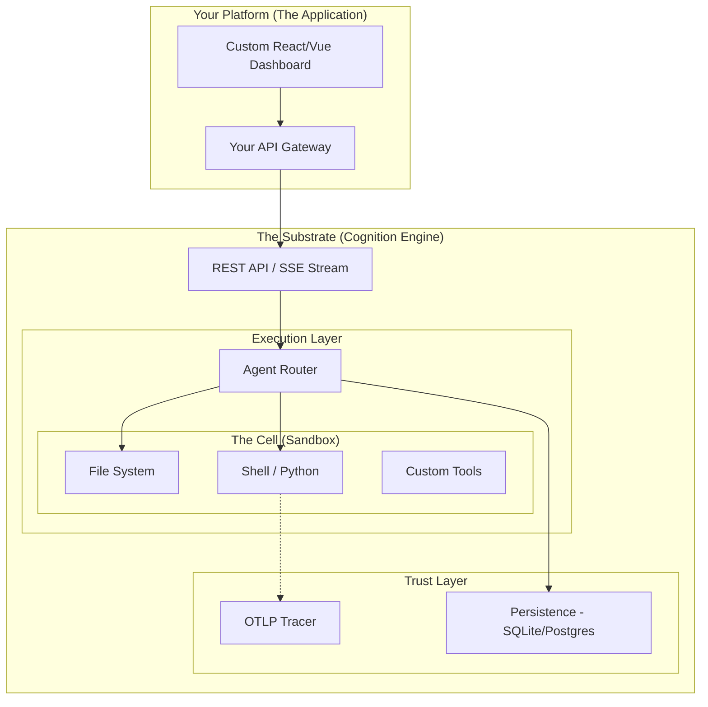

# Cognition: The Agent Substrate

> **The foundational layer for trusted, executable AI platforms.**

## The Platform Paradox

We are in the midst of a platform shift. Every industry—from Cyber Security to FinTech to BioTech—is rushing to build "AI Agents" into their workflows.

But building a production-grade Agent Platform requires solving three incredibly hard infrastructure problems that have nothing to do with the AI model itself:

1.  **Isolation (Execution):** How do I let an AI run code or tools safely without destroying my infrastructure?
2.  **State (Persistence):** How do I ensure an investigation or workflow survives server restarts and lasts for weeks?
3.  **Trust (Auditability):** How do I prove to a regulator or legal team *exactly* what data the AI accessed and what logic it used?

Most teams waste 12-18 months building this scaffolding before they write their first line of domain logic.

**Cognition is that scaffolding.** It is the **Agent Substrate**: a hardened, pre-built runtime engine that handles Execution, State, and Trust so you can focus on building your platform.

## Core Primitives

Cognition provides three fundamental primitives that you compose to build your platform:

### 1. The Cell (Execution Environment)
The Cell is the secure boundary where "Thought" becomes "Action".

- **Concept:** Bring the Code to the Data.
- **Capabilities:**
    - **Local Cells:** Lightweight process isolation for rapid development loops.
    - **Container Cells:** Hardened Docker/Kubernetes environments for analyzing untrusted data (malware, PII, financial records).
- **Benefit:** Your platform logic remains clean. You simply request a tool execution, and the Substrate handles the containment, cleanup, and resource limits.

### 2. The Thread (State Management)
The Thread is the continuous, resilient memory of a workflow.

- **Concept:** Durable, resumable state.
- **Capabilities:**
    - **Pluggable Backends:** SQLite for local/edge deployments; PostgreSQL for cloud scale.
    - **Checkpointing:** Every step the AI takes is saved. If your server crashes, the Agent picks up *exactly* where it left off.
- **Benefit:** Enables long-running "Cases" or "Projects" that span days or weeks, rather than transient "Chats."

### 3. The Trace (Forensic Audit)
The Trace is the immutable proof of action.

- **Concept:** Trust through verification.
- **Capabilities:**
    - **OTLP Integration:** Native OpenTelemetry support allows you to pipe traces to Jaeger, Splunk, or Datadog.
    - **Chain of Custody:** See exactly what file was read, what API was called, and what reasoning the AI used to make a decision.
- **Benefit:** Essential for platforms operating in regulated environments (Security, Legal, Healthcare).

## Architecture

Cognition is designed to be the "Headless Backend" for your platform. You build the specialized UI/UX; we provide the engine.

## Use Cases

Cognition is domain-agnostic. It powers platforms such as:

*   **[GeneSmith (BioTech):](./blueprints/genesmith.md)** A biological foundry for designing and simulating proteins in a secure, audited environment.
*   **[StarKeep (SpaceOps):](./blueprints/starkeep.md)** An orbital administrator for autonomous satellite repair and edge computing.
*   **[ZeroOne (DeFi):](./blueprints/zeroone.md)** An algorithmic CEO for managing decentralized capital with transparent logic.
*   **[BreachLens (Security):](./blueprints/cyber-investigation.md)** A forensic investigation platform for safely analyzing malware and breach logs.
*   **[DataLens (Analytics):](./blueprints/data-analyst.md)** A headless data scientist for securely analyzing and visualizing business data.

## Getting Started

1.  **[Concepts](./concepts/execution-environments.md):** Understand the primitives in detail.
2.  **[Blueprints](./blueprints/cyber-investigation.md):** See a reference architecture for a Cyber Security Investigation Platform.
3.  **[Build Guide](./guides/building-platforms.md):** Learn how to integrate the Cognition API into your application.
