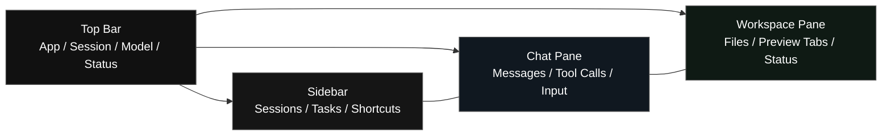
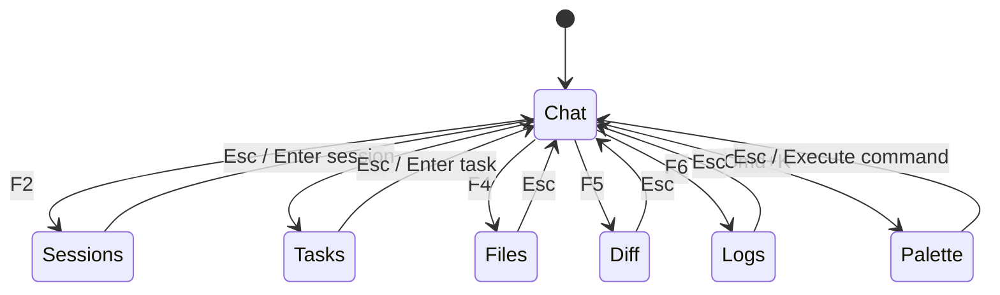
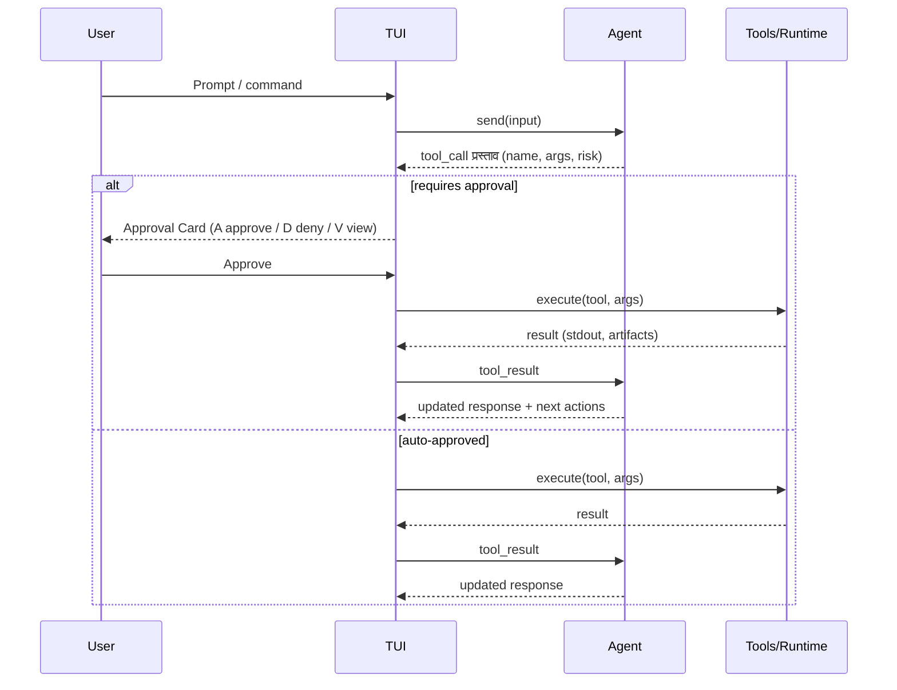
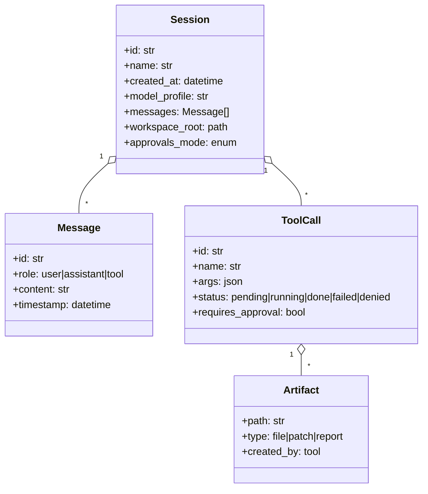
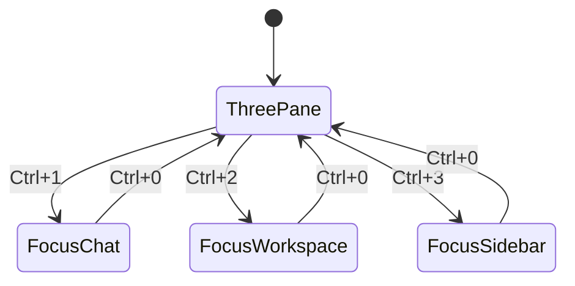

Below is a **markdown wireframe** for an **OpenCode-style TUI** (terminal UI) with **Mermaid diagrams** for layout + navigation. Copy/paste into your repo as something like `docs/tui-wireframe.md`.

---

# OpenCode-Style TUI Wireframe

## Goals

* Fast keyboard-driven workflow
* “Chat + Workspace” side-by-side
* Clear session/task context
* Safe tool execution via approvals/interrupts
* Built-in file/tree + diffs + logs

---

## Screen Layout (Primary)

### ASCII Wireframe

```
┌───────────────────────────────────────────────────────────────────────────────┐
│ OpenCode TUI  | Session: "investigations-llm" | Model: gpt-4.1 | ⏺ Recording  │
├───────────────┬───────────────────────────────────────────────┬───────────────┤
│ SIDEBAR       │ CHAT / ORCHESTRATION                           │ WORKSPACE     │
│ (20-25 cols)  │ (flex)                                         │ (35-45 cols)  │
│               │                                                │               │
│ Sessions      │ Assistant                                      │ Files         │
│  > today      │  - plan                                        │  src/         │
│  - yesterday  │  - tool calls                                  │   main.py     │
│  - archived   │                                                │   agent/      │
│               │ User                                           │   tests/      │
│ Tasks         │  prompt...                                     │               │
│  [ ] build    │                                                │ Preview       │
│  [~] test     │ ────────────────────────────────              │  (tabbed)     │
│  [!] deploy   │ Input:                                         │  - file       │
│               │  > /ask ...                                    │  - diff       │
│ Shortcuts     │  > /tool ...                                   │  - logs       │
│  ? help       │  > /open path                                  │               │
│  ⌘K commands  │                                                │ Status        │
│               │ Approvals (when pending)                       │  ✓ clean tree │
│               │  [A] approve  [D] deny  [V] view args          │  ⏱ last run   │
├───────────────┴───────────────────────────────────────────────┴───────────────┤
│ F1 Help  F2 Sessions  F3 Tasks  F4 Files  F5 Diff  F6 Logs  ⌘K Command Palette │
└───────────────────────────────────────────────────────────────────────────────┘
```

### Mermaid: Layout Grid



---

## Panes & Components

### 1) Top Bar

* App title
* Active session name
* Active model / profile
* Connection state (local/remote)
* Recording / tracing indicator (optional)

**States**

* `Connected | Disconnected | Reconnecting`
* `Idle | Running tool | Awaiting approval | Streaming`

---

### 2) Sidebar (Sessions + Tasks)

**Sections**

* Sessions list (recent, pinned, archived)
* Tasks list (agent subtasks / TODOs)
* Quick nav shortcuts
* Context badges (branch, env, container, cluster)

**Keyboard**

* `↑/↓` navigate
* `Enter` open
* `n` new session
* `p` pin
* `a` archive
* `/` filter

---

### 3) Chat / Orchestration Pane

**Message types**

* User message
* Assistant message
* Tool call (collapsed/expandable)
* Tool result (stdout/stderr + artifacts)
* Approval prompt card (when tool is gated)

**Input**

* Single-line default, expands to multiline
* Slash commands: `/ask /tool /open /diff /run /reset`

---

### 4) Workspace Pane

**Subpanes**

* File tree
* Preview tabs:

  * File viewer (read-only / edit mode optional)
  * Diff viewer
  * Logs viewer (tool execution logs)
  * “Artifacts” (generated files, reports, patches)

---

## Mermaid: Navigation Map (Global)



---

## Mermaid: Tool Execution & Approvals



---

## “OpenCode Style” Screens (Secondary Views)

### A) Command Palette (⌘K)

```
┌───────────────────────────────────────────────┐
│ Command Palette                                │
├───────────────────────────────────────────────┤
│ > open session                                 │
│   run tool                                      │
│   search files                                  │
│   show diff                                     │
│   toggle approvals                              │
│   change model                                  │
│   export transcript                             │
├───────────────────────────────────────────────┤
│ Enter: run   Esc: close   ↑↓: select            │
└───────────────────────────────────────────────┘
```

### B) Approval Card (inline in chat)

```
┌─ Approval Required ────────────────────────────┐
│ Tool: shell.exec                                │
│ Risk: writes files / runs commands              │
│ Args:                                            │
│   cmd: ["pytest", "-q"]                          │
│   cwd: server/                                   │
│                                                  │
│ [A] Approve   [D] Deny   [V] View Full JSON      │
└──────────────────────────────────────────────────┘
```

### C) Diff View (Workspace tab)

```
┌─ Diff: src/main.py ─────────────────────────────┐
│ @@ -12,7 +12,15 @@                               │
│ -def run():                                      │
│ +def run(mode="tui"):                            │
│ +    ...                                         │
│                                                  │
│ [N] next hunk  [P] prev  [A] apply patch  [Q] quit│
└──────────────────────────────────────────────────┘
```

---

## Keybindings (Suggested)

| Area     | Keys                          | Action                |
| -------- | ----------------------------- | --------------------- |
| Global   | `⌘K`                          | Command palette       |
| Global   | `Esc`                         | Back / close modal    |
| Tabs     | `Ctrl+Tab` / `Ctrl+Shift+Tab` | Cycle workspace tabs  |
| Sessions | `F2`                          | Focus sessions        |
| Tasks    | `F3`                          | Focus tasks           |
| Files    | `F4`                          | Focus files           |
| Diff     | `F5`                          | Open diff             |
| Logs     | `F6`                          | Open logs             |
| Chat     | `Enter`                       | Send                  |
| Chat     | `Shift+Enter`                 | New line              |
| Approval | `A/D/V`                       | Approve / Deny / View |

---

## Minimal Data Model (Conceptual)



---

## Optional: “3-Pane Mode” Toggle

* **Focus Chat** (hide sidebar/workspace)
* **Focus Workspace** (diff + file editing)
* **Focus Sessions/Tasks** (triage)



---

If you want, I can also generate:

* a **component tree** that matches a specific TUI framework (Textual, Bubble Tea, Ratatui),
* an **event loop + state machine** sketch,
* and a **screen-by-screen spec** (what renders where, what state each view needs).
