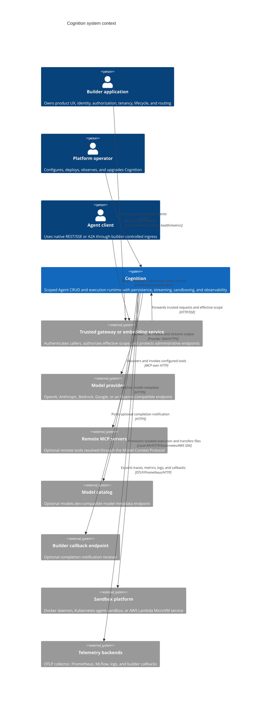

# C4 Level 1: System Context

**Status:** Current code-derived model  
**Code baseline:** `release/v0.13.0` (`890e1ad`)  
**Last verified:** 2026-07-25

Cognition is a headless Agent CRUD and execution runtime. A builder or operator
defines Agents and invokes them through native REST/SSE or Agent-to-Agent (A2A)
1.0. Cognition supplies runtime composition, durable execution state, sandbox
routing, and telemetry. It assumes trusted ingress has already authenticated
the caller and authorized the effective scope.

## System context diagram

## Responsibility boundary

### Cognition owns

- Agent definitions, runtime resolution, and execution
- Native REST/SSE and optional A2A 1.0 protocol adaptation
- Sessions, messages, runtime tasks, run attempts, events, checkpoints, Store,
  artifacts, and dynamic configuration persistence
- Propagation and enforcement of builder-authorized `effective_scope`
- Tool, skill, middleware, subagent, MCP, model, and sandbox composition
- Runtime telemetry and correlation

### The builder owns

- Authentication and authorization decisions
- Organizations, tenants, users, roles, entitlements, and billing
- Desired state, reconciliation, publishing, suspension, deletion policy, and
  product lifecycle
- Secret distribution and gateway protection for administrative CRUD
- Public endpoint allocation and product-safe telemetry projections

Cognition does not infer authorization from a model request. Scope values enter
through configured `X-Cognition-Scope-*` headers or the equivalent trusted A2A
call context. Tools and middleware receive scope through runtime context rather
than model-supplied arguments.

## External contracts

| Neighbor | Direction | Contract implemented in Cognition | Activation |
| --- | --- | --- | --- |
| Trusted ingress | Inbound | REST, SSE, scope headers, and A2A JSON-RPC | Always required for protected deployments; enforcement is external |
| Model providers | Outbound | LangChain `init_chat_model` or Bedrock adapter | At least one usable provider is required for live execution |
| MCP servers | Outbound | `langchain-mcp-adapters` multi-server client | Optional per configuration |
| Model catalog | Outbound | Cached HTTP metadata lookup | Optional; configured URL |
| Completion callback | Outbound | Caller-supplied HTTP/S completion POST | Optional per native message request |
| Docker | Outbound/local | Docker SDK container lifecycle and exec | `sandbox_backend=docker` |
| Kubernetes sandbox | Outbound | `Sandbox` custom resource plus router/exec APIs | `sandbox_backend=kubernetes` |
| AWS Lambda MicroVM | Outbound | AWS SDK lifecycle plus authenticated runtime command server | `sandbox_backend=aws_lambda_microvm` |
| Telemetry systems | Outbound | OTLP, Prometheus scrape endpoint, MLflow setup, callbacks | Individually optional |

## Trust boundaries

1. **Ingress boundary:** Cognition validates configured scope headers but does
   not authenticate the human or service presenting them.
2. **Runtime boundary:** `CognitionContext` carries trusted scope, session, run,
   and Agent identity into tools and middleware.
3. **Execution boundary:** sandbox selection determines whether commands share
   the server process, a Docker container, a Kubernetes sandbox, or a Lambda
   MicroVM.
4. **Provider boundary:** prompts and tool results leave Cognition when sent to
   a configured model or MCP provider.
5. **Telemetry boundary:** exporters and callbacks can receive operational
   metadata; runtime code is responsible for avoiding secrets and raw scope
   values in low-cardinality signals.

## Code evidence

| Claim | Primary source |
| --- | --- |
| FastAPI application and optional A2A mounting | `server/app/main.py` — `lifespan`, `app` |
| Trusted scope header extraction | `server/app/api/dependencies.py` — `get_scope_dep`; `server/app/api/scoping.py` |
| Runtime context propagation | `server/app/agent/cognition_agent.py` — `CognitionContext`, `CognitionAgentParams` |
| Model-provider adapters | `server/app/agent/resolver.py` — `RuntimeResolver.build_model` |
| Remote MCP integration | `server/app/agent/mcp_client.py` |
| Sandbox choices | `server/app/settings.py` — `sandbox_backend`; `server/app/agent/sandbox_backend.py` |
| Telemetry integrations | `server/app/observability/__init__.py`; `docker/otel-collector-config.yml` |
| Deployment-facing authentication assumption | No authentication middleware is registered in `server/app/main.py`; security headers and scope extraction are present |

## Related views

- [Container view](02-container-view.md)
- [Agent runtime components](04-agent-runtime-components.md)
- [Deployment and operations](08-deployment-and-operations.md)
- [Governance and evolution](09-governance-and-evolution.md)
