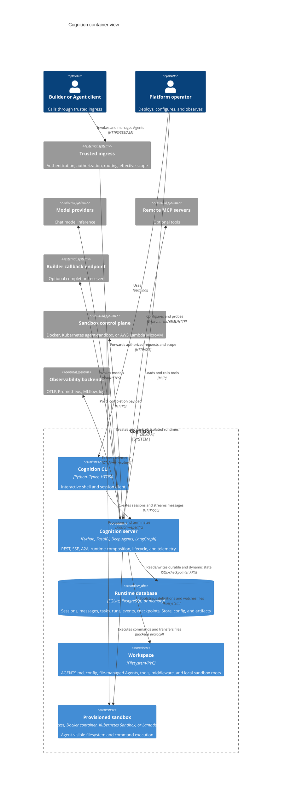

# C4 Level 2: Container View

**Status:** Current code-derived model  
**Code baseline:** `release/v0.13.0` (`890e1ad`)  
**Last verified:** 2026-07-25

The principal deployable is one asynchronous Python server. Persistence,
workspace files, and sandbox placement vary by environment. The CLI is a
separate executable client shipped from the same repository; A2A is mounted
inside the server rather than deployed as a separate gateway.

## Container diagram

## Container responsibilities

### Cognition server

The server is both the interface process and the runtime host. Its FastAPI
lifespan constructs storage, configuration, artifacts, runtime resolution,
change dispatch, session management, optional A2A routes, model catalog,
watchers, telemetry, and rate limiting.

It exposes:

- Port 8000 for REST, SSE, health, capabilities, and optional A2A routes
- Port 9090 for Prometheus metrics when telemetry is enabled
- Outbound connections to the configured database, model providers, MCP
  servers, sandbox platform, model catalog, and telemetry collectors

The server is stateless only in a qualified sense. Durable runtime state can be
externalized to PostgreSQL, but compiled graphs, active stream control,
process-local rate limiting, sandbox registries, and file watchers remain in
process.

### Runtime database

`StorageBackend`, `ConfigRegistry`, and `ArtifactStore` are separate contracts
and factory calls even when they share one physical SQLite or PostgreSQL
database. LangGraph checkpointer and Store tables are managed by their upstream
implementations; Cognition-owned tables are declared in
`server/app/storage/schema.py` and evolved with Alembic.

Supported placements are:

- **Memory:** test and ephemeral development
- **SQLite:** single-process/local deployments
- **PostgreSQL:** shared durable state and cross-instance config notification

### Workspace

The workspace is not the authoritative store for API-created runtime state. It
provides startup and extension inputs such as `.cognition/config.yaml`,
file-managed Agents, tools, middleware, and `AGENTS.md`. Skill bundles are part
of Agent definitions rather than independent workspace or registry state. The server
creates watched tool/middleware directories during startup. Kubernetes may
mount the workspace from a persistent volume claim or use an ephemeral volume.

### Provisioned sandbox

The sandbox is dynamically associated with Agent execution, not a permanent API
service. The local backend runs in the server's security boundary. Docker,
Kubernetes, and Lambda MicroVM backends move command execution into a separate
isolation boundary while retaining the Deep Agents sandbox interface.

### Cognition CLI

The Typer client calls the server through HTTP and consumes SSE. It does not own
runtime truth or execute the Agent locally. Server administration and database
migration commands are provided by the separate `cognition` server CLI entry
point.

## Scaling characteristics visible in code

- PostgreSQL storage uses connection pools and supports multiple server
  replicas.
- PostgreSQL config changes use `LISTEN/NOTIFY`; SQLite and memory use an
  in-process dispatcher.
- SSE buffers, active runtime cancellation, rate limiting, and sandbox tracking
  have process-local portions. Replica-safe behavior therefore relies on
  durable task/run/event state for recovery and polling rather than assuming a
  stream can migrate between processes.
- Kubernetes defaults to three server replicas and an external PostgreSQL
  service, but workspace sharing is optional and must be configured when
  file-managed extensions need to be identical across replicas.

## Code evidence

| Container or relationship | Primary source |
| --- | --- |
| Server image and ports | `Dockerfile` |
| FastAPI composition | `server/app/main.py` |
| CLI executable and HTTP/SSE client | `client/cli/main.py`; `client/cli/shell.py` |
| Server administration CLI | `server/app/cli.py`; `[project.scripts]` in `pyproject.toml` |
| Storage/config/artifact factories | `server/app/storage/factory.py` |
| Cognition-owned tables | `server/app/storage/schema.py`; `server/alembic/versions/` |
| Workspace bootstrap | `server/app/bootstrap.py`; `server/app/config_loader.py`; `server/app/file_watcher.py` |
| Sandbox adapters | `server/app/agent/sandbox_backend.py`; `packages/langchain-*/` |
| Compose topology | `docker-compose.yml` |
| Kubernetes topology | `deploy/helm/cognition/templates/`; `deploy/helm/cognition/values.yaml` |

## Related views

- [Server composition](03-server-components.md)
- [State and configuration](05-state-and-configuration.md)
- [Execution and sandboxes](06-execution-and-sandboxes.md)
- [Deployment and operations](08-deployment-and-operations.md)
