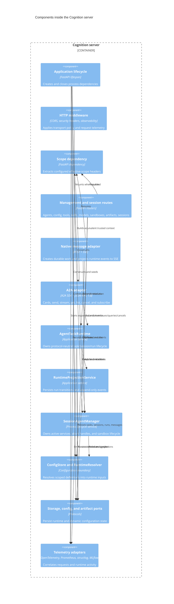

# C4 Level 3: Server Composition

**Status:** Current code-derived model  
**Code baseline:** `release/v0.13.0` (`890e1ad`)  
**Last verified:** 2026-07-25

The FastAPI process is Cognition's composition root and primary delivery
container. REST, Server-Sent Events (SSE), and Agent-to-Agent (A2A) routes adapt
external requests to the same storage and runtime services.

## Component diagram

## Composition root

`server.app.main:lifespan` assembles the process in this order:

1. Create and initialize the selected `StorageBackend`.
2. Create the matching `ConfigRegistry` and initialize its schema.
3. Wrap it in `DefaultConfigStore` and register FastAPI dependencies.
4. Load workspace YAML and seed providers, sandbox profiles, skills, tools, and
   Agent definitions.
5. Create the matching `ArtifactStore`.
6. Create `RuntimeResolver`, config-change dispatcher, session manager, and
   `SessionAgentManager`.
7. Mount the A2A adapter when enabled.
8. Create `ModelCatalog`, validate Kubernetes sandbox settings, and start file
   watchers.
9. Start tracing, metrics, MLflow integration, and rate limiting.

Shutdown reverses process-owned resources: watcher, rate limiter, dispatcher,
and storage connections.

Dependency functions in `server/app/api/dependencies.py` expose objects created
during lifespan. They are process globals populated once at startup rather than
per-request factories.

## Interface adapters

### Management and discovery REST

FastAPI routers provide CRUD and discovery for:

- Agents, tools, skills, providers/models, and sandbox profiles
- Agent-owned MCP authorization handoff and scoped status
- Sessions, runs, events, messages, artifacts, and runtime context
- Deployment configuration, capabilities, health, and readiness

Route models live in `server/app/api/models.py`. Configuration routes call
`ConfigStore`; runtime-state routes call `StorageBackend`, `ArtifactStore`, and
application services.

### Native execution over SSE

`POST /sessions/{session_id}/messages` performs rate limiting and scope/session
validation, then uses `AgentTaskRuntime.submit` to create durable task, run, and
user-message state. `agent_event_stream` converts `AgentEvent` objects into SSE
events while persisting tool-call, tool-result, context, sandbox, and lifecycle
projections. Completion persists the assistant message and final task/run state.

SSE is the implemented native streaming transport. There is no FastAPI
WebSocket route in the current server.

### A2A 1.0 adapter

When enabled, `mount_a2a_routes` adds Agent Card discovery and one JSON-RPC
endpoint per exposed Agent. The SDK-facing `CognitionTaskStore` and
`CognitionA2AExecutor` adapt A2A calls to `AgentTaskRuntime` and durable events.
The adapter does not maintain a second task database.

The A2A adapter performs protocol version negotiation, request normalization,
idempotency fingerprinting, artifact projection, streaming replay, and bounded
retention. Authentication metadata can be advertised in Agent Cards, but actual
authentication remains at trusted ingress.

## Cross-cutting request behavior

- `CORSMiddleware` is configured at import time from `Settings`.
- `SecurityHeadersMiddleware` adds browser-facing defensive headers.
- `ObservabilityMiddleware` creates request metrics and trace correlation.
- `get_scope_dep` reads only configured scope keys and constructs
  `SessionScope`.
- The message endpoint rate-limits by session plus scope when scoping is
  enabled, otherwise by session plus client IP.
- Unhandled errors pass through the application exception handler; domain
  routes also translate known conflicts and missing resources to HTTP status
  codes.

## Process-local and durable responsibilities

| Process-local | Durable or reconstructable |
| --- | --- |
| Dependency references | Sessions and messages |
| Compiled Agent graph cache | Runtime tasks and run attempts |
| Active abort handles | Append-only runtime events |
| Active sandbox registry and quota counters | Artifacts |
| SSE replay buffer | LangGraph checkpoints and Store |
| In-memory rate-limiter buckets | Dynamic configuration and change records |
| File watcher | Runtime state recoverable through polling/replay |

This split matters for multi-replica deployment. A reconnect may reach another
process, so durable task/run/event state is the recovery source; process-local
stream and cancellation state cannot be assumed to migrate.

## Code evidence

| Responsibility | Primary source |
| --- | --- |
| Composition and route registration | `server/app/main.py` |
| Dependency providers | `server/app/api/dependencies.py` |
| REST routers | `server/app/api/routes/` |
| Native SSE adapter | `server/app/api/routes/messages.py`; `server/app/api/sse.py` |
| Durable task lifecycle | `server/app/agent/task_runtime.py` — `AgentTaskRuntime` |
| Run/event projection | `server/app/runtime_projection.py` — `RuntimeProjectionService` |
| Session runtime ownership | `server/app/llm/deep_agent_service.py` — `SessionAgentManager` |
| A2A mounting and request adaptation | `server/app/protocols/a2a/routes.py` |
| A2A execution | `server/app/protocols/a2a/executor.py`; `task_store.py` |
| HTTP middleware | `server/app/api/middleware.py` |

## Related views

- [Agent runtime components](04-agent-runtime-components.md)
- [State and configuration](05-state-and-configuration.md)
- [Runtime flows](07-runtime-flows.md)
- [System context](01-system-context.md)
