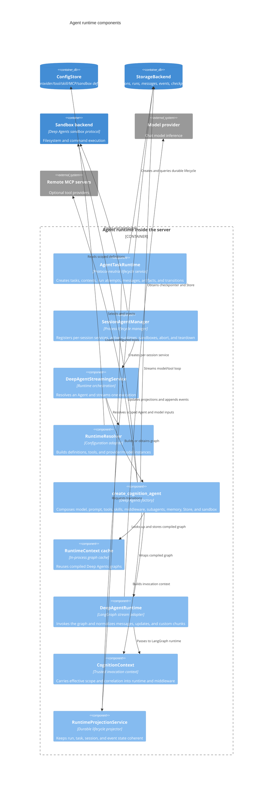

# C4 Level 3: Agent Runtime Components

**Status:** Current code-derived model  
**Code baseline:** `release/v0.13.0` (`890e1ad`)  
**Last verified:** 2026-07-25

The runtime turns a scoped `AgentDefinition` into a Deep Agents graph, executes
it against one LangGraph thread, and translates upstream stream chunks into
Cognition's durable and transport-neutral lifecycle.

## Component diagram



## Runtime contract

`AgentDefinition` is the behavioral input. It contains the stable Agent name,
prompt, selected tools and skills, memory sources, middleware, permissions,
subagents, structured-output path, context policy, model overrides, sandbox
selection, visibility, and optional A2A presentation.

`RuntimeResolver` bridges stored definitions to live Python objects:

- Resolves an Agent through `ConfigStore`
- Loads API/file tool registrations or supplied tools
- Resolves provider selection and builds a LangChain `BaseChatModel`
- Produces a secret-free model cache identity

Unknown or unusable provider configurations fail explicitly through
`LLMProviderConfigError`. The mock provider is test-only.

## Graph composition

`create_cognition_agent(CognitionAgentParams)` composes the Deep Agents graph.
Depending on the definition and deployment it supplies:

- A resolved model and system prompt
- Host-provided tools only when explicitly enabled, plus registry,
  programmatic, and remote MCP tools
- Registry-backed skills and memory instructions
- Filesystem permissions and tool-safety middleware
- Observability, streaming, context, retry, call-limit, PII, human approval,
  and other declarative middleware
- In-process and remote asynchronous subagent specifications
- A selected sandbox backend
- LangGraph checkpointer and cross-thread Store
- `CognitionContext` as the runtime context schema

The resulting graph is cached with a bounded LRU/TTL cache keyed by a frozen
`RuntimeContext`. The key includes the effective-scope fingerprint, Agent
revision, manifest digest, sandbox backend identity, model identity, and
relevant runtime settings. The cached graph does not own a sandbox handle; each
run supplies the current sandbox dynamically so cache reuse cannot retain a
previous session's backend.

## Invocation and normalized events

`DeepAgentRuntime` calls the Deep Agents graph with:

```text
stream_mode = [messages, updates, custom]
subgraphs   = true
version     = v2
thread_id   = session.thread_id
```

It translates upstream chunks to typed `AgentEvent` variants. The important
families are:

| Family | Examples | Downstream use |
| --- | --- | --- |
| Content | token, direct message, structured response, artifact | Native SSE and A2A output |
| Tools | tool call, tool result, tool safety | Message projection, approvals, audit |
| Planning | planning, step complete, delegation | Progress streaming and durable events |
| Context | summarized, offloaded, token accounting | Context-policy visibility |
| Lifecycle | status, heartbeat, run state, done, rejected, error | Task/run/session state machine |
| Approval | interrupt, approval/edit/reject decision | LangGraph pause and resume |
| Sandbox | provisioned, snapshot, terminating, terminated | Isolation lifecycle evidence |

The runtime uses the real LangGraph tool-call ID to correlate calls and results.
Subgraph namespaces identify subagent activity. Interrupts return control to the
client and resume through a LangGraph `Command` on the same thread.

## Protocol-neutral durable lifecycle

The durable model separates three identities:

- **Session/context:** conversation and LangGraph thread identity
- **Runtime task:** protocol-neutral requested work and current task status
- **Session run:** one execution attempt, including continuations after input or
  authorization is required

`AgentTaskRuntime` owns creation, idempotent recovery, continuation,
cancellation, subscription, message persistence, and task-linked artifacts.
`RuntimeProjectionService` owns legal state transitions and append-only events.
Native REST/SSE and A2A call these services instead of maintaining independent
lifecycle state.

## Scope and correlation

`CognitionContext` carries builder-authorized `effective_scope` plus session,
thread, Agent, run, task, and metadata correlation. Middleware and tools read
trusted context rather than accepting scope from model-controlled arguments.

The scope participates in configuration lookup, artifact routes, runtime tasks,
sandbox correlation, callbacks, logs, traces, and metrics. It is available to
Deep Agents through `CognitionContext`, but the LangGraph Store is passed through
without a Cognition scope-enforcing wrapper; Store namespace isolation is not
established by these components alone. API/session code treats session scope as
immutable after creation.

## Extension points

| Extension | Boundary |
| --- | --- |
| Agent definition | Pydantic `AgentDefinition` persisted or loaded from workspace |
| Tools | LangChain tools, registry source/path, programmatic tools, remote MCP |
| Skills | Registry-backed `SKILL.md` content exposed through Deep Agents skills backend |
| Middleware | Deep Agents middleware instances or supported declarative specifications |
| Subagents | Other scope-visible Agent definitions are currently translated into synchronous subagents; the current Agent can also declare experimental remote async subagents |
| Model providers | Provider configuration resolved by `RuntimeResolver` and LangChain |
| Sandbox | Deep Agents sandbox protocol selected by deployment/Agent profile |
| Callbacks | Post-completion HTTP callback configured by the embedding application |

## Current resolution constraints

- Cognition creates no native Agents. Builders must provision API Agents or
  explicit shared file Agents before creating sessions.
- API-created Agents resolve only at the complete trusted scope. Shared file
  Agents can remain as read-only fallback definitions.
- Every run pins an Agent/dependency manifest and manifest digest before model
  execution starts. Active runs do not observe later Agent or dependency
  updates.
- Registry Python tool source and host-provided tools are not available in
  strict production mode unless explicitly enabled as unsafe development or
  host-tool settings.
- The streaming path constructs synchronous delegation from scope-authorized
  subagent definitions. General subagents inherit the parent run manifest;
  explicit subagents receive their declared authorized subset.

## Code evidence

| Responsibility | Primary source |
| --- | --- |
| Agent definition schema | `server/app/agent/definition.py` |
| Runtime resolution | `server/app/agent/resolver.py` |
| Graph composition and cache | `server/app/agent/cognition_agent.py` |
| Stream normalization | `server/app/agent/runtime.py` — `DeepAgentRuntime` |
| Session runtime lifecycle | `server/app/llm/deep_agent_service.py` |
| Durable task application service | `server/app/agent/task_runtime.py` |
| Run/task/session projection | `server/app/runtime_projection.py` |
| Middleware and trusted injection | `server/app/agent/middleware.py` |
| Registry-backed skills | `server/app/agent/skills_backend.py` |
| Remote MCP tools | `server/app/agent/mcp_client.py` |

## Related views

- [Server composition](03-server-components.md)
- [State and configuration](05-state-and-configuration.md)
- [Execution and sandboxes](06-execution-and-sandboxes.md)
- [Runtime flows](07-runtime-flows.md)
