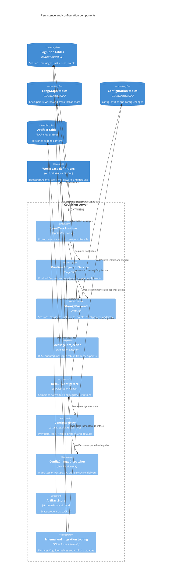
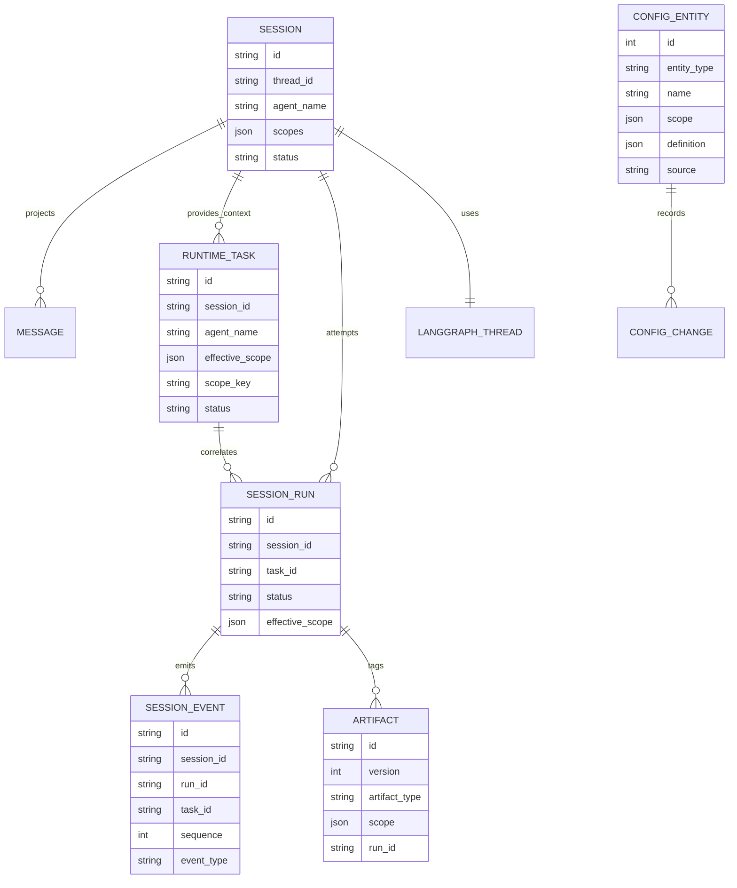

# C4 Level 3: State and Configuration

**Status:** Current code-derived model  
**Code baseline:** `release/v0.13.0` (`890e1ad`)  
**Last verified:** 2026-07-25

Cognition separates authoritative LangGraph state, durable runtime lifecycle,
read projections, versioned artifacts, and hot-reloadable configuration. These
logical stores can share one SQLite or PostgreSQL database but have different
contracts and consistency rules.

## Persistence component diagram

## State authority

| Concern | Authoritative record | Derived or supporting record |
| --- | --- | --- |
| Agent conversation and graph state | LangGraph checkpoint keyed by `thread_id` | `messages` REST projection |
| Requested work | `runtime_tasks` | Current/last run links and task metadata |
| One execution attempt | `session_runs` | Session summary fields |
| Ordered runtime evidence | Append-only `session_events` | SSE/A2A transport projections |
| Conversation container | `sessions` | Message count, active/latest run, latest event metadata |
| Dynamic definitions | `config_entities` plus native/file sources | In-process `DefaultConfigStore` entries |
| Agent-produced content | Versioned `artifacts` | Virtual filesystem routes and task artifact descriptors |
| Cross-thread memory | LangGraph Store | Scope is available through `CognitionContext`; these components do not enforce a scoped Store wrapper |

The `messages` table is explicitly rebuildable from checkpoint messages. It is
optimized for pagination, timestamps, threading, tool metadata, token counts,
and model attribution; it is not the graph's source of truth.

## Logical data model

These are application-level relationships. The Cognition SQLAlchemy schema does
not declare foreign keys between these tables. Lifecycle services must therefore
maintain referential consistency and cleanup explicitly.

## Storage adapters

### Memory

All records, checkpoints, and Store values live in process memory. This is a
test and ephemeral-development adapter, not a restart or replica boundary.

### SQLite

Operational tables use `aiosqlite`; LangGraph supplies its SQLite checkpointer
and Store. The database file is local to the configured workspace. SQLite is
appropriate for a single process and local durability.

### PostgreSQL

Operational state uses an `asyncpg` pool. LangGraph checkpointer and Store,
ConfigRegistry, ArtifactStore, and config notification use separate PostgreSQL
connections or pools. PostgreSQL is the supported shared durable substrate for
multiple server replicas.

## Dynamic configuration

`ConfigRegistry` stores providers, tools, Agents, sandbox profiles, and
global defaults as `(entity_type, name, scope, definition, source)` rows. MCP
servers exist only inside immutable Agent definitions.

Configuration resolution remains hierarchical for configuration entities:

1. A stored scope matches when it is a subset of the request scope.
2. The row with the greatest number of scope keys wins.
3. Empty scope is the global fallback.

`DefaultConfigStore` exposes one facade to routes and `RuntimeResolver`.
Cognition creates no native Agents. Startup bootstrap treats YAML/filesystem
entries as builder definitions and preserves API-managed records where
implemented. API-created Agent CRUD is stricter than general configuration:
Agent rows resolve only at the complete trusted scope, while explicit shared
file Agents may remain read-only fallback definitions.

PostgreSQL writes add a `config_changes` row and issue `NOTIFY`. The listener
queries unprocessed rows and invokes subscribers. An in-process dispatcher is
constructed for SQLite and memory, but current registry write paths do not emit
through it. At startup the only registered subscriber is
`DefaultConfigStore.on_config_change`; compiled graph cache invalidation is not
separately subscribed in the composition root.

## Scope semantics in the current code

Scope behavior is intentionally split between configuration inheritance and
runtime isolation:

- Runtime tasks use a canonical hash plus exact dictionary equality and namespace
  idempotency by Agent and scope.
- Artifact reads and versions use exact scope.
- Config entities intentionally use subset inheritance.
- API-created Agents use exact scope, revision, and definition digests.
- Sessions, runs, messages, events, tasks, artifacts, cleanup, deletion, and
  checkpoint access enforce the exact trusted scope at the storage/runtime
  boundary. Wrong-scope identifiers return not-found.
- Runs persist a redacted manifest and manifest digest so later Agent/config
  updates affect future runs only.

## Schema evolution

Alembic migrations exist and are exposed through the server administration CLI.
The FastAPI startup path does not run `alembic upgrade`; backend
`initialize()` calls `metadata.create_all()` and performs selected compatibility
checks. Operators must treat schema upgrade as an explicit deployment step.

## Known consistency boundaries

- Creating a run, linking its task, updating its session, and appending its first
  event are separate backend calls rather than one database transaction.
- “One active run per session” is enforced through service checks, not a partial
  unique database constraint.
- Event sequence uniqueness is constrained by `(session_id, sequence)`.
  PostgreSQL serializes allocation with an advisory lock; SQLite does not have an
  equivalent retry path.
- Session cleanup is scoped and deterministic for runtime-owned records, but
  operators should still treat durable stores and workspace/artifact storage as
  deployment resources that need backup/retention policy.
- Same-depth matching config scopes have no explicit precedence tie-breaker.

These boundaries belong in architectural review whenever lifecycle,
multi-tenancy, deletion, retry, or replica behavior changes.

## Code evidence

| Responsibility | Primary source |
| --- | --- |
| Storage protocols | `server/app/storage/backend.py` |
| Memory/SQLite/PostgreSQL adapters | `server/app/storage/memory.py`; `sqlite.py`; `postgres.py` |
| Table declarations | `server/app/storage/schema.py` |
| Config facade and precedence | `server/app/storage/config_store.py` |
| Config inheritance and adapters | `server/app/storage/config_registry.py` |
| Config notification | `server/app/storage/config_dispatcher.py` |
| Artifacts | `server/app/storage/artifact_store.py`; `config_models.py` |
| Message rebuild | `server/app/storage/message_projection.py`; `deep_agent_service.py` |
| Runtime lifecycle | `server/app/agent/task_runtime.py`; `server/app/runtime_projection.py` |
| Migrations | `server/alembic/versions/`; `server/app/storage/migrations.py`; `server/app/cli.py` |

## Related views

- [Agent runtime components](04-agent-runtime-components.md)
- [Runtime flows](07-runtime-flows.md)
- [Governance and evolution](09-governance-and-evolution.md)
