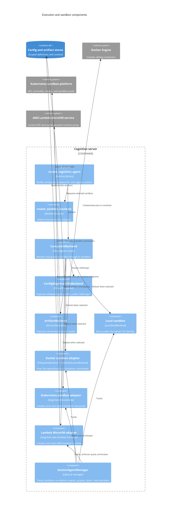

# C4 Level 3: Execution and Sandboxes

**Status:** Current code-derived model  
**Code baseline:** `release/v0.13.0` (`890e1ad`)  
**Last verified:** 2026-07-25

Deep Agents receives one backend interface even though commands and files can
be served by several systems. Cognition selects a default sandbox for ordinary
workspace paths and overlays virtual registry/artifact routes through a
composite backend.

## Execution component diagram

## Composite filesystem

The runtime's default backend is the selected sandbox. When configuration and
artifact stores are available, the factory overlays these virtual routes:

| Path | Backend | Meaning |
| --- | --- | --- |
| `/skills/api/` | `ConfigRegistrySkillsBackend` | Attached, scope-visible skills |
| `/scratch/` | `ArtifactBackend` | Versioned scratch content |
| `/artifacts/` | `ArtifactBackend` | General artifacts |
| `/contracts/` | `ArtifactBackend` | Structured contracts |
| `/evals/` | `ArtifactBackend` | Evaluation artifacts |
| `/memories/` | `ArtifactBackend` | Persisted memory content |
| `/policies/` | `ArtifactBackend` | Policy artifacts |
| All other paths | Selected sandbox | Workspace files and commands |

Artifact writes create a new version. Registry skills are restricted to the
names attached to the resolved Agent. Scope is passed to both virtual backends.

## Sandbox choices

### Local

`CognitionLocalSandboxBackend` extends Deep Agents' local shell backend. Commands
run with the Cognition server's OS identity and filesystem access. Per-session
workspace directories improve separation and protected-path checks guard direct
file writes, but local execution is not a process, kernel, or network isolation
boundary.

### Docker

`CognitionDockerSandboxBackend` uses host-side filesystem operations and lazily
creates a container for commands. `DockerExecutionBackend` configures:

- A read-only container root
- Writable `/workspace`, `/tmp`, and `/home`
- All Linux capabilities dropped
- `no-new-privileges`
- Configured CPU and memory limits
- Configured network mode, defaulting to `none`

The workspace is mounted read/write, so the container can modify session files.
The command path uses `sh -c` inside the container because arbitrary shell
execution is the intended sandbox capability.

### Kubernetes

`CognitionKubernetesSandboxBackend` delegates to the workspace package
`langchain-k8s-sandbox`. It lazily creates or claims an agent-sandbox `Sandbox`
resource, optionally uses a warm pool, verifies the runtime, applies a shutdown
time, and sends command/file requests through the sandbox platform.

The Cognition pod requires namespaced sandbox permissions and read access to the
Sandbox custom resource definition. A network policy can deny sandbox egress.
The sandbox image runs the command/file server independently of the Cognition
server.

### AWS Lambda MicroVM

`CognitionAwsLambdaMicroVmSandboxBackend` resolves a trusted `SandboxProfile`
and delegates lifecycle and file/command calls to
`langchain-aws-lambda-microvms`. Profiles can select image/version, region,
execution role, connectors, lifetime, idle policy, logging, and quota.

The adapter starts a MicroVM through the AWS SDK, obtains an in-memory runtime
authorization token, waits for health, and calls the authenticated runtime proxy.
Lifecycle metadata deliberately omits the token and records a role fingerprint
instead of exposing the role value in every signal.

## Lifecycle ownership

`SessionAgentManager` stores process-local mappings from session IDs to services,
active runtime handles, and sandbox objects. It emits sandbox lifecycle events,
supports abort, applies MicroVM quota checks, and calls `terminate()` on backends
that implement it when a session is released.

Kubernetes and MicroVM adapters implement explicit termination. The current
Docker wrapper does not expose `terminate()`, so its container lifecycle is not
closed through the same manager path.

## Security properties and limits

| Property | Local | Docker | Kubernetes | Lambda MicroVM |
| --- | --- | --- | --- | --- |
| Separate kernel boundary | No | Yes | Yes | Yes |
| Separate process boundary | No | Yes | Yes | Yes |
| Network policy | Server's network | Docker network mode | Platform/network policy | Profile connectors |
| Resource limits | Server limits | CPU/memory settings | Sandbox template | Service/profile quota |
| Explicit teardown in adapter | Not required | Not currently exposed | Yes | Yes |
| Protected direct-write paths | Yes | Host filesystem policy differs | Yes | Yes |
| Appropriate for untrusted commands | No | Depends on host hardening | Depends on sandbox platform | Depends on profile/platform |

Protected-path checks apply to direct backend write/edit methods; they do not
make arbitrary shell commands safe. API-registered Python tools are loaded in
the Cognition server process, so their trust boundary is the protected builder
administrative API—not the command sandbox.

Current Docker `execute(timeout=...)` accepts a timeout argument but does not
apply it to `exec_run`. This is a known operational constraint.

## Code evidence

| Responsibility | Primary source |
| --- | --- |
| Composite backend creation | `server/app/agent/cognition_agent.py` — `create_cognition_agent` |
| Sandbox selection and wrappers | `server/app/agent/sandbox_backend.py` |
| Docker container configuration | `server/app/execution/backend.py` |
| Kubernetes adapter package | `packages/langchain-k8s-sandbox/langchain_k8s_sandbox/sandbox.py` |
| Lambda MicroVM adapter package | `packages/langchain-aws-lambda-microvms/langchain_aws_lambda_microvms/sandbox.py` |
| Registry skill filesystem | `server/app/agent/skills_backend.py` |
| Artifact virtual filesystem | `server/app/agent/artifacts_backend.py` |
| Sandbox lifecycle ownership | `server/app/llm/deep_agent_service.py` — `SessionAgentManager` |
| Per-session workspace | `server/app/session_manager.py` |
| Kubernetes runtime image/API | `Dockerfile.sandbox`; `deploy/sandbox/runtime_server.py` |

## Related views

- [Agent runtime components](04-agent-runtime-components.md)
- [Runtime flows](07-runtime-flows.md)
- [Deployment and operations](08-deployment-and-operations.md)

