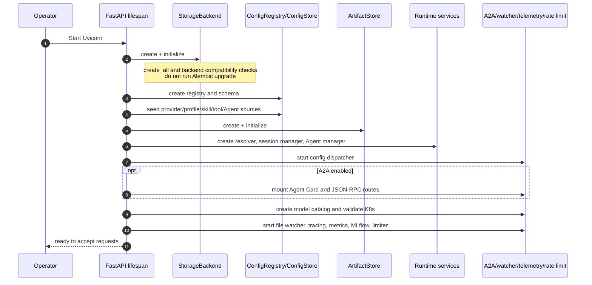
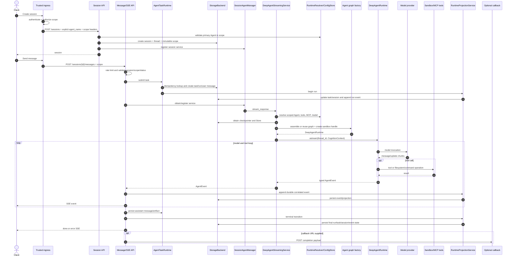
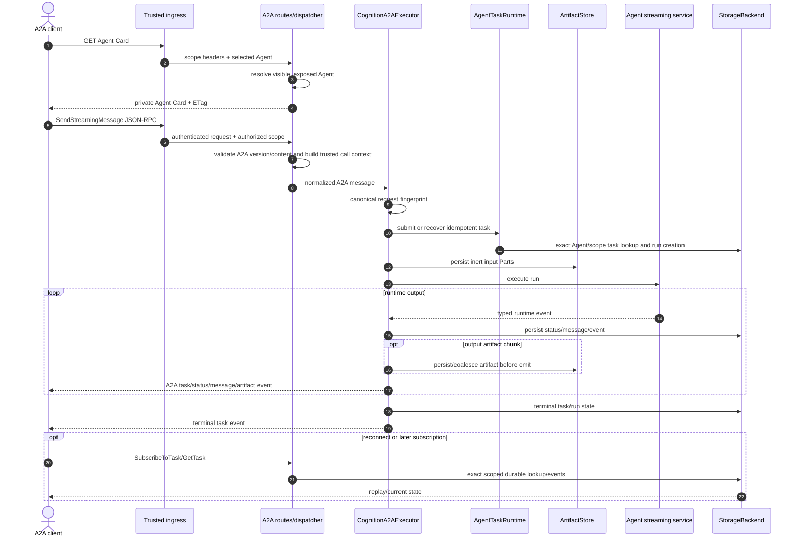
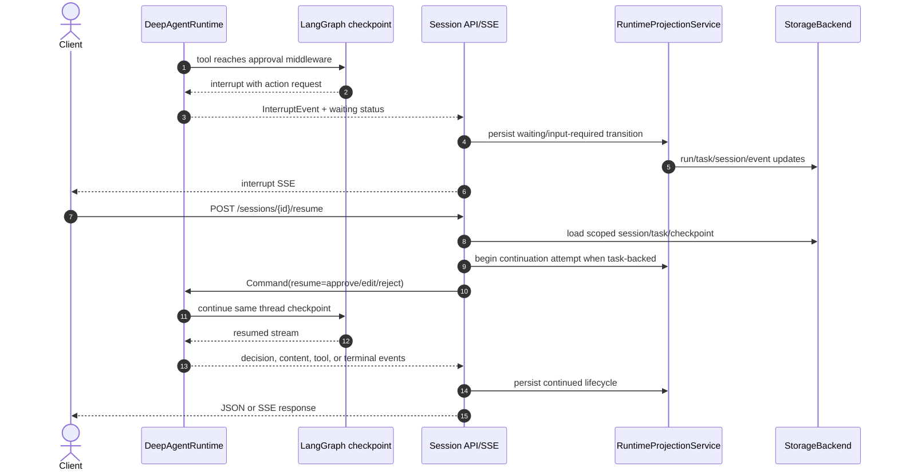
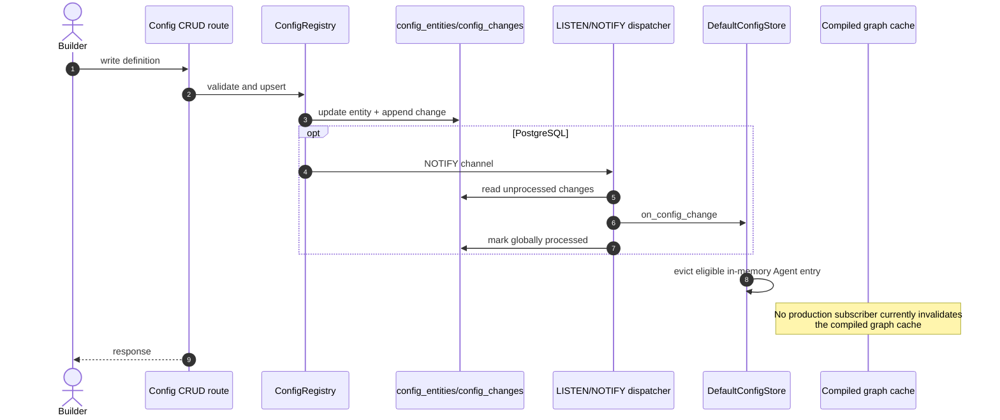

# Dynamic View: Runtime Flows

**Status:** Current code-derived model  
**Code baseline:** `release/v0.13.0` (`890e1ad`)  
**Last verified:** 2026-07-25

Static C4 diagrams show ownership; these sequences show when state becomes
durable and where process-local behavior remains.

## Single-Agent full-stack lifecycle

The lifecycle view follows one Agent across the builder boundary, API adapters,
runtime composition, execution dependencies, durable state, and observability.
The detailed sequences below expand the startup, native, A2A, approval, and
configuration-change paths.

## Startup

Database migrations are an operator-controlled prerequisite. `/ready` reports
true after startup completes; it does not perform an active dependency probe.

## Create a session and run a native SSE turn

The route emits token deltas and rich runtime events while durable events carry
session, task, run, sequence, trace, and span correlation. The message table is
a read projection; the LangGraph checkpoint remains authoritative conversation
state.

Native `SSEStream` uses a request-local circular buffer. A new request cannot
read the previous request's buffer, so `Last-Event-ID` is not durable replay.
Clients that need recovery should query persisted runs/events. A2A subscription
uses durable task events and has stronger replay semantics.

## A2A streaming task

Text, data, raw, and URL Parts are normalized without fetching URL content.
Message IDs are namespaced by Agent and complete effective scope. Cancellation,
polling, listing, and subscription all use durable `RuntimeTask` state.

## Human approval and resume

Task-backed continuations create another run attempt beneath the same durable
task. A compatibility path exists for older runs that predate runtime-task
correlation.

## Cancellation

`AgentTaskRuntime.cancel` persists task cancellation before requesting
process-local interruption. If an active run exists, the serving process asks
`SessionAgentManager` to abort the thread and projects the run to an aborted
terminal state. Persist-first ordering makes polling observe cancellation even
if runtime interruption races or the process exits.

Because abort handles are process-local, a request reaching another replica can
persist the durable state without necessarily owning the live graph operation.
Deployment design must distinguish durable cancellation intent from immediate
same-process interruption.

## Configuration change

SQLite and memory registries do not currently call the created in-process
dispatcher. PostgreSQL's shared `processed` flag also makes multi-worker
delivery best effort rather than a guaranteed broadcast. These are tracked
architecture gaps, not guarantees.

## Code evidence

| Flow | Primary source |
| --- | --- |
| Startup/shutdown | `server/app/main.py` — `lifespan` |
| Session creation and resume | `server/app/api/routes/sessions.py` |
| Native execution/SSE/callback | `server/app/api/routes/messages.py`; `server/app/api/sse.py` |
| Task lifecycle/cancellation/subscription | `server/app/agent/task_runtime.py` |
| Runtime projection | `server/app/runtime_projection.py` |
| Runtime resolution and streaming | `server/app/llm/deep_agent_service.py`; `server/app/agent/resolver.py` |
| Graph stream translation | `server/app/agent/runtime.py` |
| A2A adaptation | `server/app/protocols/a2a/` |
| Config notification | `server/app/storage/config_registry.py`; `config_dispatcher.py` |

## Related views

- [Server composition](03-server-components.md)
- [Agent runtime components](04-agent-runtime-components.md)
- [State and configuration](05-state-and-configuration.md)
