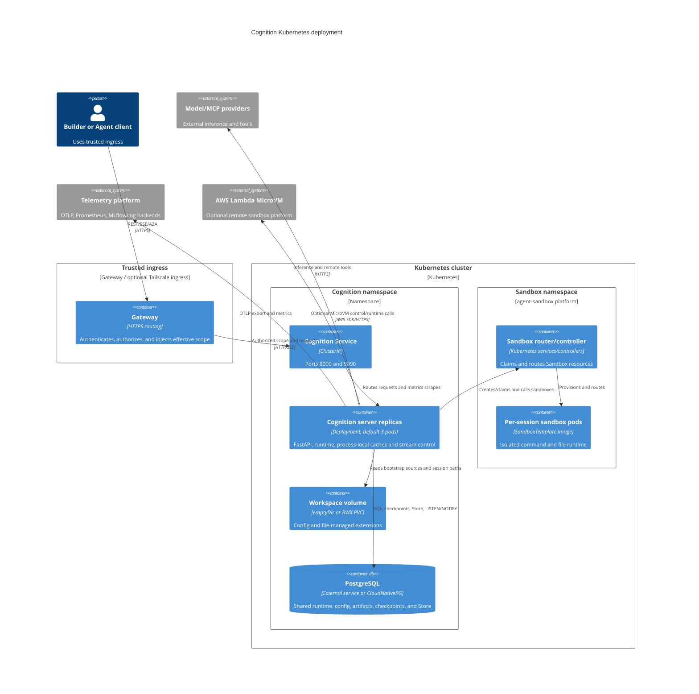
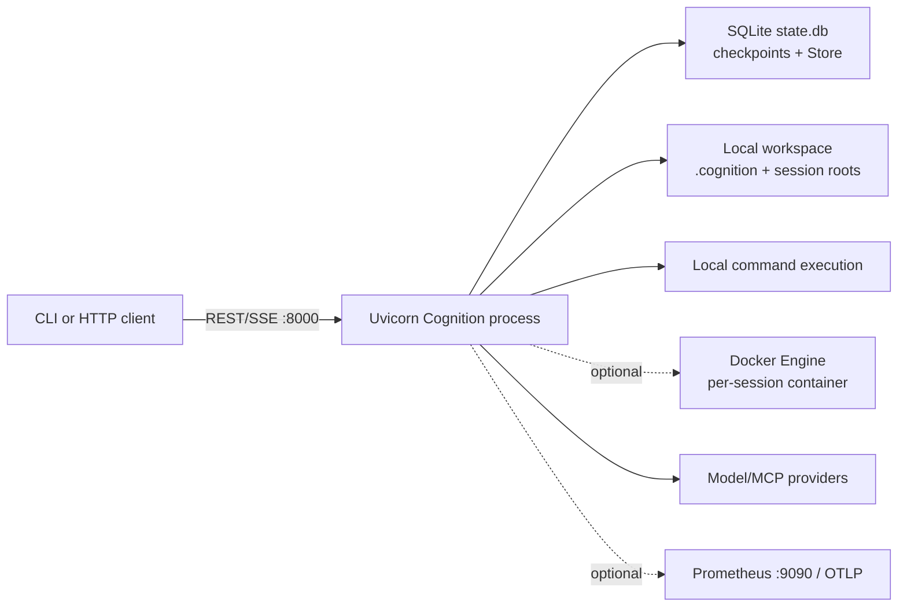
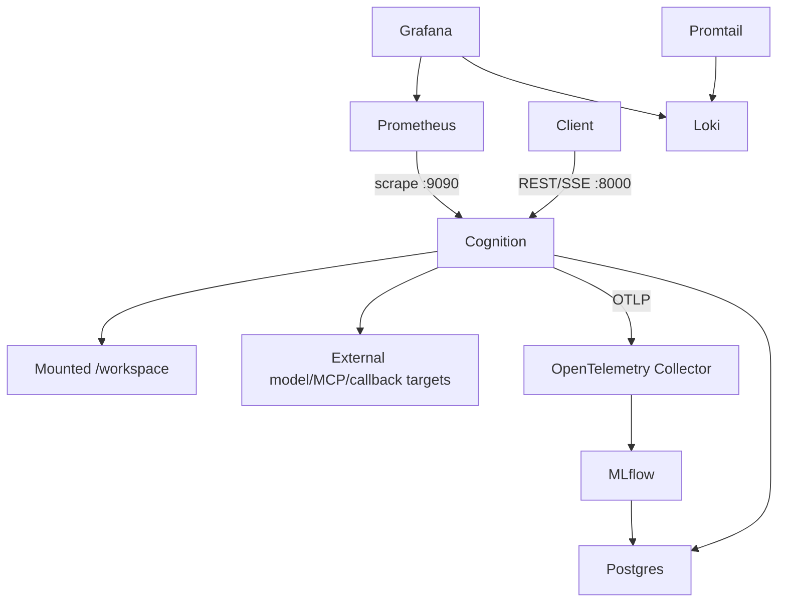

# C4 Deployment View: Deployment and Operations

**Status:** Current code-derived model  
**Code baseline:** `release/v0.13.0` (`890e1ad`)  
**Last verified:** 2026-07-25

Cognition can run as one local process or as replicated server containers backed
by PostgreSQL. The chosen sandbox changes the strongest isolation boundary and
the infrastructure Cognition must reach.

## Kubernetes deployment diagram

## Local development

The CLI probes `/ready` and can start the server administration CLI when no
local server responds. SQLite and the local workspace are single-host state.
The local sandbox executes in the server's security boundary; Docker provides a
separate container only when explicitly selected.

## Docker Compose

The checked-in Compose file selects the local sandbox because the server itself
runs in a container. Per-session Docker isolation requires running Cognition
where it can safely reach a Docker daemon and mount the correct host workspace.

Compose also supplies PostgreSQL, MLflow, Prometheus, Grafana, an OpenTelemetry
Collector, Loki, and Promtail. Those observability containers are deployment
choices rather than mandatory runtime dependencies.

## Kubernetes placement

The Helm chart supplies:

- A non-root server Deployment with a read-only root filesystem
- A ClusterIP Service for API and metrics
- An optional Tailscale ingress
- Init containers that wait for PostgreSQL and initialize the workspace
- An ephemeral workspace by default or optional ReadWriteMany persistent volume
- Service-account and role permissions for agent-sandbox resources
- An optional deny-egress NetworkPolicy for sandbox pods
- Pod anti-affinity and a default replica count of three

The chart does not deploy PostgreSQL. It expects an external service; a
CloudNativePG example is present under `deploy/cnpg/`.

When file-managed Agents, tools, skills, or middleware matter, replicas require
identical immutable workspace content or a correctly shared volume. An
`emptyDir` workspace is per pod and can diverge.

## Sandbox deployment alternatives

### Kubernetes sandbox

The server calls the Kubernetes API and agent-sandbox router/controller. A
`SandboxTemplate` selects the runtime image. Each lazily provisioned sandbox
runs the command/file server, can receive a shutdown time, and may come from a
warm pool. Scope-derived labels and session identity are added to resources.

### AWS Lambda MicroVM sandbox

The server uses the AWS SDK to run, inspect, resume, and terminate a MicroVM,
then calls its authenticated HTTPS command/file proxy. This topology has a
control path through AWS and a data path through the returned runtime endpoint.
The authorization token remains process memory and is not included in lifecycle
metadata.

## Shared versus replica-local state

| Shared with PostgreSQL | Replica-local |
| --- | --- |
| Sessions and message projections | Active `SessionAgentManager` services |
| Runtime tasks, runs, and events | Live graph invocation and abort handles |
| Config entities and change records | Compiled graph cache |
| Artifacts | Native SSE request buffers |
| LangGraph checkpoints and Store | Rate-limit buckets |
| Idempotency records | File watcher and model-catalog cache |
| Durable polling/replay sources | Sandbox object handles and in-process quotas |

This division means PostgreSQL makes state recoverable but does not turn every
runtime action into a distributed coordinator. Native streaming and immediate
abort are tied to the serving process. A2A subscription and REST polling are
more portable because they read durable task/run/event state.

## Operability surfaces

| Surface | Current behavior |
| --- | --- |
| `/health` | Returns version and active-session count by listing stored sessions |
| `/ready` | Returns `ready=true` after startup; no active dependency checks |
| Metrics port | Separate embedded Prometheus HTTP server, started with telemetry setup |
| Tracing | Optional FastAPI/LangChain instrumentation and custom OTLP spans |
| Logging | Structlog console or JSON output |
| MLflow | Optional tracking URI/experiment setup |
| Durable runtime evidence | Session run/event APIs plus task/A2A polling and subscription |
| Container health | Docker and Helm probe FastAPI health/readiness routes |

Prometheus request labels currently use concrete request paths, so dynamic
resource IDs can create high-cardinality series. `/health` work grows with the
number of sessions. These are tracked operational constraints.

## Schema and release operations

Run Alembic upgrades explicitly before starting code that requires a newer
schema. Server initialization creates missing tables but is not a substitute for
ordered migrations.

CI runs unit tests, Ruff, strict mypy, Python 3.11/3.12 coverage, and the A2A
Technology Compatibility Kit. Release workflows build application and sandbox
images for amd64 and arm64 and merge their GitHub Container Registry manifests.
The pre-release workflow validates candidate images before final tagging.

The current CI configuration does not run the full E2E suite, Helm lint,
database-upgrade scenarios, or image vulnerability scanning.

## Code evidence

| Placement or operation | Primary source |
| --- | --- |
| Application image | `Dockerfile` |
| Sandbox image | `Dockerfile.sandbox`; `deploy/sandbox/runtime_server.py` |
| Compose topology | `docker-compose.yml`; `docker/` |
| Kubernetes server placement | `deploy/helm/cognition/templates/core/` |
| Kubernetes sandbox permissions/policy | `deploy/helm/cognition/templates/core/rbac.yaml`; `networking/sandbox-networkpolicy.yaml` |
| PostgreSQL example | `deploy/cnpg/cluster.yaml` |
| Kubernetes sandbox SDK | `packages/langchain-k8s-sandbox/` |
| Lambda MicroVM SDK | `packages/langchain-aws-lambda-microvms/` |
| CI and image release | `.github/workflows/ci.yml`; `pre-release-images.yml` |
| Health/readiness/metrics setup | `server/app/main.py`; `server/app/observability/__init__.py` |

## Related views

- [Container view](02-container-view.md)
- [Execution and sandboxes](06-execution-and-sandboxes.md)
- [Governance and evolution](09-governance-and-evolution.md)

