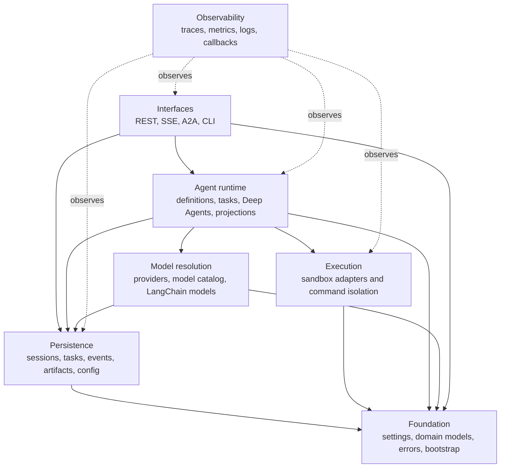

# Architecture

**Status:** Current code-derived model  
**Audience:** Maintainers, platform engineers, and builders embedding Cognition  
**Code baseline:** `release/v0.13.0` (`890e1ad`)  
**Last verified:** 2026-07-25

This section explains Cognition as it is implemented. It is derived from Python
entry points, protocols, persistence schemas, package manifests, deployment
templates, and tests. Earlier architecture prose was not used as a source.

## Architecture map

| View | Question answered |
| --- | --- |
| [System context](01-system-context.md) | Who uses Cognition, which external systems surround it, and where does its responsibility end? |
| [Container view](02-container-view.md) | Which runnable processes and data stores make up a Cognition deployment? |
| [Server composition](03-server-components.md) | How does the FastAPI process assemble interfaces, lifecycle services, and dependencies? |
| [Agent runtime](04-agent-runtime-components.md) | How does a stored Agent definition become a scoped Deep Agents execution? |
| [State and configuration](05-state-and-configuration.md) | Which records are authoritative, which are projections, and how are configuration changes distributed? |
| [Execution and sandboxes](06-execution-and-sandboxes.md) | How are filesystem and command operations routed across local, Docker, Kubernetes, and Lambda MicroVM backends? |
| [Runtime flows](07-runtime-flows.md) | What happens during startup, native streaming, A2A execution, approval, and cancellation? |
| [Deployment and operations](08-deployment-and-operations.md) | How do local, Compose, and Kubernetes deployments place and connect the containers? |
| [Governance and evolution](09-governance-and-evolution.md) | How is this model kept current and how are architectural changes tracked? |
| [Code-derived risks](10-code-derived-risks.md) | Which verified implementation constraints require acceptance, correction, or release tracking? |
| [Architecture decisions](decisions/index.md) | Which durable choices govern boundaries and future implementation? |

## C4 coverage

The documentation uses the C4 model for static structure and sequence diagrams
for behavior.

| C4 level | Cognition view | Detail |
| --- | --- | --- |
| Level 1 | System context | People, Cognition, and neighboring systems |
| Level 2 | Containers | Server, CLI, database, workspace, and provisioned sandboxes |
| Level 3 | Components | API composition, runtime, persistence, and execution adapters |
| Level 4 | Code | Source paths and symbols listed in each evidence section |

Level 4 is intentionally the code itself. These pages identify the stable
boundaries and the source locations that implement them rather than duplicating
class-level documentation.

## Logical dependency model

The repository implements seven logical concerns. They are not seven separately
deployed services; most run inside one server process.

The FastAPI lifespan in `server/app/main.py` is the composition root. It may
construct objects from every concern; ordinary modules should depend toward
foundation, persistence, and explicit protocols rather than importing API
routes or process globals.

## Architectural center

Cognition is a runtime backend built around five durable ideas:

1. An `AgentDefinition` describes behavior and extensions.
2. Builder-authorized `effective_scope` travels with runtime state.
3. A `RuntimeTask` owns protocol-neutral work identity; a `SessionRun` is one
   execution attempt and `SessionEvent` is its append-only evidence.
4. Deep Agents and LangGraph provide the reasoning loop, checkpointing, Store,
   middleware, skills, tools, and subagents.
5. Sandbox protocols keep the agent-facing filesystem/command interface stable
   while execution placement changes.

REST/SSE and A2A are adapters over the same runtime lifecycle. SQLite,
PostgreSQL, and memory are adapters behind the same storage contracts. Local,
Docker, Kubernetes, and Lambda MicroVM sandboxes are adapters behind the same
Deep Agents sandbox interface.

## Accuracy convention

Every page contains a **Code evidence** section. A claim belongs in this
architecture set only when it can be tied to implementation or deployable
configuration. Pages distinguish:

- **Implemented:** present in executable source.
- **Optional:** present but activated by configuration or an extra dependency.
- **External responsibility:** required around Cognition but not implemented by
  Cognition.
- **Known constraint:** behavior visible in the code that future changes must
  preserve or intentionally replace.

Use [governance and evolution](09-governance-and-evolution.md) when changing a
boundary, authoritative record, protocol, deployable, or external dependency.
