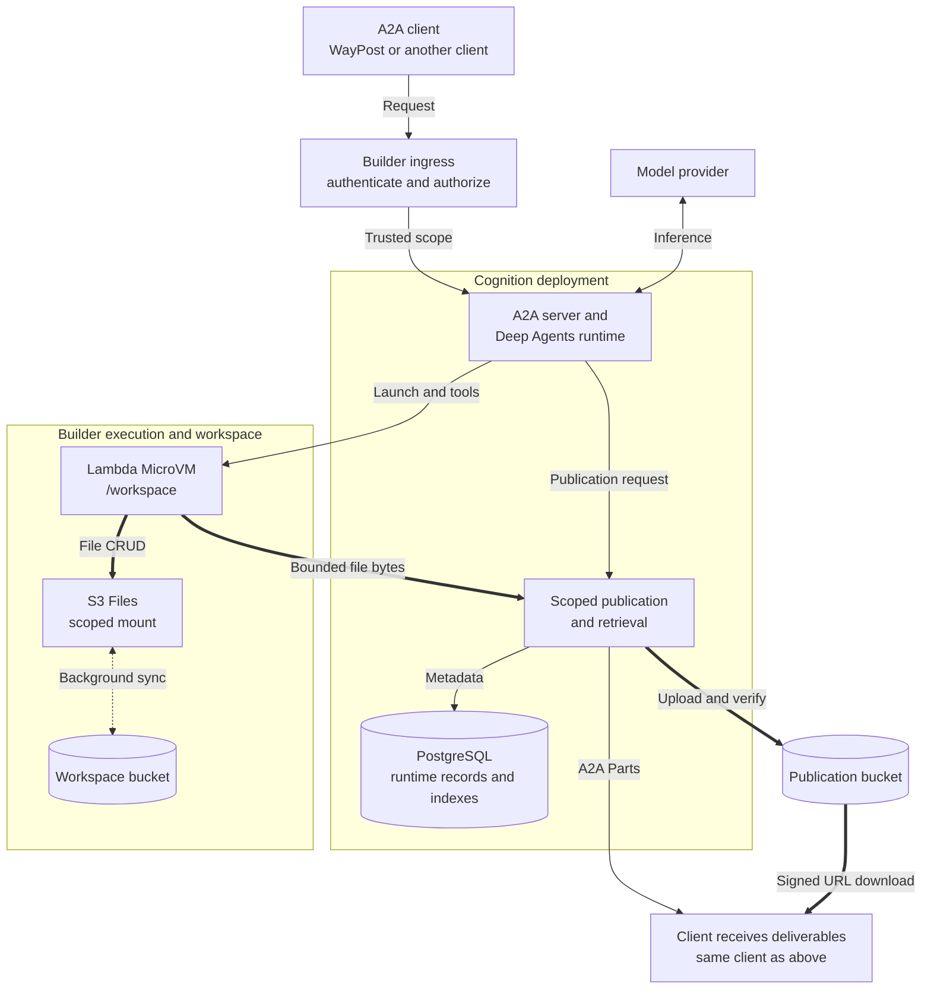
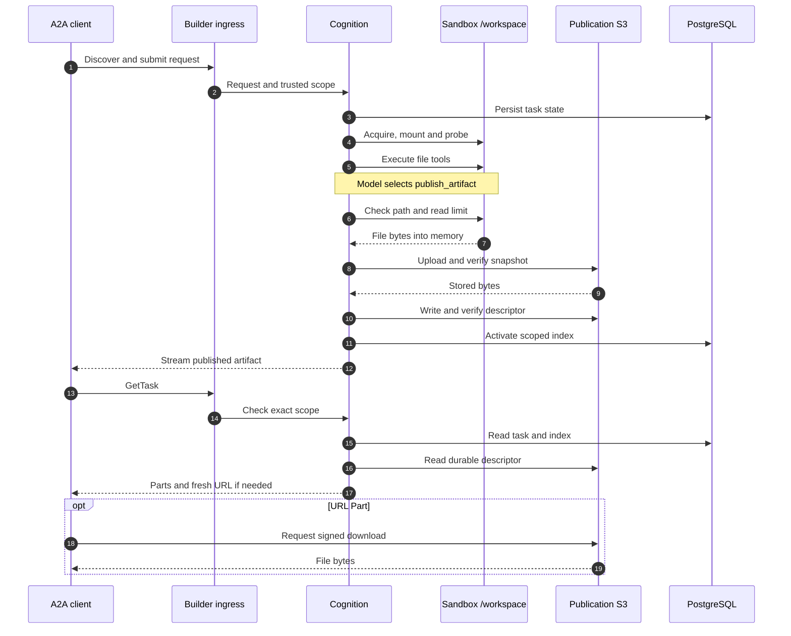
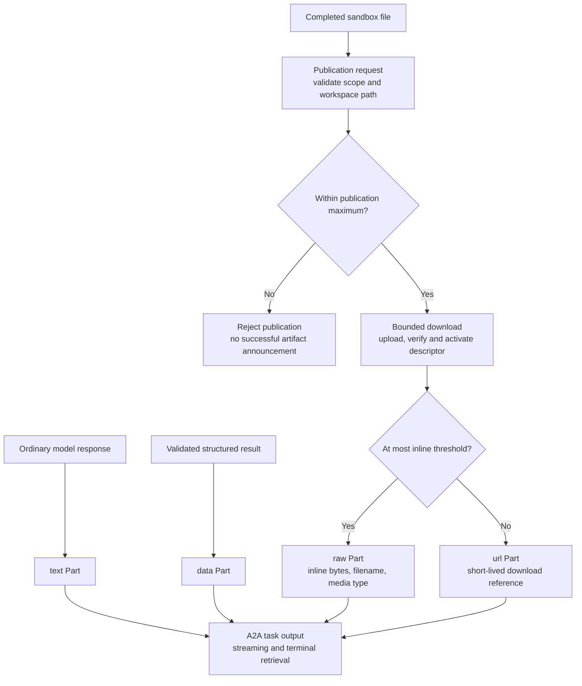
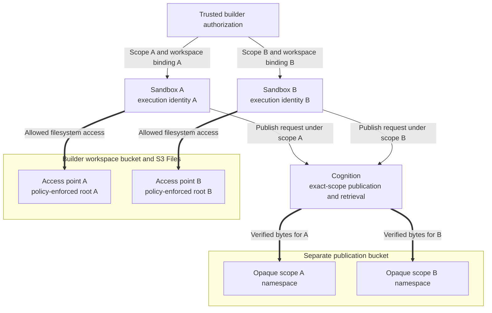
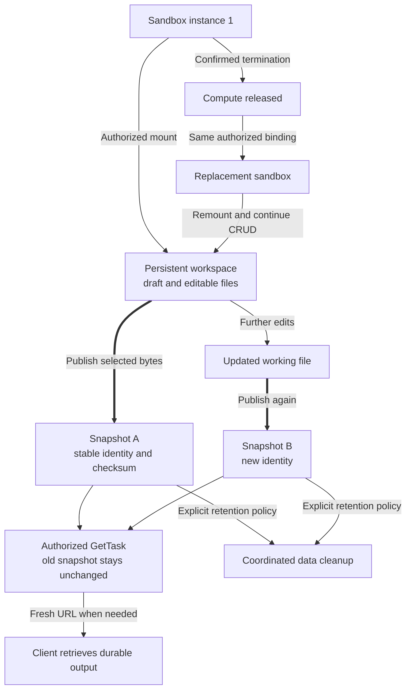

# From Agent Workspace to A2A Deliverable

*A builder and operator whitepaper on S3 Files, Cognition and durable agent output*

**Status:** Validated reference implementation on `codex/a2a-performance-otel`; not a production-readiness declaration.
**Evidence date:** September 8, 2026. Storage optimization: `3ba1053`; comparison evidence: `eea6253`.

## 1. The problem: making agent work useful beyond a response

Consider a user asking an agent to analyze sales and produce a CSV and a downloadable report. The request sounds simple. Delivering it reliably requires several distinct capabilities: interpreting intent, creating files safely, preserving working state, identifying completed outputs, and making those outputs available after execution ends. A useful backend must also prevent one customer's agent from accessing another customer's work.

Cognition connects those capabilities through an agent definition and a durable runtime. In the architecture described here, an agent works inside a disposable sandbox, uses a persistent S3 Files workspace, and explicitly publishes selected files through Cognition. An A2A client receives the resulting deliverables without needing to understand the sandbox or its storage layout.

This paper distinguishes three levels throughout. **Generic Cognition behavior** includes scoped execution, artifact persistence and A2A delivery. **Builder-owned integration** supplies the S3 Files filesystem, access policy and sandbox image. **Investigation configuration** supplies the particular Docker Compose deployment, Lambda MicroVMs and model used to validate the design. The AWS deployment demonstrates the contracts; it does not make S3 Files a dependency of every Cognition agent.

### A shared vocabulary

Agent2Agent, or **A2A**, defines communication between agent clients and servers. An **A2A server** exposes an agent's capabilities through protocol operations. An **Agent Card** describes discovery information, interfaces and supported capabilities. A **message** carries conversational input or output. A **task** represents work whose progress and results can be retrieved. An **artifact** represents an output of that work. Messages and artifacts contain **Parts**, the units that carry content. These concepts let a client interact with a remote agent without sharing its internal runtime. [A2A core concepts][a2a-concepts]

In A2A 1.0, a Part carries one content variant: `text`, `data`, `raw` bytes or a `url` reference. Several Parts can appear together. A CSV is therefore not a special agent protocol: it can be a byte-bearing Part with a filename and media type. A task can announce an artifact while work continues and expose it again on retrieval. [A2A 1.0 specification][a2a-spec]

**Amazon S3 Files** exposes bucket data through a shared filesystem interface. Applications use file and directory operations, while the service manages synchronization with a linked S3 bucket or prefix. The linked bucket requires versioning. An S3 Files access point provides a constrained filesystem entry point; a mount target provides network access. This differs from an application directly issuing S3 object API requests. [AWS service overview][s3-files] · [Synchronization][s3-sync]

For the agent, the useful abstraction is an ordinary `/workspace`. For the operator, that directory has an explicit storage identity and access policy.

## 2. Architecture and ownership

Cognition implements an A2A server as an interface to its existing runtime. The A2A adapter does not introduce a second agent execution engine. Agent definitions resolve prompts, models, middleware and sandbox configuration; Deep Agents supplies the reasoning and tool framework. Cognition connects that execution to task state, streaming, persistence and trusted scope. PostgreSQL holds the reference deployment's durable runtime records and checkpoints. [Cognition A2A architecture](../concepts/a2a/index.md)

WayPost is the example client. It discovers an agent, submits requests, displays output and retrieves attachments. Another conforming client can occupy the same position. The model provider is also a replaceable boundary: the live measurements used Bedrock Claude Sonnet 4.6, while the publication contract belongs to Cognition.

*Figure 1. Control requests use thin arrows, file transfers use thick arrows, and filesystem synchronization uses dotted arrows. PostgreSQL persists runtime state as well as publication indexes. Inline bytes also travel inside A2A responses. Cognition participates in the publication data path; the host does not mount the workspace.*

The separation makes ownership concrete:

| Responsibility | Builder or operator supplies | Cognition supplies |
|---|---|---|
| Identity and authorization | Caller authentication, entitlements, trusted ingress and scope mapping | Propagation and exact enforcement of the authorized scope |
| Agent behavior | Definition, model selection, instructions, skills and approved tools | Runtime composition, execution state and result handling |
| Workspace | Filesystem, bucket, access points, IAM and network access | A configured sandbox backend and trusted execution context |
| Sandbox integration | Image mount hooks, workspace binding and readiness probe | Launch/control integration and sandbox tool routing |
| Deliverables | Artifact-store configuration, credentials and retention policy | Validation, verified publication, durable references and A2A projection |
| Operations | Capacity limits, monitoring destination, backup and recovery policy | Runtime signals, OTel instrumentation and persistence interfaces |

An operator may also be the builder. The table describes boundaries between responsibilities, not a requirement for separate teams or services. [Builder boundaries](../guides/core-vs-app-layer.md) · [Implementation sources](#implementation-sources)

## 3. Following a request from conversation to deliverable

The running example begins with an ordinary request: “Analyze sales of 10, 20 and 30 dollars. Give me a CSV and a useful downloadable report.” The caller need not name an S3 bucket, filesystem path or publication tool. The agent definition supplies environmental guidance and tells the model how to publish completed files.

The client discovers the Agent Card and submits the request through trusted ingress. The builder authorizes the caller and assigns `effective_scope`. Cognition validates the A2A request, creates or continues the appropriate durable task/context, resolves the agent configuration and starts execution. A conversational context can contain multiple tasks; each execution attempt has its own run identity. [Tasks and streaming](../concepts/a2a/tasks-and-streaming.md)

The sandbox backend acquires a MicroVM when runtime operations require it. In this integration, the builder image mounts the selected S3 Files access point at `/workspace`. Its hook verifies real filesystem I/O before accepting commands. Cognition receives a usable sandbox through its existing contract; it does not interpret filesystem IDs or provision mount targets.

The model selects tools to create the CSV and report, then calls `publish_artifact` for the completed files. This tool is contributed by Cognition's Deep Agents-native publication middleware. It is not a separately deployed MCP server. The model chooses a deliverable; trusted runtime context determines where that operation is allowed. [Publication and mount sources](#implementation-sources)

*Figure 2. Solid arrows initiate operations; dashed arrows return results, with file-byte transfers labeled explicitly. A completed file becomes an announced deliverable only after verified publication. Model inference occurs through Cognition's provider boundary; the sequence focuses on file delivery. Background workspace synchronization is independent of this sequence.*

### How the four Parts fit

Cognition preserves ordinary model text as `text` and extracts validated root structured results as `data`. File publication selects `raw` or `url` according to policy. These are complementary output paths, not four tools the user must learn.

*Figure 3. Part routing reflects the output's meaning and delivery policy. Every accepted file publication is durably stored, including files later delivered inline.*

On input, mixed Parts retain their order and canonical history. Text and JSON become model-visible input. Raw attachments become scoped artifact references, rather than automatically appearing as files in the mounted workspace. URL Parts remain references: accepting one does not make the Cognition API process fetch it. Reading or importing such content requires an explicit approved tool or sandbox workflow under the deployment's network and size policies. [Input Part contract](../concepts/a2a/message-parts.md)

Support for all four variants does not guarantee that every model emits all four in one answer. The natural-language performance tasks returned validated `data` and small `raw` files. Other investigation runs demonstrated `text` and S3-backed `url` delivery, including across conversational turns. Builders should validate the requested business result, rather than equating a particular combination of Parts with successful reasoning. [Recorded demonstrations](#evidence-and-reproducibility)

## 4. Working files and published files have different lifecycles

A workspace file is working state. The agent can open, edit, rename or delete it using filesystem tools. Persistence allows a replacement sandbox with the same authorized binding to revisit those files. A published artifact instead identifies the exact bytes designated as a deliverable. Editing `/workspace/report.txt` later does not change a previously published report.

This distinction makes historical task retrieval meaningful. A client revisiting yesterday's output should receive yesterday's deliverable, even when today's agent is still editing the corresponding workspace file. Publication is an explicit snapshot boundary. It is a Cognition implementation choice; A2A itself does not require builders to adopt this particular storage layout. [Publication source](#implementation-sources)

S3 Files synchronizes filesystem changes with its backing bucket in the background. Visibility through the mounted workspace and visibility through direct bucket access are separate milestones. AWS also documents conflict behavior when the same data is changed through both interfaces. Consequently, operators should avoid treating an immediate direct S3 read of a workspace key as proof that a just-written file has been published. [AWS synchronization semantics][s3-sync]

Cognition instead asks the assigned sandbox to read the completed file. The bounded download protocol rejects unsupported targets and excessive size before fully buffering a file. Publication validates trusted scope and the workspace path; the reference runtime rejects traversal, symlinks, non-regular files and targets outside the workspace. Bytes travel through Cognition memory to the artifact store. There is no host-file staging step and no dependence on the workspace export schedule. [Validation and runtime sources](#implementation-sources)

The normal inline threshold is **256 KiB**: files at or below it use `raw`; larger accepted files use `url`. The publication maximum is **10 MiB**, inclusive. Deployments can lower the configured limits. Streaming or direct upload above that maximum remains deferred. The recorded S3 Files demonstration deliberately used a 1 KiB inline threshold to exercise URL delivery with a naturally sized report; performance runs used the normal threshold. The S3 Files example now sets the threshold to zero for new nonempty files, allowing operators to own generated-file retention through S3 Lifecycle. Earlier inline outputs remain unchanged.

Both small and large files are uploaded to S3 and read back for integrity verification before the published descriptor is activated. The descriptor records identity, key, checksum, length, filename, media type and delivery kind. In the existing artifact store, the descriptor's JSON body is itself durable S3 content indexed by a PostgreSQL record. Task projections and events provide additional runtime records. A logical file therefore has a clear identity-to-content relationship without implying exactly one database row and one S3 object across the entire implementation.

For URL delivery, Cognition persists an opaque reference instead of an expiring URL. Authorized retrieval resolves that reference, checks its scoped metadata and expected object key, then signs a new download URL. The current signing lifetime is fifteen minutes, bounded by credential validity. Such a URL is a bearer capability: possession permits its authorized operation until it expires or otherwise becomes invalid. Operators must protect it in logs and client storage. [Signing implementation](#implementation-sources) · [AWS presigned URLs][presigned]

## 5. A configurable storage shape with explicit isolation

The reference deployment uses two buckets with different purposes. The builder's workspace bucket backs S3 Files. Cognition's publication bucket acts as the deliverable outbox and stores related artifact bodies. This separation makes permission and retention policies easier to explain; it does not make a bucket name an authorization mechanism.

An illustrative workspace namespace is `tenants/<tenant>/agents/<agent>/workspaces/<workspace>/`. Builders may instead share a workspace across an authorized team or allocate one per conversation. Cognition does not prescribe those business relationships. The chosen binding must remain stable enough for continuation and explicit enough to decide who may read or mutate its contents.

Cognition's publication keys use a different shape: `<prefix>/scopes/<scope-digest>/published/<publication-id>/<checksum>`. The digest derives from the canonical effective scope using the configured HMAC key. Descriptor bodies and other artifact projections use additional keys under the same scope namespace. These are opaque storage addresses; filenames and user-supplied metadata do not authorize access. Keep the namespace key stable across restarts and plan any rotation as a storage migration. [Namespace implementation](#implementation-sources)

*Figure 4. Separate roots and namespaces are enforced by authorization and storage policies. The diagram shows allowed paths; its absence of a cross-tenant arrow is not itself a security control.*

AWS access-point root restrictions, IAM policies and filesystem policies must agree. A workload allowed to select another access point, mount an unrestricted root or read the backing bucket directly may bypass the intended boundary. Network reachability is another prerequisite, not a substitute for authorization. The example explicitly denies alternate access points and unrestricted mounts; sandbox execution roles do not receive direct access to the backing or publication buckets. [AWS access isolation][access-policy] · [Builder integration evidence](#evidence-and-reproducibility)

An access point is a configured entry point, not proof that a sandbox is actively mounted. Nor should removing an access binding be treated as the application's data-retention procedure. Track compute ownership, mount authorization and stored data as separate resources.

There is no universal “one IAM role per tenant” rule. The tested setup used separate execution identities and access points for fixed workspaces. A production builder must choose a mapping that enforces its intended tenant and workspace boundaries, including what other AWS access those identities possess. Cognition receives that authorized binding; the model cannot choose a tenant or access point through publication arguments.

For anonymous chat, the application still needs a server-assigned visitor/conversation identity and an authorization policy. A caller-selected scope header is not sufficient. The demo's loopback route selectors are testing conveniences, not a public authentication system. [Trusted scope boundary](../concepts/a2a/security-and-scoping.md)

## 6. Continuation, failure and operations

Three lifecycles must remain distinct: the task's execution state, the mutable workspace, and the published deliverable. A completed task can have retrievable artifacts after its MicroVM has terminated. A replacement sandbox can revisit the workspace if the builder restores the same binding. That remount does not by itself restore an in-flight model operation; Cognition's durable runtime and checkpoints serve that purpose.

*Figure 5. Compute replacement, workspace edits, publication and retention are separate transitions. The replacement path requires confirmed ownership transfer; it is not an assertion that automatic same-session reuse is currently correct.*

The investigation reproduced a Cognition lifecycle defect: repeated runs constructed new sandbox backends and overwrote the tracked session backend without terminating its predecessor. The reported benchmarks therefore used fresh VMs with explicit teardown, and replacement demonstrations confirmed termination before rebinding. The subsequent process-local ownership repair (`fa60c92`) reuses compatible backends and retains pending/failed teardown handles and quota. It does not change the meaning of the original benchmark results. Durable ownership across replicas, crash reconciliation and production writer fencing—preventing an obsolete or duplicate sandbox from continuing to write a workspace—remain necessary. See [current lifecycle behavior](../concepts/sandboxes/aws-lambda-microvm/lifecycle-and-observability.md) and the [original findings](#evidence-and-reproducibility).

Publication failures have a different boundary. Invalid paths and oversized files are rejected. Upload or readback failure prevents successful publication. A failed manifest write must not produce a success announcement, although an uploaded but unreferenced object can remain. Newly published binary objects have a dedicated Lifecycle tag; descriptors remain untagged. Authorized retrieval checks content availability before signing and projects missing bytes as an unavailable-content text notice under the same artifact identity. Storage failures remain errors. Operators can retain task history after files expire, but need separate policies for workspace data, old inline payloads, descriptors, backups and client caches. See the [published-file retention guide](../guides/published-file-retention.md) for selectors, permissions and URL-refresh behavior.

The demonstrated Cognition container has a read-only root, read-only configuration mounts and no writable host workspace mount. Operational temporary storage uses tmpfs. This proves publication without host disk staging, not an absence of all Python filesystem calls. Workspace file CRUD belongs inside the sandbox. S3 credentials used by Cognition belong to the operator's deployment, while sandbox execution permissions belong to the builder's workspace integration.

Runbooks should cover failed mounts, denied publication, credential expiry, retrievable historical tasks and compute cleanup separately. The builder image's readiness probe should fail closed when its workspace is unavailable. Monitor workspace synchronization health separately from task completion: successful A2A publication does not report the synchronization status of every draft file.

## 7. Performance: the live experience and the concurrency penalty

The strongest user-experience evidence is the live workload. Each request asked Claude Sonnet 4.6 through Bedrock to analyze the same three sales values and produce a CSV, report and validated statistics. Ten requests ran at each concurrency level before the storage fix, followed by ten at each level afterward. Actual peak request overlap was verified as 1, 5 and 10; all sixty requests succeeded. Each used a fresh MicroVM and an existing dedicated workspace.

| Concurrent requests | Before median completion | After median completion | Observed reduction | Slowest before | Slowest after |
|---|---:|---:|---:|---:|---:|
| 1 | 21.7 s | 21.3 s | 1.6% | 28.0 s | 26.6 s |
| 5 | 31.9 s | 26.3 s | 17.7% | 38.8 s | 33.7 s |
| 10 | 40.2 s | 27.1 s | 32.4% | 63.2 s | 46.1 s |

Completion measures client submission through terminal task retrieval, including model calls, sandbox acquisition, file work and publication. It excludes fixture setup and cleanup. These tasks produced approximately two KiB of inline files; they do not measure concurrent large-file downloads or browser paint time. With ten observations, the empirical nearest-rank p95 is the observed maximum, not a dependable production tail estimate. [Live comparison evidence](#evidence-and-reproducibility)

The fix addressed a generic server issue: synchronous S3 operations inside async artifact methods could stall other requests, and client construction was repeated. Cognition now reuses a client per store and performs blocking operations off the event loop with bounded concurrency. Cancellation retains an operation's slot until its worker finishes. Checksums, scope checks and activation ordering remain intact.

At concurrency ten, median manifest-persistence time fell from 1.58 to 0.30 seconds. The same tasks still used three model calls. These observations support the optimization's mechanism, but sequential before/after samples retain model, content and cache variability. The percentage changes are measured outcomes, not guaranteed savings for other deployments.

Earlier deterministic tests used scripted model responses while still executing real sandbox tools, S3 publication, PostgreSQL persistence and A2A delivery. Those tests established repeatable infrastructure behavior and boundary checks. Their larger generated files and omitted live reasoning mean their timing cannot be substituted for the live-model baseline.

### Observability and remaining work

Cognition's OTel design keeps one semantic run trace linked to ingress and retains framework-owned model/tool spans. Additional measurements cover configuration resolution, checkpoints, actual lazy sandbox acquisition, publication, persistence and retrieval. The SDK uses its caller's provider. Optional WayPost instrumentation measures client requests and browser milestones. Metric dimensions remain bounded; secrets, content and signed URLs do not belong in telemetry. [Observability architecture](decisions/0002-curated-opentelemetry-agent-tracing.md)

Interpret spans as overlapping work. Their medians cannot be summed into a critical path, and model spans can include client scheduling delays. Follow-up investigation should distinguish checkpoint lock wait from SQL time and repair sandbox ownership before evaluating warm reuse. The available evidence does not establish 100–1,000-agent capacity or a product latency SLO.

After the fix, 106 relevant regression tests passed. Post-restart checks preserved artifact identities and bytes across 21 representative cohorts, refreshed eleven signed URLs and rejected all 21 wrong-scope requests. WayPost retrieved four existing demonstration tasks again. All thirty new execution traces had one run root and no missing manual-span parents. The earlier full pinned A2A conformance run recorded 91 passed, one failed and 173 skipped; the unsupported-media error-metadata finding remains documented, and that full suite was not rerun for the internal storage optimization.

The architecture therefore has substantial evidence for durable, scoped A2A deliverability. Production adoption still requires the operator's authentication, writer ownership, recovery, retention and capacity decisions. Those responsibilities fit around the validated publication mechanism rather than disappearing because a demonstration succeeded.

## Appendix: configuring and evaluating the reference architecture

| Configuration area | Builder/operator decision | Cognition contract |
|---|---|---|
| Agent definition | Model, response schema, instructions and approved capabilities | Native runtime and middleware; no requirement for a particular LLM |
| Trusted scope | Authorized keys and values, including anonymous-session policy | Immutable `effective_scope` and exact runtime-resource access |
| Sandbox profile | Image, execution identity, network connector, quotas and idle policy | Existing launch/control interface |
| Workspace mount | Filesystem/access point and `/workspace` binding | Builder image interprets opaque `run_hook_payload`; mount/probe before tools |
| Artifact store | Private bucket, prefix, credentials and stable scope HMAC key | Verified object storage and scoped descriptor persistence |
| Publication policy | Enable publication; optionally lower size thresholds | Normal 256 KiB inline limit and 10 MiB maximum |
| Operations | Telemetry destination, credential rotation, backups and retention | OTel signals and durable runtime interfaces |

Start with the [A2A builder guide](../guides/a2a.md), [MicroVM setup](../concepts/sandboxes/aws-lambda-microvm/setup.md), [sandbox profiles](../concepts/sandboxes/aws-lambda-microvm/profiles.md), and [configuration guide](../guides/configuration.md). The [validation record](a2a-deliverability-validation.md#archive-and-reproduction) explains how to retrieve the archived lab and its deployment/cleanup runbooks. Production builders supply their own authorized bindings.

### Implementation sources

These are repository-relative primary-source references at `3ba1053`, available in the accompanying checkout. They deliberately identify the tested revision rather than implying that unreleased branch behavior is present in every Cognition release.

| Subject | Source |
|---|---|
| Tool registration, trusted scope and path validation | `server/app/agent/publication.py`, `PublicationMiddleware` |
| Sandbox bounded read and filesystem checks | `examples/aws-lambda-microvm-default-runtime/runtime/server.py`, `read_publication_file` |
| Builder mount and readiness behavior | Archived lab: `s3-files/runtime/mount_runtime.py`; see [archive access](a2a-deliverability-validation.md#archive-and-reproduction) |
| Verified binary publication and URL resolution | `server/app/storage/published_file.py`, `publish_file`, `resolve_download` |
| Descriptor storage and bounded S3 operations | `server/app/storage/artifact_store.py`, `S3ArtifactStore` |
| Opaque namespaces and URL expiry | `server/app/storage/s3_object_store.py`, `S3ObjectStore` |
| A2A artifact projection | `server/app/agent/task_runtime.py` |
| Backend ownership | `server/app/llm/deep_agent_service.py`, `register_sandbox_backend` |

### Evidence and reproducibility

The [validation record](a2a-deliverability-validation.md) consolidates measured
results, tested revisions, representative task/trace identities and known limits.
It includes instructions for retrieving the full lab at immutable commit
`79982391cb17d215503f4168674ac05663f11405`. The release tree retains production
code, regression tests and operator documentation; AWS fixtures, exploratory
probes, dashboards and bulk captures live in that archive. Historical evidence
is not a claim that every check was repeated on a later release revision.

[a2a-concepts]: https://a2a-protocol.org/latest/topics/key-concepts/
[a2a-spec]: https://a2a-protocol.org/v1.0.0/specification/
[s3-files]: https://docs.aws.amazon.com/AmazonS3/latest/userguide/s3-files.html
[s3-sync]: https://docs.aws.amazon.com/AmazonS3/latest/userguide/s3-files-synchronization.html
[access-policy]: https://docs.aws.amazon.com/AmazonS3/latest/userguide/s3-files-access-point-policy-examples.html
[presigned]: https://docs.aws.amazon.com/AmazonS3/latest/userguide/using-presigned-url.html
