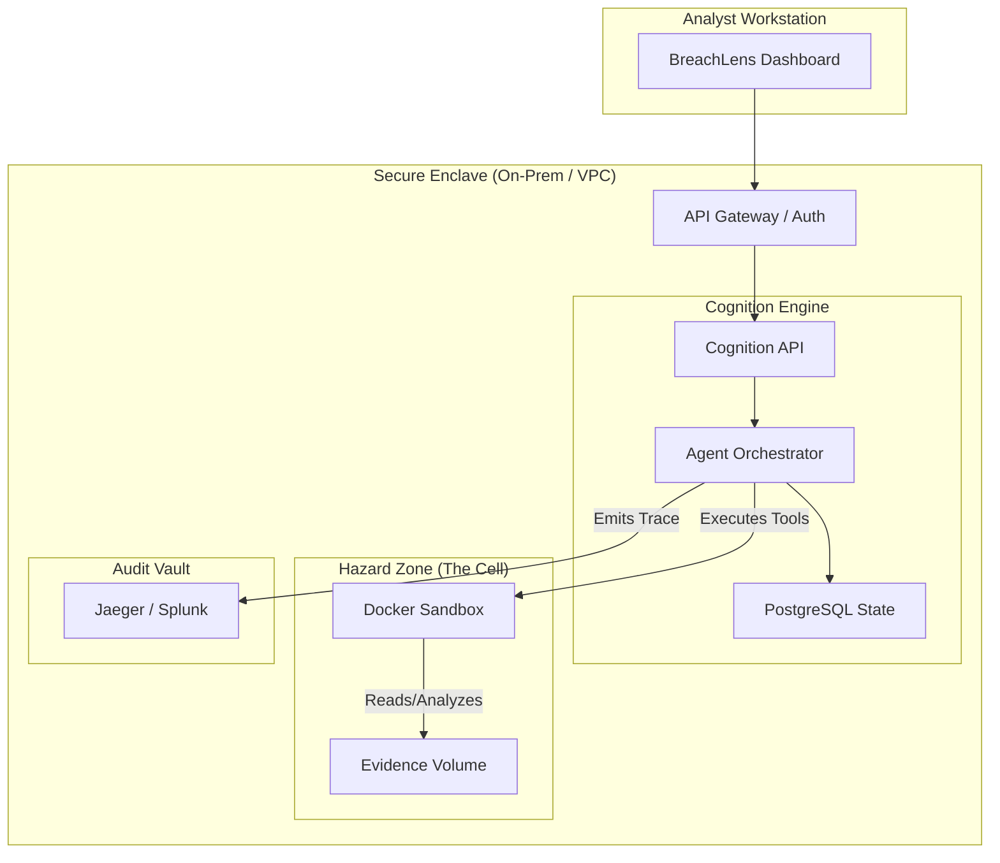

# Blueprint: Secure Security Investigation Platform

> **Codename: "BreachLens"**

This blueprint demonstrates how to use the Cognition Agent Substrate to build a production-grade Cyber Security Investigation Platform.

## The Challenge

A Security Operations Center (SOC) team needs to investigate potential breaches. This involves analyzing raw access logs, inspecting suspicious binaries, and querying internal databases.

**The Hard Requirements:**
1.  **Safety:** Malware analysis must happen in a completely isolated environment (Sandbox).
2.  **Privacy:** Sensitive logs cannot leave the premise or be sent to public LLM APIs.
3.  **Audit:** Every action taken by the AI must be logged for compliance and review.

## The Solution: BreachLens

BreachLens is a custom web application built on top of Cognition. It allows analysts to assign "Cases" to AI agents, which then perform the heavy lifting of data analysis in a secure environment.

### High-Level Architecture



### Key Components

#### 1. The Hazard Zone (Docker Sandbox)
BreachLens uses Cognition's **Docker Sandbox Backend**.
*   **Isolation:** Each investigation runs in a fresh, ephemeral Docker container.
*   **Tooling:** The container image (`breachlens-agent:latest`) is pre-loaded with security analysis tools: `yara`, `grep`, `jq`, `python`, `wireshark-cli`.
*   **Data Access:** The "Evidence" (logs, binaries) is mounted as a read-only volume at `/mnt/evidence`. The agent can read, but cannot alter the original evidence (preserving integrity).

#### 2. The Private Intelligence (Local LLM)
To satisfy privacy requirements, Cognition is configured to use a local inference endpoint (e.g., vLLM hosting Llama 3 or a fine-tuned security model).
*   **Config:** `COGNITION_LLM_PROVIDER=openai_compatible`
*   **Result:** No data ever leaves the VPC.

#### 3. The Audit Trail
Every step of the investigation is recorded via OpenTelemetry (OTLP).
*   **Analyst:** "Scan the evidence volume for IOCs related to Log4Shell."
*   **Agent Trace:**
    1.  *Thought:* "I need to search for JNDI strings."
    2.  *Tool Call:* `execute("grep -r 'jndi:ldap' /mnt/evidence")`
    3.  *Tool Result:* `Found matches in access.log:204`
    4.  *Action:* Flagged as critical.
*   **Benefit:** The trace serves as an automated, immutable log of exactly how the conclusion was reached, supporting compliance and review processes.

## User Workflow

1.  **Ingest:** Analyst uploads a 5GB `access.log` to the Evidence Volume.
2.  **Initialize:** Analyst creates a new Session in BreachLens: "Case #402 - Log Analysis".
3.  **Instruct:** Analyst prompts: "Analyze the logs for SQL injection patterns."
4.  **Execute:**
    *   Cognition spins up a Sandbox.
    *   Agent generates Python scripts to parse the logs (much faster than a human manually grepping).
    *   Agent executes the script in the Sandbox.
5.  **Report:** Agent summarizes findings. Analyst reviews the raw output in the dashboard (streamed via SSE).
6.  **Close:** Session state is persisted to PostgreSQL. Sandbox is destroyed.

## Implementation Guide

### 1. Engine Configuration
Configure Cognition to use the Docker backend and a private LLM.

```yaml
# .cognition/config.yaml
server:
  host: 0.0.0.0
  port: 8000

llm:
  provider: openai_compatible
  base_url: "http://vllm-service:8000/v1"
  model: "meta-llama/Meta-Llama-3-70B-Instruct"

workspace:
  root: /var/lib/cognition/evidence
```

### 2. Sandbox Setup
Ensure your Docker environment mounts the evidence correctly.

```yaml
# docker-compose.yml
services:
  cognition:
    image: cognition:latest
    volumes:
      - ./evidence:/mnt/evidence:ro  # Read-only mount
      - /var/run/docker.sock:/var/run/docker.sock
```

### 3. API Integration
The BreachLens frontend drives the investigation via simple REST calls.

```javascript
// Start Investigation
const session = await api.post('/sessions', {
  title: 'Case #402',
  system_prompt: 'You are a Senior Security Analyst. You verify facts before reporting.'
});

// Send Instruction
const stream = api.stream(`/sessions/${session.id}/messages`, {
  content: 'Check /mnt/evidence/access.log for 404 errors spike.'
});

// Render Stream
stream.on('tool_call', (tool) => {
  console.log(`Agent is running: ${tool.name} ${tool.args}`);
  // Display "Scanning logs..." in UI
});
```

## Why Cognition?

Building this platform from scratch would require:
1.  Writing a secure Docker orchestration layer.
2.  Implementing a streaming agent protocol.
3.  Building a persistent memory system.
4.  integrating observability.

With **Cognition**, you get all of this as a deployable infrastructure. You focus on the **Investigation Logic** and **User Experience**; Cognition handles the **Runtime**.
