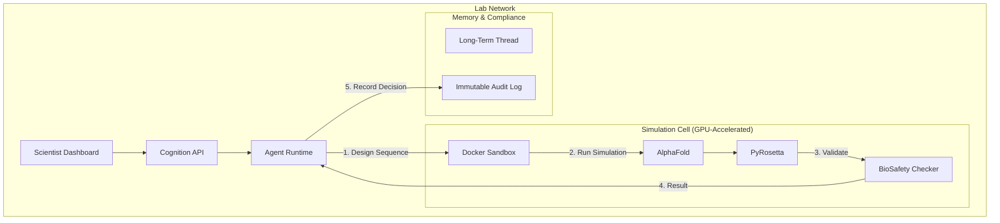

# Blueprint: Biological Foundry ("GeneSmith")

> **Use Case: Synthetic Biology & Drug Discovery**

This blueprint demonstrates using the Cognition Substrate to power an autonomous platform for designing, simulating, and validating novel protein structures.

## The Challenge

BioTech R&D is shifting from "Discovery" to "Engineering." Scientists need tools that can not only suggest molecules but **validate** them using complex simulation pipelines (AlphaFold, PyRosetta, Gromacs) while maintaining strict bio-safety protocols.

**The Hard Requirements:**
1.  **Computational Hazard:** Simulation tools are computationally heavy and often run arbitrary user scripts. They must be isolated.
2.  **Bio-Safety (Safety Rails):** The AI must be physically prevented from synthesizing or outputting sequences matching known pathogens.
3.  **Regulatory Audit:** The exact sequence of decisions ("Why did we pursue Candidate X?") must be preserved for 10+ years for FDA filing.

## The Solution: GeneSmith

GeneSmith is a "Computational Wet Lab" built on Cognition.

### Architecture

### Key Components

#### 1. The Simulation Cell (GPU Sandbox)
GeneSmith uses a specialized **Docker Cell** image pre-loaded with bioinformatics libraries.
*   **Capabilities:** The Cell mounts NVIDIA GPU drivers, allowing the Agent to run CUDA-accelerated folding simulations.
*   **The Safety Valve:** A custom "Egress Filter" tool is baked into the image. Before any sequence string leaves the sandbox (via `stdout` or file), it is regex-matched against a database of restricted sequences.

#### 2. The Multi-Week Thread
Drug discovery is slow. A single "Session" might last 3 weeks.
*   **Day 1:** Agent generates 10,000 candidates.
*   **Day 2-5:** Agent runs simulations in batches (Cognition's persistence handles server restarts/updates during this time).
*   **Day 14:** Scientist reviews the top 5 candidates.
*   **Day 20:** Agent formats the data for the physical synthesizer.

#### 3. The FDA Trace
Years later, during clinical trials, regulators ask: "Is this molecule derivative of [Competitor Drug]?"
*   **The Answer:** You pull the **Trace**. It shows the Agent accessed public PDB files (Source A) and applied a specific mutation algorithm (Logic B), proving independent discovery.

### Example Workflow

1.  **Scientist:** "Design a variant of Enzyme X that is stable at 80°C."
2.  **Agent (Planning):** "I will fetch the PDB structure, identify flexible regions, and perform single-point mutations on those regions."
3.  **Execution (The Cell):**
    *   `fetch_pdb("1XYZ")`
    *   `run_rosetta_ddg(mutations=["A123C", "T45G"])`
    *   *...Agent loops this 500 times...*
4.  **Result:** "I found 3 variants with predicted ΔΔG < -2.0 kcal/mol."

## Why Cognition?

*   **State:** Handling a 3-week simulation loop requires robust persistence, not a fragile chat script.
*   **Security:** Running community-sourced Python simulation scripts is dangerous; the Sandbox makes it safe.
