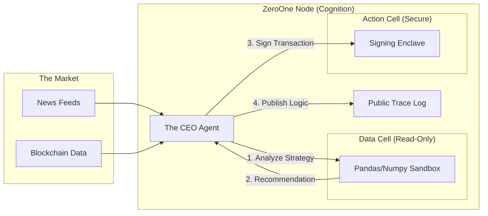

# Blueprint: The Algorithmic CEO ("ZeroOne")

> **Use Case: Autonomous Finance (DeFi / DAO)**

This blueprint demonstrates using the Cognition Substrate to power a "Headless Organization" or DAO that manages capital without human intervention.

## The Challenge

Decentralized Autonomous Organizations (DAOs) traditionally rely on static Smart Contracts. But contracts cannot read news, interpret sentiment, or adapt to black swan events. They need an "Active Intelligence."

**The Hard Requirements:**
1.  **Execution Integrity:** The Agent controls real money (Private Keys). The execution environment must be hardened against key leakage.
2.  **Rational Transparency:** Investors need to know *why* a trade was made. "Black box" AI trading is unacceptable for governance.
3.  **Complex Logic:** The Agent needs to run Python data science libraries (Pandas, Scikit-learn) to analyze market trends before acting.

## The Solution: ZeroOne

ZeroOne is a Cognition-powered platform where the "CEO" is a persistent Agent session tasked with maximizing treasury yield.

### Architecture

### Key Components

#### 1. Dual-Cell Architecture
ZeroOne uses two different Cell configurations for maximum security:
*   **The Analyst Cell (Low Trust):** A standard Docker Sandbox with internet access to download and crunch massive datasets using Python.
*   **The Signer Cell (High Trust):** A locked-down, network-isolated Cell that contains the Wallet Private Key. It accepts a transaction object, verifies it matches the Agent's intent, signs it, and returns the signature. It *never* exposes the key to the Agent or the Analyst Cell.

#### 2. The Logic Log (Public Trace)
Unlike traditional hedge funds, ZeroOne publishes its **Trace** to IPFS (InterPlanetary File System).
*   Investors can view the `Trace` to see:
    *   *Input:* "Detected 15% drop in ETH price."
    *   *Reasoning:* "RSI indicates oversold. Sentiment analysis of 'CryptoTwitter' is neutral. Executing 'Buy the Dip' strategy."
    *   *Action:* Transaction Hash.

#### 3. Persistence as Governance
The **Thread** is the governance record. The Agent remembers previous votes, strategy shifts, and long-term goals (e.g., "Reduce volatility exposure by Q3").

### Example Workflow

1.  **Trigger:** A scheduled Cron job wakes the Agent.
2.  **Ingest:** Agent scrapes financial news and on-chain liquidity metrics.
3.  **Simulate:** Agent uses the **Analyst Cell** to backtest a rebalancing strategy against the last 24h of data. Result: "Projected +0.5% yield."
4.  **Decide:** Agent decides to swap USDC for WBTC.
5.  **Execute:** Agent constructs the transaction payload and sends it to the **Signer Cell**.
6.  **Sign:** The Signer Cell signs and broadcasts.
7.  **Publish:** The entire Trace is hashed and pinned to the DAO's governance dashboard.

## Why Cognition?

*   **Security:** Separating the "Thinking" (Analyst Cell) from the "Signing" (Signer Cell) is a critical security pattern that Cognition's flexible backend architecture enables.
*   **Audit:** The OTLP Trace becomes the "Annual Report," generated automatically every second.
