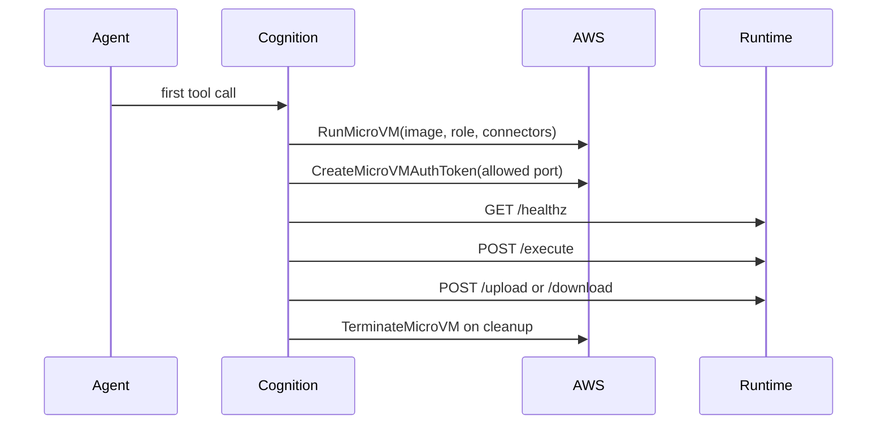

# AWS Lambda MicroVM Sandbox

The `aws_lambda_microvm` sandbox backend runs agent shell work inside AWS
Lambda MicroVMs. It is intended for builders who want stronger isolation than a
local process and an AWS-native alternative to Docker or Kubernetes sandboxes.

This backend is definition-driven: agents select a named sandbox profile and,
optionally, a trusted IAM execution role. The model never chooses image ARNs,
IAM roles, network connectors, or auth tokens through tool arguments.

## Architecture

```mermaid
flowchart TD
    A[AgentDefinition] -->|sandbox_profile| B[ConfigStore SandboxProfile]
    A -->|sandbox_execution_role_arn| C[Trusted role selector]
    B --> D[CognitionAwsLambdaMicroVmSandboxBackend]
    C --> D
    D --> E[langchain-aws-lambda-microvms]
    E -->|RunMicroVM| F[AWS Lambda MicroVM]
    E -->|CreateMicroVMAuthToken| G[AWS proxy token in memory]
    E -->|HTTPS with proxy headers| H[Runtime command server]
    H --> I[/execute /upload /download]
```

The implementation is split in two layers:

| Layer | Responsibility |
|---|---|
| Cognition wrapper | Resolves trusted profile and role config, protects `.cognition/`, exposes token-free lifecycle metadata |
| `langchain-aws-lambda-microvms` package | Implements the Deep Agents sandbox protocol against the Lambda MicroVM APIs and runtime command server |

Cognition v1 consumes prebuilt Lambda MicroVM image ARNs. Cognition does not
create, update, publish, or mutate MicroVM images.

## Sandbox Profiles

A `SandboxProfile` is builder-managed configuration for a class of MicroVM
sandbox. Profiles can be seeded from `.cognition/config.yaml` or managed at
runtime with `/sandbox/profiles`.

```yaml
sandbox_profiles:
  default-lambda:
    backend: aws_lambda_microvm
    image_arn: arn:aws:lambda:us-west-2:123456789012:microvm-image:cognition-runtime
    image_version: "1.0"
    region: us-west-2
    egress_mode: internet
    maximum_duration_seconds: 3600
    port: 8080
    token_expiration_minutes: 30
    default_execution_role_arn: arn:aws:iam::123456789012:role/cognition-agent-runtime
    idle_policy:
      max_idle_duration_seconds: 900
      suspended_duration_seconds: 300
      auto_resume_enabled: true
    logging:
      disabled: {}
    quota:
      max_concurrent_sessions: 10
      max_session_starts_per_minute: 30
```

| Field | Purpose |
|---|---|
| `name` | Stable profile selector used by agents |
| `backend` | Must be `aws_lambda_microvm` |
| `image_arn` | Prebuilt Lambda MicroVM image ARN |
| `image_version` | Optional image version |
| `region` | AWS region; defaults to the ARN region when omitted |
| `ingress_network_connector_arns` | Optional ingress connector ARNs; defaults to AWS managed `ALL_INGRESS` |
| `egress_mode` | `internet` or `vpc` |
| `egress_network_connector_arns` | Required when `egress_mode` is `vpc`; optional for `internet` |
| `idle_policy` | Optional Lambda MicroVM idle and suspend policy |
| `logging` | Optional Lambda MicroVM logging config; use `disabled: {}` or `cloud_watch` |
| `quota` | Optional Cognition-side profile/scope quota policy |
| `run_hook_payload` | Optional payload for the image `/run` lifecycle hook |
| `maximum_duration_seconds` | Maximum MicroVM lifetime, up to 28800 seconds |
| `port` | Runtime command server port inside the MicroVM |
| `token_expiration_minutes` | Proxy auth token lifetime requested by Cognition |
| `default_execution_role_arn` | IAM role used when an agent does not specify one |
| `scope` | Builder-defined scope used by the ConfigStore |

When `egress_mode` is `internet`, Cognition uses the AWS managed
`INTERNET_EGRESS` connector by default. When `egress_mode` is `vpc`, the
profile must provide explicit egress network connector ARNs.

Cost-sensitive profile fields are `maximum_duration_seconds`, `idle_policy`,
`logging`, `quota`, and network connector selection. `quota` is enforced by
Cognition per profile and effective-scope fingerprint; it can cap concurrent
sandbox sessions and new session starts per minute before Cognition attempts
more AWS work. Disable runtime logging by default unless you need CloudWatch
logs for investigation, because noisy command output can create CloudWatch
ingestion and retention cost. For CloudWatch logging:

```yaml
logging:
  cloud_watch:
    log_group: /aws/lambda-microvms/cognition
    log_stream: repo-maintainer
```

## Per-Agent IAM Role Assignment

Agents can select both a profile and an IAM execution role:

```yaml
agents:
  - name: repo-maintainer
    system_prompt: "You maintain Python repositories."
    sandbox_profile: default-lambda
    sandbox_execution_role_arn: arn:aws:iam::123456789012:role/repo-maintainer-runtime
```

Role resolution is intentionally narrow:

1. Use `agent.config.sandbox_execution_role_arn` when present.
2. Otherwise use `SandboxProfile.default_execution_role_arn`.
3. Otherwise launch without an explicit execution role.

`executionRoleArn` is resolved only from trusted agent/profile config. It is
never accepted from model output, tool-call arguments, or runtime command
payloads.

## Runtime Command Server

The MicroVM image must run a small HTTP command server on the profile `port`.
Cognition speaks this protocol through AWS's proxy-authenticated endpoint.

Required routes:

| Route | Purpose |
|---|---|
| `GET /healthz` | Confirm the runtime is ready before command execution |
| `POST /execute` | Run a command; Cognition sends `["sh", "-c", command]` |
| `POST /upload` | Upload workspace files |
| `GET` or `POST /download` | Download workspace files |
| AWS lifecycle hooks | Optional hooks for ready, validate, run, resume, suspend, terminate |

The command server does not need application-level auth if it is only exposed
through the Lambda MicroVM proxy. Cognition requests proxy auth tokens at
runtime, keeps them in memory, and sends them as AWS proxy headers.

## Lifecycle



MicroVMs are lazy-created on the first sandbox operation. Conversation-only
turns do not launch a MicroVM.

## Security Model

The MicroVM backend is an infrastructure isolation boundary, not an
authorization system. Builders still own gateway authentication, policy, and
which agents may select which roles.

Important controls:

- The image ARN, network connectors, and execution role come from trusted
  `SandboxProfile` and `AgentDefinition` config.
- Proxy auth tokens are never persisted and are not included in logs, SSE
  events, or runtime metadata.
- Persisted sandbox metadata stores a role fingerprint, not the role ARN token
  or credentials.
- `.cognition/` remains protected from agent write/edit operations.
- Cognition's control-plane IAM identity must only be allowed to pass approved
  execution roles and approved network connectors.

## Observability

The backend emits `sandbox_lifecycle` events. For Lambda MicroVM sandboxes,
lifecycle metadata includes:

- `microvm_id`
- `endpoint`
- `profile`
- `image`
- `image_version`
- `status`
- `region`
- `port`
- `maximum_duration_seconds`
- `logging_mode`
- `quota`
- `execution_role_fingerprint`
- `correlation` with session id, run id, agent name, profile, scope keys, and a
  scope fingerprint

Auth tokens are filtered before events are streamed or persisted.

## Related

- [AWS Lambda MicroVM setup guide](../guides/aws-lambda-microvm-sandbox.md)
- [Configuration Reference](../guides/configuration.md#sandbox-execution)
- [API Reference](../guides/api-reference.md#sandbox-profiles)
- [Security](./security.md)
