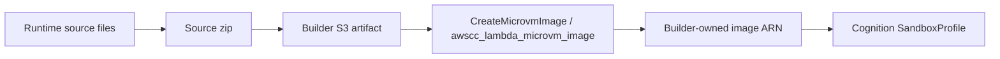

# Lambda MicroVM Default Runtime Image

Cognition provides a default Lambda MicroVM runtime source example for builders
who need a starting image for the `aws_lambda_microvm` sandbox backend.

This is similar in purpose to the `cognition-sandbox` container image, but AWS
Lambda MicroVMs use builder-owned image resources. Cognition provides runtime
source; the builder packages it, creates the image in their AWS account, and
uses the resulting image ARN in a `SandboxProfile`.

## Build Flow



The example at
[`examples/aws-lambda-microvm-default-runtime`](https://github.com/CognicellAI/Cognition/tree/main/examples/aws-lambda-microvm-default-runtime)
contains the runtime source, packaging script, and Terraform.

## Zipped Runtime Files

The runtime zip contains only files needed by AWS to build the MicroVM image.

| File | Purpose |
|---|---|
| `Dockerfile` | Builds the MicroVM application layer, installs baseline tools, creates `/workspace`, and starts the command server. |
| `server.py` | Implements `/healthz`, `/execute`, `/upload`, `/download`, and lifecycle hook acknowledgements. |
| `README.md` | Documents the runtime source for builders. It is included for inspection and is not used by Cognition at runtime. |

The source files are intentionally commented so builders can inspect, fork, and
harden the runtime before building their own image.

## Terraform Outputs

After packaging the runtime and applying the example Terraform, builders use:

```bash
terraform output microvm_image_arn
terraform output microvm_image_version
terraform output -raw sandbox_profiles_yaml
```

The generated YAML can be copied into `.cognition/config.yaml` or registered
with `/sandbox/profiles`.

## Builder Ownership

Cognition does not create or mutate Lambda MicroVM images at runtime. Builders
own:

- the artifact bucket used for image source zips
- the image build role
- the Lambda MicroVM image ARN and versions
- runtime dependency patching and security hardening
- any extra CLIs, language runtimes, or observability agents in the image

Cognition owns consuming the image ARN, launching MicroVMs from the selected
profile, creating in-memory proxy auth tokens, and emitting token-free lifecycle
metadata.

## Runtime Contract

The default runtime listens on port `8080` and uses `/workspace` as the writable
workspace root. It exposes:

- `GET /healthz`
- `POST /execute`
- `POST /upload`
- `GET` and `POST /download`
- AWS Lambda MicroVM lifecycle hook endpoints

The command server has no application-level public auth. Cognition reaches it
through the AWS Lambda MicroVM proxy with short-lived proxy auth tokens.

## Related

- [Setup](./setup.md)
- [Runtime Command Server](./runtime-command-server.md)
- [Sandbox Profiles](./profiles.md)
- [Troubleshooting](./troubleshooting.md)
- [AWS MicroVM images](https://docs.aws.amazon.com/lambda/latest/dg/microvms-images.html)
- [CreateMicrovmImage API](https://docs.aws.amazon.com/lambda/latest/microvm-api/API_CreateMicrovmImage.html)
