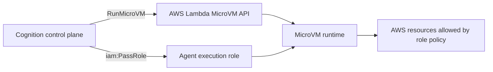
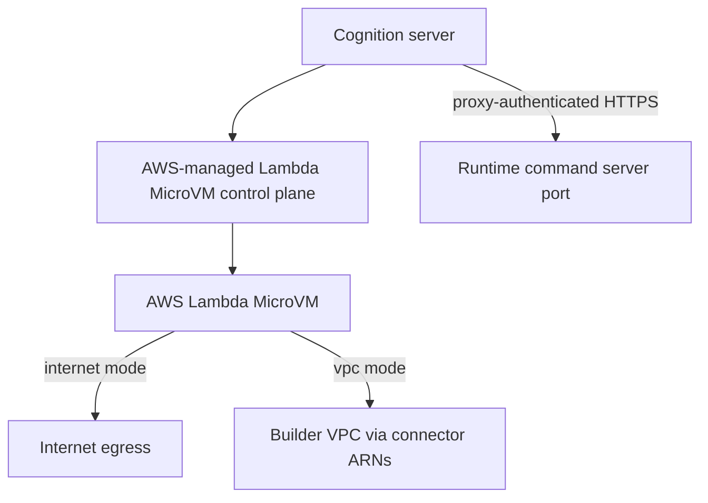

# Lambda MicroVM IAM and Networking

Lambda MicroVM sandboxing separates the Cognition control plane from the
sandbox execution role. Cognition launches and manages the MicroVM; the MicroVM
uses its assigned execution role when agent tools interact with AWS resources.

## IAM Roles

Role resolution is intentionally narrow:

1. Use `agent.config.sandbox_execution_role_arn` when present.
2. Otherwise use `SandboxProfile.default_execution_role_arn`.
3. Otherwise launch without an explicit execution role.

`executionRoleArn` is resolved only from trusted agent/profile config. It is
never accepted from model output, tool-call arguments, or runtime command
payloads.

## Control Plane Permissions

The AWS identity running Cognition needs permission to:

- run, inspect, and terminate approved MicroVMs
- create MicroVM proxy auth tokens for approved MicroVMs and ports
- pass only approved execution roles with `iam:PassRole`
- use approved Lambda Network Connector ARNs when VPC egress is configured

Keep `iam:PassRole` scoped to the roles agents are allowed to use.

## Networking Model

Egress follows AWS defaults:

| Mode | Behavior |
|---|---|
| `internet` | Uses AWS-managed internet egress by default |
| `vpc` | Requires explicit `egress_network_connector_arns` |

Ingress is normally not public like a Lambda Function URL. Cognition talks to
the runtime command server through AWS's proxy-authenticated MicroVM endpoint.
Builders can keep application traffic private and avoid exposing the command
server directly.

## No-Ingress Benefit

No-ingress designs reduce the exposed attack surface:

- runtime command server ports are not public application endpoints
- callers need AWS control-plane authorization and short-lived proxy tokens
- builders can keep data-plane access inside AWS networking policy
- Cognition can stream token-free lifecycle metadata without persisting runtime
  credentials

## Related

- [Sandbox Profiles](./profiles.md)
- [Runtime Command Server](./runtime-command-server.md)
- [Security](../../security.md#aws-lambda-microvm-isolation)
