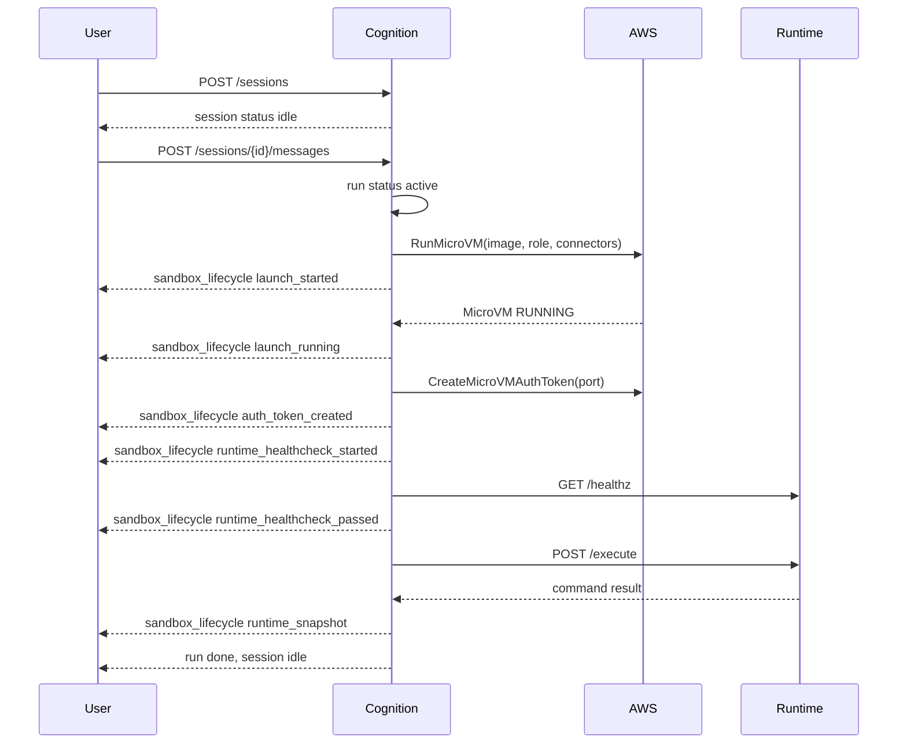

# Lambda MicroVM Lifecycle and Observability

Lambda MicroVM sandboxes are provisioned lazily. Conversation-only turns do not
launch a MicroVM; the first command or file operation does.

## Lifecycle

The session remains reusable after a successful run. If the user returns later,
the next message creates a new run on the same session and thread. Within the
same Cognition process, agent construction reuses the owned backend only when
the exact trusted scope, agent and resolved sandbox configuration match. This
includes the workspace path, image/version, execution role, network settings and
builder profile payload. A changed configuration requires confirmed teardown
before replacement. Model or prompt changes alone do not invalidate the sandbox.

Acquisition remains lazy. Reuse emits a `reused` lifecycle event and does not
consume another sandbox-start quota reservation. Readiness retries continue on
the existing allocation rather than launching a second VM. AWS idle/resume
behavior remains governed by the builder's profile. An expired or terminal VM
must be released before a fresh backend can replace it; this change does not add
automatic recovery from every provider-side failure.

## Cleanup Triggers

Cognition attempts sandbox release on:

- explicit session deletion or cancellation
- session-service cache eviction
- graceful server shutdown
- API failure/abort paths that request backend cleanup

Successful run completion does not automatically terminate the sandbox. When
Cognition releases a Lambda MicroVM sandbox, it calls `TerminateMicrovm`, polls
`GetMicrovm` for a bounded period, and then emits the observed teardown result.
Cognition does not run a separate MicroVM controller or expose AWS cleanup
actions to end users.

Pending or failed teardown retains the backend handle and quota reservation.
Replacement is blocked until a later release confirms termination. Session
deletion returns HTTP 409 while teardown is unconfirmed and keeps the session
record for retry. A failed task alone does not authorize another allocation.
Once release starts, the MicroVM wrapper and SDK reject subsequent execution
through that handle; teardown itself can be retried.

Ownership is currently process-local. Graceful shutdown attempts cleanup and
logs unconfirmed resources, but cannot guarantee cleanup after process death.
Production operators still need durable ownership/reconciliation across replicas
and a mechanism that prevents an obsolete sandbox from writing the builder's
workspace. Session affinity alone does not solve crash recovery. Do not treat
this reuse fix as distributed writer fencing or automatic VM adoption after a
restart. S3 Files mount and workspace authorization remain builder-owned.

## Lifecycle Events

The backend emits `sandbox_lifecycle` events. Lambda MicroVM phases are:

- `launch_started`
- `launch_running`
- `auth_token_created`
- `runtime_healthcheck_started`
- `runtime_healthcheck_passed`
- `runtime_snapshot`
- `reused`
- `teardown_started`
- `teardown_complete`
- `teardown_pending`
- `teardown_failed`

`teardown_complete` means AWS confirmed `TERMINATED`, or no VM was ever allocated.
`teardown_pending` means
Cognition requested termination but AWS had not reported a terminal state before
the bounded poll window ended. It retains Cognition-side quota.
`teardown_failed` means the AWS control-plane call or verification failed; that
also retains ownership and quota. Operators should reconcile the resource and
retry cleanup rather than assuming the requested termination succeeded.

Lambda MicroVM metadata includes:

- `microvm_id`
- `endpoint`
- `profile`
- `image`
- `image_version`
- `status`
- `aws_state`
- `region`
- `port`
- `maximum_duration_seconds`
- `logging_mode`
- `quota`
- `execution_role_fingerprint`
- `launch_duration_ms`
- `healthcheck_duration_ms`
- `teardown_duration_ms`
- `teardown_status`
- `correlation` with session id, run id, agent name, profile, scope keys, and a
  scope fingerprint

Proxy auth tokens and credentials are filtered before lifecycle events are
streamed or persisted.

## Cost Visibility

Cognition exposes profile settings and lifecycle snapshots. AWS remains the
source of truth for provider-side billing, CloudWatch logs, and MicroVM service
metrics. Use both:

- Cognition events to correlate agent/session/run behavior
- AWS metrics and logs to inspect service-side runtime cost and failures

## Related

- [Sandbox Profiles](./profiles.md)
- [Troubleshooting](./troubleshooting.md)
- [Observability](../../observability.md)
