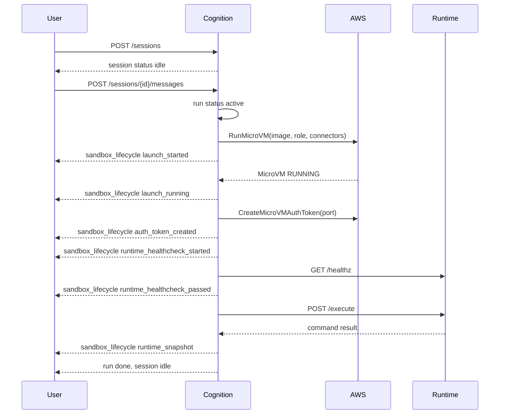

# Lambda MicroVM Lifecycle and Observability

Lambda MicroVM sandboxes are provisioned lazily. Conversation-only turns do not
launch a MicroVM; the first command or file operation does.

## Lifecycle

The session remains reusable after a successful run. If the user returns later,
the next message creates a new run on the same session and thread. The live
MicroVM may still be warm, suspended, or already released by policy; Cognition
should provision as needed when the next sandbox tool call occurs.

## Cleanup Triggers

Cognition releases sandbox resources when the session is:

- deleted
- aborted
- failed
- expired
- otherwise explicitly cleaned up by the backend lifecycle

Successful run completion does not automatically terminate the sandbox. When
Cognition releases a Lambda MicroVM sandbox, it calls `TerminateMicrovm`, polls
`GetMicrovm` for a bounded period, and then emits the observed teardown result.
Cognition does not run a separate MicroVM controller or expose AWS cleanup
actions to end users.

## Lifecycle Events

The backend emits `sandbox_lifecycle` events. Lambda MicroVM phases are:

- `launch_started`
- `launch_running`
- `auth_token_created`
- `runtime_healthcheck_started`
- `runtime_healthcheck_passed`
- `runtime_snapshot`
- `teardown_started`
- `teardown_complete`
- `teardown_pending`
- `teardown_failed`

`teardown_complete` means AWS confirmed `TERMINATED`. `teardown_pending` means
Cognition requested termination but AWS had not reported a terminal state before
the bounded poll window ended. It frees Cognition-side quota and is operator
telemetry, not a user action. `teardown_failed` means the AWS control-plane call
or verification failed.

Lambda MicroVM metadata includes:

- `microvm_id`
- `endpoint`
- `profile`
- `image`
- `image_version`
- `status`
- `aws_state`
- `region`
- `port`
- `maximum_duration_seconds`
- `logging_mode`
- `quota`
- `execution_role_fingerprint`
- `launch_duration_ms`
- `healthcheck_duration_ms`
- `teardown_duration_ms`
- `teardown_status`
- `correlation` with session id, run id, agent name, profile, scope keys, and a
  scope fingerprint

Proxy auth tokens and credentials are filtered before lifecycle events are
streamed or persisted.

## Cost Visibility

Cognition exposes profile settings and lifecycle snapshots. AWS remains the
source of truth for provider-side billing, CloudWatch logs, and MicroVM service
metrics. Use both:

- Cognition events to correlate agent/session/run behavior
- AWS metrics and logs to inspect service-side runtime cost and failures

## Related

- [Sandbox Profiles](./profiles.md)
- [Troubleshooting](./troubleshooting.md)
- [Observability](../../observability.md)
