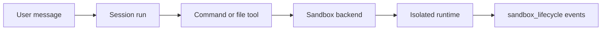

# Sandboxes

Cognition sandboxes isolate agent command execution from the API process.
Agents can reason, stream, and persist messages without a sandbox; a sandbox is
created only when the agent uses a command or file tool that needs an execution
environment.

Sandboxes are session-scoped. A successful message run returns the session to
`idle`, but the sandbox may remain available for follow-up work in that same
conversation. Cleanup happens when the session is deleted, aborted, failed,
expired, or when the selected backend's own idle and lifetime policy releases
resources.

## Backend Choices

| Backend | Best for | Isolation boundary |
|---|---|---|
| [`local`](./local/index.md) | Local development and trusted single-user use | Cognition process user with protected-path guards |
| [`docker`](./docker/index.md) | Local or VM deployments with container isolation | Container per session |
| [`kubernetes`](./kubernetes/index.md) | K8s deployments without Docker socket access | Sandbox pod per session |
| [`aws_lambda_microvm`](./aws-lambda-microvm/index.md) | AWS-native production isolation with per-agent IAM roles | AWS Lambda MicroVM per sandbox runtime |

## Common Model

Every backend follows the same user-facing contract:

- agents select a sandbox through trusted configuration, not model output
- protected Cognition control files remain guarded
- command and file operations emit observable tool and sandbox lifecycle events
- durable session state is separate from live sandbox process lifetime

## Related

- [Storage & Execution](../storage-and-execution.md)
- [Security](../security.md#sandbox-isolation)
- [Configuration](../../guides/configuration.md#sandbox-execution)
- [API Reference](../../guides/api-reference.md#sandbox-profiles)
