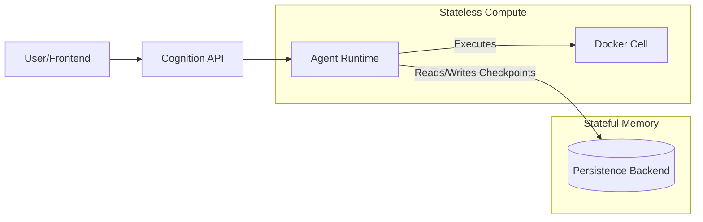

# Session Persistence ("The Thread")

> **Intelligence requires Memory.**

A "Chatbot" has a short memory; if the server restarts, the conversation dies.
A "Platform" requires long-running, resilient workflows that can span days or weeks.

Cognition implements **"The Thread"**—a continuous, stateful execution log that persists independently of the compute layer.

## The Architecture of State

Cognition separates **State** (The Thread) from **Compute** (The Cell).



This separation allows for:
1.  **Resilience:** You can redeploy the Cognition Engine (update the container) in the middle of a 24-hour job. The new container will load the Thread from the DB and resume exactly where the old one left off.
2.  **Scalability:** Since agents are stateless, you can run 10 Cognition nodes behind a load balancer. Any node can handle the next step of any Thread.

## Unified StorageBackend Protocol

Cognition implements a unified storage protocol that abstracts sessions, messages, and checkpoints behind a single interface.

```
StorageBackend (Protocol)
├── SessionStore - Session metadata and scoping
├── MessageStore - Message history with pagination  
└── Checkpointer - LangGraph checkpoint persistence
```

### Pluggable Backends

Swap the storage engine based on your deployment scale:

### 1. SQLite Backend (Local / Single-Node)
**Best for:** Dev, Edge, Air-Gapped Single Server.

*   **Config:** `COGNITION_PERSISTENCE_BACKEND=sqlite`
*   **Mechanism:** Stores state in a `.cognition/state.db` file within the Workspace volume.
*   **Benefit:** Zero external dependencies. "Git-style" portability (copy the folder, copy the memory).
*   **Tables:** `sessions`, `messages`, `checkpoints`

### 2. PostgreSQL Backend (Cloud / Scale)
**Best for:** Production Platforms, Kubernetes.

*   **Config:** `COGNITION_PERSISTENCE_BACKEND=postgres`
*   **Mechanism:** Connects to an external Postgres database (e.g., RDS, Supabase).
*   **Benefit:** High concurrency, centralized backup, allows horizontal scaling of the Agent Runtime.
*   **Connection Pooling:** Uses `asyncpg` with connection pooling for high throughput.

### 3. Memory Backend (Testing)
**Best for:** Unit tests, ephemeral workloads.

*   **Config:** `COGNITION_PERSISTENCE_BACKEND=memory`
*   **Mechanism:** In-memory storage (no persistence).
*   **Benefit:** Fast, no cleanup required. Sessions lost on restart.

## Session Scoping (Multi-Tenancy)

Sessions support multi-dimensional scoping for multi-tenant deployments.

### How Scoping Works

Sessions are tagged with scope values extracted from request headers:

```
X-Cognition-Scope-User: alice
X-Cognition-Scope-Project: breachlens
```

Sessions are filtered by scope on list operations. A user can only see sessions that match their scope dimensions.

### Configuration

```yaml
scoping:
  enabled: true
  keys: ["user", "project"]
```

**Use Cases:**
- **User Isolation:** Each user sees only their sessions
- **Project Isolation:** Sessions scoped to specific projects
- **Team Isolation:** Multi-tenant platforms with team separation
- **Environment Isolation:** Separate sessions per environment (dev/staging/prod)

### Scope Matching

- Sessions are created with scope metadata
- List operations filter by the caller's scope
- Empty scope (when scoping disabled) matches all sessions
- Fail-closed: missing required headers return 403

## Message Persistence

In addition to agent checkpoints, Cognition persists all messages to the database. This ensures conversation history survives server restarts and enables pagination for long-running sessions.

### Message Schema

```sql
CREATE TABLE messages (
    id TEXT PRIMARY KEY,
    session_id TEXT NOT NULL,
    role TEXT NOT NULL,        -- 'user', 'assistant', 'system'
    content TEXT,
    parent_id TEXT,            -- For threading/replies
    created_at TEXT NOT NULL
)
```

### Features

- **Pagination:** Retrieve messages in chunks (default 50 per page)
- **Session-scoped:** Messages automatically filtered by session ID
- **Survives restarts:** All messages persisted to SQLite/Postgres
- **API access:** `GET /sessions/{id}/messages` with limit/offset

### Enriched Message Model (P2-5)

Messages include additional metadata:

```python
{
    "id": "msg-123",
    "session_id": "session-456",
    "role": "assistant",
    "content": "...",
    "tool_calls": [...],        # Tool invocations
    "tool_call_id": "...",      # ID of tool being responded to
    "token_count": 150,         # Token usage
    "model_used": "gpt-4o",     # Model that generated response
    "metadata": {...}           # Additional metadata
}
```

## Checkpointing Explained

Cognition doesn't just save "Chat History." It saves the **Full Stack Frame** of the agent (Checkpoints).

When an Agent stops to wait for user input (or a long-running tool), it saves a Checkpoint. This includes:
*   The conversation history.
*   The current variables in scope.
*   The status of the last tool execution.
*   The "Next Step" the agent was planning.

This enables **"Time Travel"** capabilities for your platform:
*   **Resume:** Continue a task after a crash.
*   **Fork:** Branch a conversation from a previous point to try a different strategy.
*   **Rewind:** "Undo" the last tool action and try again.

## Managing Sessions

The API exposes Threads as **Sessions**.

```typescript
// Create a new Thread (Session)
const session = await api.createSession({
  title: "Investigation #99"
});

// Resume an existing Thread (even after server restart)
const history = await api.getMessages(session.id);
```

## Agent Association

Sessions are associated with a specific agent definition that determines:
- System prompt and persona
- Available tools and skills
- Subagent delegation capabilities
- Human-in-the-loop configuration

### Creating Sessions with Agents

```bash
# Create with default agent
curl -X POST http://localhost:8000/sessions \
  -d '{"title": "Default Agent Session"}'

# Create with specific agent
curl -X POST http://localhost:8000/sessions \
  -d '{"title": "Code Review", "agent_name": "readonly"}'
```

### Switching Agents

You can dynamically switch the agent for an existing session:

```bash
curl -X PATCH http://localhost:8000/sessions/{session_id} \
  -d '{"agent_name": "security-auditor"}'
```

**Behavior:**
- The new agent's configuration is applied immediately
- Previous conversation history is preserved
- Subsequent messages use the new agent's system prompt and tools
- Validation ensures only valid primary agents can be used
