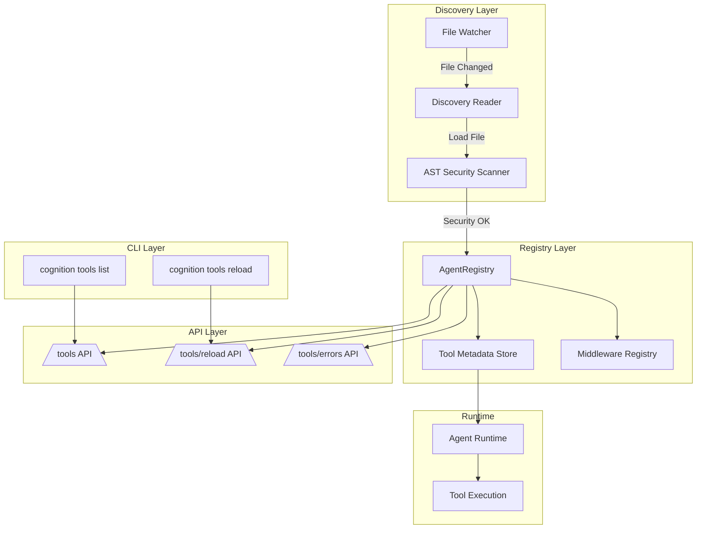
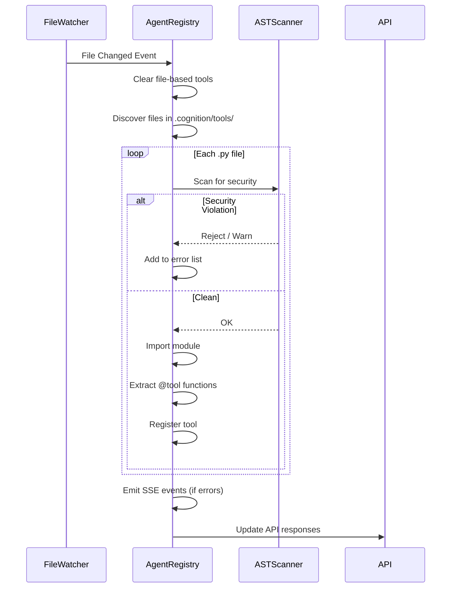
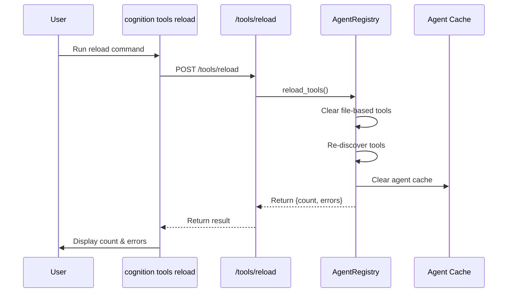

# Tool Registry Design

> **Architecture and design of the P3-TR (Tool Registry End-to-End) system.**

## Overview

The Tool Registry is a unified system for discovering, registering, and managing AI tools across the Cognition platform. It provides automatic discovery from the filesystem, hot-reloading for development, API endpoints for management, and CLI commands for administration.

## Architecture



## Components

### 1. Discovery Layer

**File Watcher (`server/app/file_watcher.py`)**
- Monitors `.cognition/tools/` directory for changes
- Triggers hot-reload on file creation/modification
- Debounced to prevent excessive reloads

**Discovery Reader (`server/app/agent_registry.py`)**
- Scans directory for `.py` files with `@tool` decorators
- Dynamically imports modules using `importlib`
- Extracts tool metadata (name, source, module)

**AST Security Scanner (`server/app/agent_registry.py`)**
- Parses tool source code before execution
- Detects banned imports (os, subprocess, socket, etc.)
- Configurable: warn mode (log) or strict mode (block)

### 2. Registry Layer

**AgentRegistry (`server/app/agent_registry.py`)**
- Singleton pattern for tool storage
- Thread-safe registration/deregistration
- Metadata storage (name, source, module, factory)
- Hot-reload capability

**Tool Metadata Store**
```python
@dataclass
class ToolRegistration:
    name: str
    factory: ToolFactory
    source: str  # 'programmatic' or file path
    module: str  # Python module path
```

**Middleware Registry**
- Stores middleware configurations
- Supports upstream middleware (tool_retry, tool_call_limit, pii, human_in_the_loop)

### 3. API Layer

**REST Endpoints (`server/app/api/routes/tools.py`)**

| Endpoint | Method | Description |
|----------|--------|-------------|
| `/tools` | GET | List all registered tools |
| `/tools/{name}` | GET | Get specific tool details |
| `/tools/errors` | GET | Get tool load errors |
| `/tools/reload` | POST | Trigger hot-reload |

**Response Schema**
```json
{
  "tools": [
    {
      "name": "file_reader",
      "source": "/workspace/.cognition/tools/file_reader.py",
      "module": "_cognition_tools_file_reader"
    }
  ],
  "count": 1
}
```

### 4. CLI Layer

**Commands**

```bash
# List all tools
cognition tools list [--host HOST] [--port PORT]

# Reload tools from disk
cognition tools reload [--host HOST] [--port PORT]

# Create new tool
cognition create tool <name>
```

### 5. Runtime Integration

**Agent Runtime (`server/app/agent/runtime.py`)**
- Resolves tool paths from AgentDefinition
- Validates trusted namespaces
- Loads tools into DeepAgents

**Tool Execution**
- Security middleware wraps tool calls
- Audit logging tracks usage
- Error handling with graceful degradation

## Security Model

### Tool Namespace Allowlist

```yaml
# config.yaml
settings:
  trusted_tool_namespaces:
    - "server.app.tools"
    - "custom.tools"
```

Only tools from these namespaces can be loaded by agents.

### AST Scanning

**Banned Modules (P3-SEC-1)**
- `os`, `subprocess`, `socket`, `ctypes`
- `sys`, `shutil`, `importlib`, `pty`
- `multiprocessing`, `threading`, `concurrent`
- `code`, `codeop`, `exec`, `eval`

**Modes**
- `warn`: Log violations, continue loading
- `strict`: Block tool load, emit error

## Data Flow

### Tool Discovery Flow



### Hot Reload Flow



## Configuration

### Directory Structure

```
.cognition/
├── tools/           # Custom tools
│   ├── file_reader.py
│   ├── git_helper.py
│   └── slack_notifier.py
├── skills/          # Reusable workflows
└── config.yaml      # Agent configuration
```

### Agent Definition

```yaml
# .cognition/config.yaml
name: production-agent
mode: primary
tools:
  - "server.app.tools.file_reader"
  - "server.app.tools.execute_command"
middleware:
  - name: tool_retry
    max_retries: 3
  - name: pii
    pii_types: [email, phone]
```

## Upstream Middleware

### Available Middleware

| Name | Description | Parameters |
|------|-------------|------------|
| `tool_retry` | Exponential backoff on failure | `max_retries`, `backoff_factor` |
| `tool_call_limit` | Enforce call limits | `run_limit`, `thread_limit` |
| `pii` | Detect/redact PII | `pii_types`, `strategy` |
| `human_in_the_loop` | Require approval | `approve_tools` |

### Middleware Resolution

```python
# Runtime resolves middleware names to classes
upstream_middleware = {
    "tool_retry": ("langchain.agents.middleware", "ToolRetryMiddleware"),
    "tool_call_limit": ("langchain.agents.middleware", "ToolCallLimitMiddleware"),
    "pii": ("langchain.agents.middleware", "PIIMiddleware"),
    "human_in_the_loop": ("langchain.agents.middleware", "HumanInTheLoopMiddleware"),
}
```

## Error Handling

### Error Types

```python
@dataclass
class ToolLoadError:
    file: str           # Source file path
    error_type: str     # SyntaxError, ImportError, SecurityError
    message: str        # Human-readable error
    timestamp: float    # Unix timestamp
```

### Error Visibility

- **API**: `GET /tools/errors` returns error list
- **CLI**: `cognition tools list` shows errors with exit code 1
- **SSE**: Tool load errors emit SSE events for UI
- **Logs**: Structured logging with file paths

## Performance Considerations

### Discovery Performance
- AST parse of 200-line file: <1ms
- File watcher uses inotify (efficient)
- Debounced reloads (500ms)

### Caching Strategy
- Agent cache invalidated on reload
- Tool metadata cached in registry
- Lazy loading of tool factories

### Scalability
- Supports 1000s of tools (metadata only loaded)
- Tool factories instantiated on-demand
- Memory-efficient for large registries

## Testing Strategy

### E2E Scenarios

See `tests/e2e/test_scenarios/p3_tools/`

- Tool discovery from filesystem
- Hot reload functionality
- API endpoint responses
- CLI command execution
- Error handling and visibility
- Security scanning
- Middleware integration

## Future Enhancements

### P4 (Extended Vision)
- Tool versioning
- Remote tool registry
- Tool marketplace
- Permission-based tool access

### Related Items
- P3-ALN: Deep Agents alignment
- P3-SEC: Security hardening
- P2-9: AgentRegistry foundation
- P2-10: File watcher
- P2-11: CLI scaffolding

## References

- [Tool Registry Implementation](../../server/app/agent_registry.py)
- [Tool API Routes](../../server/app/api/routes/tools.py)
- [Tool Creation Guide](../guides/custom-tools.md)
- [E2E Test Scenarios](../../tests/e2e/test_scenarios/p3_tools/)
- [P3-TR Roadmap](../../ROADMAP.md#p3-tr--tool-registry-end-to-end)
