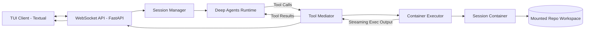
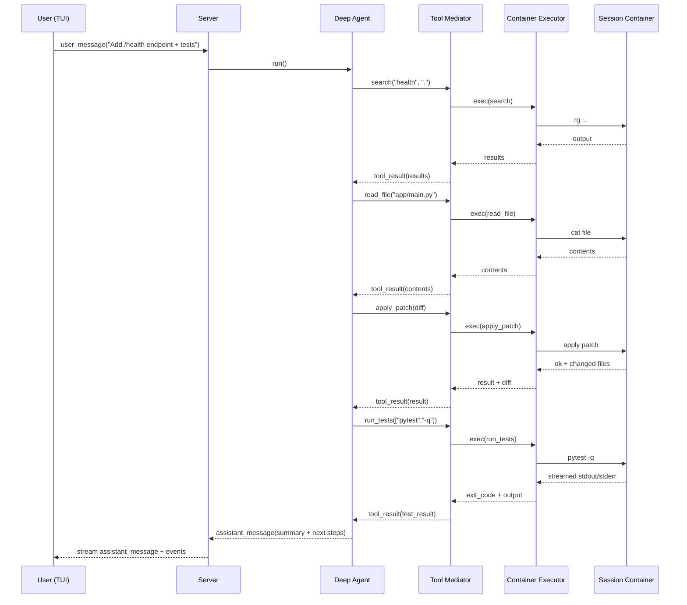

# MVP Design Doc: Python-Only OpenCode-Style Coding Agent

**Deep Agents + FastAPI WebSocket + Textual TUI + Container-per-Session Executor (Optional Network)**

---

## 1. Outcome

A usable, OpenCode-like **Python coding agent** that can:

* operate on a repo in an isolated **container per session**
* **read/search/edit via diff**, run tests, and show output live
* provide an interactive **Textual TUI** from day one
* optionally enable **network access per session** (default off)

* CRITICAL: The core of the functionality must be built upon LangGraph Deep Agents, with a clear path to adding LangGraph middleware in the future.
---

## 2. MVP Scope

### In Scope

* **Client/Server**: Textual TUI ↔ FastAPI WebSocket server
* **Deep Agents** runtime for multi-step planning + tool usage
* **Repo actions**:

  * list/read/search
  * apply patch (unified diff)
  * run tests (`pytest`)
  * git status/diff
* **Container-per-session execution**
* **Streaming UX**: tool start/output/end + assistant messages
* **Network toggle per session**:

  * default `network=OFF`
  * optional `network=ON` at session start
* Observability best practices with structured logging and error handling using Open Telemetry
* Allow implementation of LangGraph middleware in a pluggable fasion
* Allow using skills

### Out of Scope (MVP)

* Multi-tenant / auth / RBAC
* SOC2/ISO controls
* Egress allowlist networking
* Lint/typecheck pipelines (can add after)
* Git commit/push
* Distributed execution

---

## 3. MVP Decisions (Key Choices)

1. **Python repos only** (tests via `pytest`)
2. **Container per session** (reused across turns)
3. **Network default OFF** (`--network none`)
4. **Network optional ON** at session creation (visible in TUI)
5. **Edits via unified diff** using `apply_patch` (not arbitrary writes)
6. **No shell strings** for execution — argv lists only (`["pytest","-q"]`)
7. **Workspace mount**: host repo workspace mounted into container at `/workspace/repo`

---

## 4. High-Level Architecture



---

## 5. Session Model

Each session owns:

* `session_id`
* `container_id`
* `network_mode`: `OFF | ON`
* `workspace_path` (host)
* conversation history / plan context (agent memory)

Workspace structure on host:

```
workspaces/
  <session_id>/
    repo/          # checked-out code
    .agent_state/  # optional caches, notes
    tmp/
```

Mounted into container:

* `/workspace/repo` ← `workspaces/<session_id>/repo`

---

## 6. Network Modes (MVP)

### Default: Network OFF

* container started with `--network none`
* supports most coding tasks: reading/editing + running unit tests

### Optional: Network ON (session-level)

* container started with normal Docker networking (bridge or named network)
* used when user expects installs like `pip install` (future) or tests requiring external calls
* **MVP does not implement egress allowlisting**; it’s a simple on/off toggle

TUI must clearly show:

* `NETWORK: OFF` or `NETWORK: ON`

---

## 7. Action Schema (Coding Agent MVP)

The agent must only interact through these actions.

### Repo inspection

* `list_dir(path=".")`
* `read_file(path, start_line=None, end_line=None)`
* `read_files(paths[])` *(batch)*
* `search(query, path=".", max_results=50)` *(ripgrep-backed)*

### Editing

* `apply_patch(unified_diff)` *(primary edit mechanism)*

### Validation

* `run_tests(cmd=["pytest","-q"])` *(argv only)*

### Git

* `git_status()`
* `git_diff(staged=False)`

### UX helpers

* `ask_user(question)`

---

## 8. Core Workflow (Coding Loop)



---

## 9. Responsibilities by Component

### 9.1 Textual TUI (Client)

* Send user messages + session create request (network mode)
* Render event stream:

  * `assistant_message`
  * `tool_start/tool_output/tool_end`
  * `diff_applied`
  * `test_results`
* Show session banner: repo + network mode

### 9.2 FastAPI Server (Transport)

* Manage WebSocket connections
* Route messages to session manager
* Stream events back to TUI

### 9.3 Session Manager

* Create session workspace
* Start container with network mode selection
* Create and retain Deep Agent instance for the session
* Maintain per-session state and history

### 9.4 Deep Agents Runtime

* Planning and action selection
* Requests tools via tool functions
* Receives tool results and continues loop

### 9.5 Tool Mediator

* Converts tool calls → internal `Action`
* Enforces MVP constraints:

  * argv-only execution
  * workspace-only paths
* Emits streaming events
* Calls executor

### 9.6 Container Executor

* Starts/stops session containers
* Executes:

  * ripgrep search
  * file reads
  * patch application
  * pytest runs
  * git status/diff
* Streams stdout/stderr chunks
* Enforces:

  * timeouts
  * output caps
  * cwd confinement

---

## 10. Container Runtime (MVP)

### Base image strategy (Python-only)

* Single image: `opencode-agent:py`

  * python 3.11+
  * git
  * ripgrep
  * patch/apply utilities (or python patch logic)
  * pytest installed (or rely on repo venv later)

### Start container (conceptual)

* `--user 1000:1000`
* `--workdir /workspace/repo`
* `-v workspaces/<session_id>/repo:/workspace/repo:rw`
* network:

  * OFF: `--network none`
  * ON: default bridge (or named `opencode_net`)

---

## 11. Streaming Event Types (MVP)

Server → Client events:

* `session_started {session_id, network_mode, workspace_path}`
* `assistant_message {content}`
* `tool_start {tool, input}`
* `tool_output {stream, chunk}`
* `tool_end {tool, exit_code, artifacts}`
* `diff_applied {files_changed, diff_preview}`
* `tests_finished {exit_code, summary}`
* `error {message}`
* `done {}`

---

## 12. MVP Acceptance Criteria

* Start server + TUI
* Create session with `network=OFF` and run a request that:

  * searches repo
  * patches a file
  * runs `pytest -q`
  * streams output into TUI
* Create session with `network=ON` and show correct banner
* Diffs are displayed in TUI for `apply_patch`
* Session persists across multiple user turns without restarting the container

---

## 13. Next Steps After MVP

* Add `pip install` action (requires network mode ON)
* Add lint/typecheck actions (`ruff`, `mypy`)
* Add approval prompts for risky commands
* Add egress allowlist networking (proxy/firewall)
* Add repo indexing / context summarization
