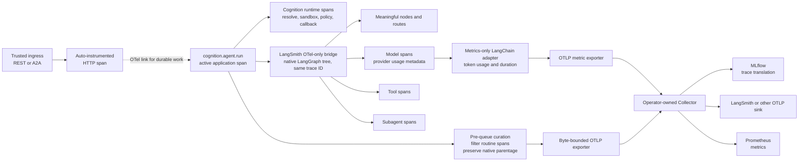
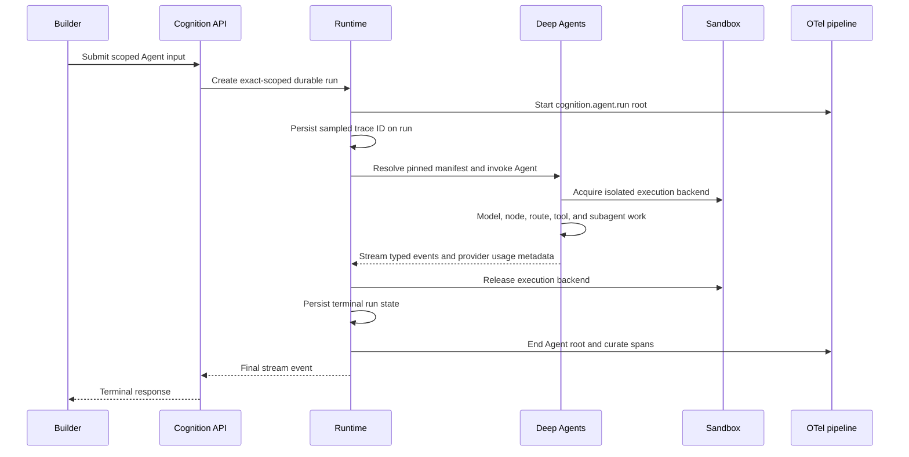

# Curated OpenTelemetry Agent Tracing

**Status:** Implemented on the v0.13 branch; release validation pending  
**Audience:** Cognition maintainers, deployment operators, and builders  
**Date:** 2026-07-26  
**Implementation state:** Accepted and implemented for v0.13 branch work. Local observability smoke has passed; final release validation remains a gate.  
**Related decision:** [ADR-0002](../architecture/decisions/0002-curated-opentelemetry-agent-tracing.md)

## Summary

Cognition should emit one portable, useful durable run trace for each Agent run
and preserve raw trace content for builder-operated back-office observability.

The proposed design uses LangChain's built-in LangSmith OpenTelemetry-only
bridge for the workflow tree, adds custom telemetry only at Cognition-owned
runtime boundaries, and sends one curated OpenTelemetry Protocol (OTLP) stream
through an operator-owned Collector. The bridge uses Cognition's global
`TracerProvider`; it is not a LangSmith destination path. The active
`cognition.agent.run` application span parents the
LangGraph/model/tool/subagent tree so one run attempt has one semantic trace
ID. A split framework trace is a context-propagation regression. The Collector
may route the same telemetry stream to MLflow, LangSmith, or another
OTLP-compatible backend.

Token telemetry and builder-facing usage are related but distinct:

1. **Curated tracing** is an observability architecture change. LangSmith's
   OTel-only bridge owns native LangChain/LangGraph semantic spans. The
   OpenLLMetry LangChain instrumentor remains a metrics-only adapter for the
   standard `gen_ai.client.token.usage` and operation-duration instruments;
   its duplicate spans are dropped before export.
2. **Authoritative Usage Events** are a runtime and API correctness change.
   Cognition projects provider-reported `AIMessage.usage_metadata` into one
   exact-scoped run event, but never tokenizes or estimates text.

These are implemented as separate concerns in the v0.13 work cycle. The local
observability smoke test has proved MLflow trace shape, provider usage
agreement, and Collector-exported OTel metrics; release CI remains the gate
before any cutover.

## Why change the current trace

The local MLflow trace
`tr-a845c49d437f26b89e86dadeb0538168` exposed several code-level problems:

| Finding | Observed evidence | Builder impact |
| --- | ---: | --- |
| Framework hook noise | 172 middleware-hook spans in a 209-span turn | The useful Agent path is difficult to find |
| Excessive attributes | 742,119 bytes of span attributes | Higher export cost and increased OTLP drop risk |
| Repeated Agent content | User text, output, system instructions, and tool definitions appeared on many spans | Trace storage becomes a new tenant-data path |
| Incorrect usage projection | Provider trace reported 17,722 input and 224 output tokens; Cognition reported 34 and 24 | Builders cannot trust Usage Events for budgets or accounting |
| Incorrect run correlation | `thread_id` was recorded as `cognition.run_id` | Durable runs cannot be joined reliably to traces |
| Wrong streaming duration | The custom HTTP span ended after about 127 ms while the trace lasted about 11 seconds | Transport and Agent latency are misleading |
| Probe dominance | 94 of 100 recent traces were health checks | Trace capacity is spent on low-value operations |

The target reference turn should export no more than 40 spans in the standard
profile. This is a regression budget for the reference fixture, not a promise
that every Agent run has a fixed span count.

## Goals

- Give a builder one durable Cognition run trace ID for one run attempt.
- Preserve the LangGraph workflow shape: Agent invocation, meaningful nodes
  and routes, model calls, tools, and subagents.
- Make MLflow a first-class validated destination without coupling Cognition
  to MLflow's private tracing SDK.
- Keep Cognition a runtime backend: emit raw OTLP traces and leave downstream
  redaction, retention, and back-office access control to builders/operators.
- Make traces and automatically instrumented token metrics independent of
  trace sampling and sink availability.
- Preserve an accurate builder-facing usage signal when providers report it.
- Keep Cognition a runtime backend, not a trace search, billing, or tenant
  analytics product.

## Non-goals

- Cognition-managed trace authorization, retention, search, or dashboards
- Per-tenant metric labels or trace-routing policies
- Cognition-managed pricing, billing, or cost estimates
- Token estimation when a provider does not report usage
- Custom instrumentation for ordinary storage CRUD or every streamed token
- A vendor-specific trace contract for MLflow, LangSmith, or Databricks

## Architecture



The HTTP and Agent traces have different lifetimes. The HTTP trace describes
transport handling. The Agent trace describes the durable execution attempt
and may outlive, resume outside, or execute independently from the ingress
request. An OpenTelemetry link preserves ingress correlation without making
the HTTP span the semantic root.

### Run trace lifecycle



An interrupted run attempt ends its trace. A continuation creates a new run
and trace with `parent_run_id` linking the durable attempts.

## Instrumentation ownership

| Operation | Instrumentation | Standard profile |
| --- | --- | --- |
| HTTP request | FastAPI auto-instrumentation | Kept, except probes and ASGI send/receive |
| Agent/graph invocation | LangSmith OTel-only bridge | Kept |
| Meaningful graph node or route | LangSmith OTel-only bridge | Kept |
| Model call and provider usage | LangSmith OTel-only bridge | Kept |
| Tool and subagent call | LangSmith OTel-only bridge | Kept |
| Standard token/duration instruments | OpenLLMetry LangChain metrics adapter | Metrics kept; adapter spans dropped |
| Native intermediate middleware/graph span | LangSmith OTel-only bridge | Kept when required for semantic parentage |
| Duplicate middleware wrapper | OpenLLMetry or Cognition wrapper | Not installed or dropped |
| Middleware decision or failure | Cognition span event | Kept |
| Manifest/provider resolution | Cognition custom span | Kept |
| Sandbox acquire/release | Cognition custom span | Kept |
| External policy evaluation | Cognition custom span | Kept |
| Callback delivery | Cognition custom span | Kept |
| Projection recovery | Cognition custom span | Only when executed |
| Durable event append or transition | Durable record, metric, and run-span event | No child span |
| Ordinary storage CRUD | Existing bounded metrics | No child span |
| Streamed token | SSE only | No span or event per token |

Custom spans are justified when they describe a timed Cognition boundary that
Deep Agents cannot observe. State changes that already belong to the active
run become span events instead of separate spans.

Request logging and metrics middleware should remain pure ASGI rather than
`BaseHTTPMiddleware` so request duration includes the complete streaming body.
FastAPI auto-instrumentation may still create the transport span, but Cognition
must not add a second custom HTTP span around the same request.

## Trace profiles

### Standard

`COGNITION_TRACE_DETAIL=standard` is the production default.

- Keeps the Agent root, meaningful graph nodes/routes, model calls, tools,
  subagents, sandbox operations, middleware outcomes, and failures.
- Does not install duplicate upstream `before_*` and `after_*`
  middleware-hook wrappers. Native LangSmith intermediate spans remain when
  retained descendants depend on them for valid parentage.
- Excludes `/health`, `/ready`, `/metrics`, and ASGI send/receive spans.
- Records the effective middleware and model-visible tool names, count, and
  digest, but not tool descriptions or schemas.

### Debug

`COGNITION_TRACE_DETAIL=debug` retains additional Cognition/framework task
internals and routine standalone middleware-hook timing. It does not change
the rule that a retained child must have a retained parent.

The profile is deployment-wide and operator-controlled. An Agent, request, or
scope cannot select it.

## Trace content policy

Cognition emits raw trace content when the active instrumentation or
`cognition.agent.run` root span supplies it. This includes model-visible inputs
and outputs used by builder back-office tools such as MLflow and LangSmith.

Cognition does not provide trace-content redaction, masking, truncation, or
`off`/`raw` content modes. Builders and operators own downstream trace
redaction, access control, retention, and export policy through their
OpenTelemetry Collector, LangSmith, MLflow, data warehouse, or other telemetry
pipelines.

## Correlation contract

The Agent root carries a small, stable envelope:

| Attribute | Meaning |
| --- | --- |
| `gen_ai.operation.name=invoke_agent` | GenAI semantic operation |
| `gen_ai.agent.name` | Resolved Agent name |
| `session.id` | Conversation/session grouping recognized by trace backends |
| `cognition.run.id` | Exact durable execution-attempt identifier |
| `cognition.run.parent_id` | Previous attempt when continuing |
| `cognition.task.id` | Durable task identifier when present |
| `cognition.agent.revision` | Pinned Agent revision |
| `cognition.manifest.digest` | Pinned runtime manifest digest |
| `cognition.transport` | Bounded `rest`, `a2a`, or `background` value |
| `cognition.sandbox.backend` | Bounded execution-backend type |
| `cognition.scope.keys` | Sorted scope key names, never values |
| `cognition.scope.fingerprint` | Optional operator-enabled HMAC pseudonym |

`run_id` and `thread_id` are never interchangeable. The optional scope
fingerprint uses a deployment secret and must not reuse the unsalted database
scope hash.

## Canonical export topology

OTLP is the only production semantic export contract.

- Cognition creates one active durable run application span. Upstream
  instrumentation attaches the framework tree under that span and inherits its
  trace ID. Split semantic traces fail validation.
- A Collector performs destination fan-out and destination-specific
  transformation.
- MLflow ingests the standard `gen_ai.*` attributes and translates Agent,
  model, tool, token, and optional structured content fields into its trace
  representation.
- LangSmith and other compatible backends receive the same source tree.
- A destination may sample, enrich, redact, index, or retain telemetry
  differently. These destination policies are builder/operator responsibilities.

The pre-release `COGNITION_NATIVE_AGENT_TRACING` modes are removed. Cognition
does not expose direct MLflow or LangSmith destination modes; canonical OTLP is
the only semantic trace export path. LangSmith's OTel-only bridge remains an
internal instrumentation adapter and emits through Cognition's global provider.
MLflow routing, experiment id selection, redaction, retention, and fan-out are
Collector/operator responsibilities.

## Automatic token metrics

The OpenLLMetry LangChain metrics adapter already defines:

- `gen_ai.client.token.usage`; and
- `gen_ai.client.operation.duration`.

Cognition should configure an OpenTelemetry `MeterProvider` and periodic OTLP
metric reader, then pass that provider to the metrics adapter. It must not
define a parallel Cognition token counter or histogram.

The adapter's semantic-span wrappers are disabled where upstream permits and
all remaining spans from its instrumentation scope are dropped synchronously
before the batch queue. The Collector receives OTLP metrics and exposes them
to Prometheus. Token metric dimensions remain limited to the adapter's
provider, model, and input/output token type. Session, run, task, Agent, and
scope identifiers are not metric labels.

Trace sampling does not control token metrics. A model call may contribute an
automatic token metric even when its trace is not sampled.

When a supported LangChain provider exposes safe streaming-usage configuration,
Cognition's provider adapter should enable it. Providers that do not report
usage produce a partial or unavailable Usage Event; Cognition must not fill the
gap with tokenization, character counts, or default zeroes.

## Separate workstream: authoritative Usage Events

Usage Events are a builder-facing runtime contract, not a telemetry-export
mechanism. They should be corrected as a separate runtime/API issue, reviewed
and tested independently from trace curation. They may land in the same
v0.13.0 work cycle if this proposal is accepted.

### Source of truth

Only LangChain-normalized provider `AIMessage.usage_metadata` is authoritative.
Cognition may normalize and aggregate those reported values; it must not
estimate missing values.

The runtime aggregates by model-call/message ID so the final cumulative
streaming chunk replaces earlier metadata for the same call. Main-Agent and
subagent calls are included in the run total.

### Proposed event

```json
{
  "type": "usage",
  "source": "provider_usage_metadata",
  "status": "complete",
  "input_tokens": 17722,
  "output_tokens": 224,
  "total_tokens": 17946,
  "cache_read_tokens": 17408,
  "cache_write_tokens": null,
  "reasoning_tokens": null,
  "model_calls": 2,
  "reported_model_calls": 2,
  "unreported_model_calls": 0,
  "by_model": []
}
```

Status has an explicit accuracy meaning:

| Status | Meaning |
| --- | --- |
| `complete` | Every observed model call reported usage |
| `partial` | At least one call reported usage; totals cover only reported calls |
| `unavailable` | No call reported usage; token fields are `null`, never zero |

`by_model` is populated when a run uses more than one provider/model
combination. Provider-reported cache, reasoning, audio, or other standard
details may be preserved without inventing absent values.

The same object is:

- emitted once at terminal run completion;
- persisted in the exact-scoped `usage.recorded` durable event; and
- projected on the run response.

### Compatibility

- Keep the existing Usage Event and response shapes during this minor release,
  adding `source`, `status`, call counts, optional token details, and
  `by_model`.
- Make legacy token fields nullable.
- Stop writing the complete run's output usage into the final assistant
  message's `token_count`.
- Remove fallback estimates from the context-debug response.
- Deprecate `estimated_cost` and return `null`; builders or gateways own
  pricing.
- Display complete, partial, or unavailable usage in the CLI instead of
  fabricated zeroes.
- Do not derive custom metrics from Usage Events. The OpenTelemetry
  instrumentor owns token metrics.

The separate Usage Events issue deletes Cognition's token-counting helper,
text-length accumulation, and hard-coded pricing table. Deep Agents may keep
its internal approximate context budgeting; Cognition does not expose that as
billable usage.

## Proposed operator settings

| Setting | Default | Meaning |
| --- | --- | --- |
| `COGNITION_TRACE_DETAIL` | `standard` | `standard` or `debug` span profile |
| `COGNITION_OBSERVABILITY_SCOPE_HMAC_KEY` | unset | Enables deployment-local scope fingerprinting |
| `COGNITION_OTLP_ENDPOINT` | unset | Canonical trace and metric Collector endpoint |

`COGNITION_OTEL_ENDPOINT` remains a compatibility alias. Existing trace sample
ratio, queue, timeout, and 3.5 MiB encoded-request settings remain unchanged.

These settings are deployment-only. They are not Agent fields, scoped
configuration records, or request parameters.

## Local stack changes

The Compose/Collector smoke stack should reflect the production topology in
miniature:

- Cognition exports traces and metrics to the Collector through canonical OTLP.
- Trace export uses OTLP/HTTP with compression when routed to MLflow.
- The Collector exposes OpenTelemetry metrics to Prometheus, including
  LangChain's GenAI token and operation-duration metrics.
- The local metric export interval may be short for smoke testing, but
  production defaults should remain conservative.
- MLflow experiment/evaluation settings remain ordinary operator settings;
  they do not select a second semantic trace path.

## Delivery sequence

### Issue 1: curated tracing

1. Add the proposed ADR and roadmap entry.
2. Establish the Agent-run root and correct run/thread correlation.
3. Configure the LangSmith OTel-only semantic bridge, the metrics-only
   LangChain adapter, and FastAPI auto-instrumentation.
4. Add the pre-queue curation processor and remove duplicate custom spans.
5. Configure the OTel `MeterProvider` and Collector-to-Prometheus metric path.
6. Remove native autologging paths and update local MLflow integration.
7. Validate the span and attribute budgets against the reference turn.

### Issue 2: authoritative Usage Events

1. Add the bug entry and API compatibility tests.
2. Aggregate provider `usage_metadata` by model-call ID.
3. Implement complete, partial, and unavailable event semantics.
4. Persist the exact-scoped run usage projection.
5. Remove custom token counting and estimated cost.
6. Update REST, SSE, context-debug, CLI, and builder documentation.
7. Prove Usage Events agree with the auto-instrumented model spans.

Issue 2 may be developed independently after the tracing contract is accepted,
but both issues must pass before the release is considered complete.

## Validation

### Curated tracing

- The reference run exports no more than 40 spans in one semantic trace.
- Standard traces contain no duplicate middleware-wrapper tree and retain any
  native intermediary required to parent a kept child.
- Debug traces retain additional middleware-hook timing; raw trace content
  behavior is the same as standard mode.
- Meaningful LangGraph nodes/routes, model calls, tools, and subagents retain
  correct parentage beneath the durable Cognition application span.
- Every retained non-root span references a retained parent in the same trace.
- The Cognition, LangGraph, model, tool, and subagent spans for a run attempt
  share exactly one trace ID.
- Probe endpoints produce no spans.
- A run trace covers resolution through sandbox teardown and terminal state.
- `run_id`, `thread_id`, and `session_id` remain distinct.
- OTLP/MLflow failure never fails an Agent run.
- Byte-bounded export operates on already curated spans.

### Token metrics and Usage Events

- Provider-reported token attributes appear on model spans.
- Standard `gen_ai.usage.*` attributes do not also appear on the Agent root;
  its exact run summary uses `cognition.usage.*` and the
  `cognition.usage.recorded` event so destination-level totals are not doubled.
- `gen_ai.client.token.usage` reaches Prometheus through the Collector.
- Metrics still export when the related trace is not sampled.
- No Cognition-defined token metric exists.
- Two-turn, subagent, mixed-model, cache, reasoning, duplicate-chunk, partial,
  and unavailable fixtures produce accurate Usage Events.
- No test expects a text-derived token estimate or estimated cost.
- MLflow model-span totals and the final Usage Event agree for every reported
  call.

### Documentation and quality

- Strict MkDocs build succeeds.
- Mermaid diagrams render with clear runtime, telemetry, and vendor
  boundaries.
- Ruff, strict mypy, unit tests, tracing end-to-end tests, and A2A regression
  pass.
- `git diff --check` succeeds.

### Local observability smoke test

- Execute a multi-turn, tool-using Agent against the local Compose stack.
- Verify MLflow shows one durable Cognition run trace containing the bounded
  LangGraph/model/tool tree.
- Verify model-span provider token totals match the final Usage Event for all
  reported calls.
- Verify `gen_ai.client.token.usage` reaches Prometheus through the Collector.
- Confirm there is no duplicate native-autolog trace, middleware-hook flood, or
  Cognition-defined token estimate.

## Builder experience

A builder provisions an Agent and starts a run as it does today. Cognition
automatically supplies:

- a durable run ID;
- a correlated Agent trace ID when sampled;
- a readable graph/model/tool/subagent trace in any supported OTLP backend;
- deployment-level automatic model-token metrics; and
- one accurate Usage Event when provider metadata is complete, partial, or
  unavailable.

The builder does not configure trace destinations, storage credentials, or
sampling through Agent definitions. The builder continues to own trace
redaction, content retention, user authorization, billing, budgets, pricing,
and access to its observability systems.

## References

- [LangChain OpenTelemetry tracing](https://docs.langchain.com/langsmith/trace-with-opentelemetry)
- [LangChain message usage metadata](https://docs.langchain.com/oss/python/langchain/messages)
- [Deep Agents streaming](https://docs.langchain.com/oss/python/deepagents/streaming)
- [MLflow OpenTelemetry integration](https://mlflow.org/docs/latest/genai/tracing/opentelemetry/)
- [MLflow OpenTelemetry attribute mapping](https://mlflow.org/docs/latest/genai/tracing/opentelemetry/attribute-mapping/)
- [OpenTelemetry Collector transformations](https://opentelemetry.io/docs/collector/transforming-telemetry/)
