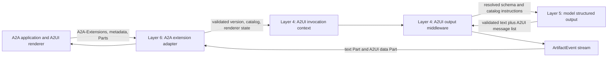

# Optional A2UI v1.0 Support for A2A Agents

**Status:** Draft

**Target:** Cognition v0.15.0

**Category:** Feature and architectural change

**Layers:** 1 (Foundation), 2 (Persistence), 4 (Agent Runtime), 5 (LLM
Provider), 6 (API and Streaming), 7 (Observability)

**Last updated:** 2026-08-16

## Decision summary

Cognition should provide built-in support for the A2UI v1.0 Extension for the
A2A Protocol. Support is optional per Agent and is enabled only when the
Agent's definition contains an `a2a.a2ui` block.

The initial implementation should:

- advertise the A2UI v1.0 extension in that Agent's A2A Agent Card;
- negotiate A2UI for each request using A2A extension activation and validated
  renderer capabilities;
- generate A2UI through a typed runtime output path, never by parsing
  JSON-looking assistant text;
- emit A2UI message lists as A2A data Parts with
  `mediaType: application/a2ui+json`;
- allow the same task to contain ordinary text artifacts and A2UI data
  artifacts;
- accept renderer actions and synchronized renderer data as untrusted,
  schema-validated input;
- ship with a pinned copy of the official A2UI v1.0 Basic catalog; and
- neither fetch catalog IDs as URLs nor accept inline catalogs in the initial
  release.

This is a dedicated standards integration, not a generic schema registry and
not a Cognition-managed UI renderer.

## Why this belongs in Cognition

A2A already gives Cognition task transport, messages, artifacts, streaming, and
extension negotiation. A2UI adds a portable contract for an agent to describe
interactive UI that a client application renders with its own native
components.

Without a runtime integration, an Agent can discuss A2UI or print A2UI-shaped
JSON, but Cognition cannot reliably claim that the Agent supports the A2UI
extension. Correct support requires all of the following to agree:

1. the Agent Card capability declaration;
2. request-scoped extension and catalog negotiation;
3. catalog-constrained model generation;
4. schema validation;
5. typed runtime artifact emission; and
6. A2A Part projection and persistence.

Cognition is the layer that owns those boundaries for every Agent it exposes.
Applications such as Asterism should only need to implement the renderer side
of the published A2UI contract.

## Protocol baseline

The target extension URI is:

```text
https://a2ui.org/a2a-extension/a2ui/v1.0
```

The A2UI v1.0 extension specification is currently labeled **Candidate**; the
current production A2UI release remains v0.9.1. Cognition must pin the exact
candidate schemas used by a release and must not claim final v1.0 conformance
until A2UI v1.0 reaches general availability. The candidate defines:

- optional Agent Card advertisement in `AgentCapabilities.extensions`;
- renderer capabilities in
  `Message.metadata.a2uiRendererCapabilities`;
- optional renderer data-model synchronization in
  `Message.metadata.a2uiRendererDataModel`;
- agent-to-renderer and renderer-to-agent message lists carried by A2A data
  Parts; and
- `application/a2ui+json` as the A2UI media type.

The v1.0 wire payload is always a JSON array. Agent-to-renderer entries include
messages such as `createSurface`, `updateComponents`, `updateDataModel`, and
`deleteSurface`. Renderer-to-agent entries include actions, function calls,
function responses, and errors.

### A2A v1.0 is canonical

The candidate A2UI document contains terminology inherited from earlier A2A
revisions. Cognition should use the A2A v1.0 representation when the two
documents differ:

| Concern | Cognition behavior |
| --- | --- |
| Extension request header | Use the standard `A2A-Extensions` service parameter for HTTP bindings. |
| Part type | Use A2A v1.0 `Part.data`; do not emit a legacy `kind` discriminator. |
| MIME placement | Set `Part.mediaType` to `application/a2ui+json`. Do not place MIME metadata inside the A2UI payload. |
| Extension attribution | Add the A2UI URI to the output Artifact's `extensions` list and return it in the activated-extension response parameter. |

Before implementation is accepted, an interoperability spike must compare the
published A2UI v1.0 schemas and conformance tests with A2A SDK 1.x. The current
official A2UI Python agent adapter requires `a2a-sdk<0.4`, while Cognition uses
`a2a-sdk>=1.0.3`, so Cognition must not add that adapter as a runtime dependency
until it supports A2A v1.0. If candidate clients still send
`X-A2A-Extensions`, Cognition may accept that name as a temporary inbound
compatibility alias. The standard header remains canonical, takes precedence
on conflict, and is the only header Cognition emits.

Explicit activation is also under active upstream reconsideration. A2UI pull
request #2033 proposes using Agent Card advertisement plus message metadata and
removing per-request extension activation. Cognition should isolate activation
inside the Layer 6 adapter so that upstream resolution does not alter the
runtime artifact contract.

## Goals

- Make A2UI v1.0 an optional, discoverable capability of an individual
  Cognition Agent.
- Preserve normal conversational behavior when A2UI is not negotiated.
- Support text and A2UI data in one A2A task.
- Give the model a concrete, catalog-resolved schema for A2UI generation.
- Validate both directions of the A2UI exchange before data reaches the model
  or client.
- Preserve ordered A2UI messages through streaming, persistence, replay, and
  task retrieval.
- Keep the implementation generic to any A2A client that supports A2UI v1.0.
- Respect exact `effective_scope` isolation and existing output limits.

## Non-goals

- Rendering A2UI inside Cognition.
- Defining application-specific components or schemas in Cognition core.
- Inferring A2UI intent from `acceptedOutputModes`, JSON-looking text, or an
  inbound data Part alone.
- Fetching an extension URI or catalog ID during a request.
- Treating catalog IDs as network locations.
- Allowing A2UI actions to bypass Agent tools, MCP policy, human approval, or
  builder authorization.
- Giving an A2UI surface direct authority over an embedding application's
  durable state.
- Supporting A2UI v0.8, v0.9, or v0.9.1 in the v1-only implementation.

## Agent configuration

The absence of `a2a.a2ui` means the Agent does not support A2UI. There is no
deployment-wide implicit enablement.

```yaml
name: project-planner
system_prompt: Help the user plan and explain project work.

a2a:
  exposed: true
  a2ui:
    version: "1.0"
    catalogs:
      - basic
```

The proposed typed shape is conceptually:

```python
class A2UIConfig(BaseModel):
    version: Literal["1.0"] = "1.0"
    catalogs: list[Literal["basic"]] = Field(
        default_factory=lambda: ["basic"]
    )


class A2AConfig(BaseModel):
    # Existing fields omitted.
    a2ui: A2UIConfig | None = None
```

The initial surface deliberately does not expose `required` or
`acceptsInlineCatalogs`:

- Cognition always advertises A2UI as `required: false`, because the Agent must
  remain conversational for extension-unaware clients.
- Cognition advertises `acceptsInlineCatalogs: false` until inline catalogs have
  a separate security and lifecycle design.
- `basic` resolves to the pinned official v1.0 Basic catalog ID and schema that
  ship with the Cognition release.

Custom catalog bundles can be proposed later as builder-installed,
content-addressed Agent dependencies. They must not become a mutable global
schema registry or request-time URL fetcher.

## Agent Card projection

For an A2UI-enabled Agent, Cognition adds this capability to the generated Agent
Card:

```json
{
  "uri": "https://a2ui.org/a2a-extension/a2ui/v1.0",
  "description": "Generates interactive UI using A2UI v1.0.",
  "required": false,
  "params": {
    "supportedCatalogIds": [
      "https://a2ui.org/specification/v1_0/catalogs/basic/catalog.json"
    ],
    "acceptsInlineCatalogs": false
  }
}
```

Cognition also adds `application/a2ui+json` to the Agent's applicable input and
output media types, including any A2UI-capable public skill. This is a media
capability, not the activation mechanism. Clients must not send a nonstandard
value such as `acceptedOutputModes: ["a2ui"]` to request A2UI.

Agents without `a2a.a2ui` publish no A2UI extension, do not advertise the A2UI
media type in either direction, and retain their existing runtime behavior.

## Request activation and catalog selection

Cognition treats A2UI as active for a request only when all of these conditions
hold:

1. the resolved Agent definition includes `a2a.a2ui`;
2. the client either requests the exact v1.0 extension URI through the A2A
   extension service parameter or supplies a valid v1.0
   `a2uiRendererCapabilities` object;
3. the renderer and Agent have at least one catalog ID in common; and
4. all A2UI metadata and inbound A2UI Parts pass size and schema validation.

An explicit extension request without renderer capabilities may use the Basic
catalog only when the request otherwise signals v1.0 support. Cognition should
prefer explicit renderer capabilities because catalog IDs do not have an
implicit fallback in A2UI v1.0.

Unsupported extension URIs are ignored as A2A specifies. Cognition does not
echo them as activated. A request that explicitly activates Cognition's
advertised A2UI v1.0 extension but has no compatible catalog fails clearly
instead of silently returning differently shaped data.

## Runtime architecture

The A2A adapter should not generate UI and the core model stream should not know
about HTTP headers. The boundary is a request-scoped, protocol-neutral
presentation context.



### Request context

Layer 6 validates and translates the wire input into an immutable invocation
context containing:

- A2UI version;
- selected catalog IDs and pinned catalog digests;
- validated renderer capabilities;
- validated renderer data-model snapshot, when supplied;
- validated renderer-to-agent messages; and
- the activated extension URI.

This context is carried with the existing trusted runtime invocation. The model
must not be able to invent or alter the selected catalog set.

### Structured generation

For an active A2UI request, Cognition attaches a Deep Agents-native middleware
or response-format strategy that constrains the final response to an internal
envelope:

```json
{
  "text": "Here is a project plan you can adjust.",
  "messages": [
    {"version": "v1.0", "createSurface": {}},
    {"version": "v1.0", "updateComponents": {}}
  ]
}
```

The envelope is internal and never appears on the A2A wire. Cognition validates
`messages` against the A2UI Agent-to-Renderer Message List schema resolved with
the selected catalog, then emits:

- `text` as a normal text `ArtifactEvent`, when present; and
- `messages` as `ArtifactEvent(kind="data", media_type="application/a2ui+json")`.

This preserves mixed conversational and structured output without teaching the
A2A serializer any A2UI schema. The serializer continues to perform a
mechanical mapping from typed runtime artifacts to A2A Parts.

Normal, non-A2UI requests use the existing conversational graph and do not pay
the A2UI schema or prompt cost. The implementation spike should choose between
request-scoped model middleware and a separately cached A2UI graph variant,
preferring the smallest Deep Agents-native mechanism that keeps cache identity
and Agent revision pinning correct.

### Validation and repair

Invalid model output is never reclassified from text and never sent to the
client as partially trusted A2UI. Cognition may perform a bounded structured
output repair attempt. If validation still fails, the task fails with an
observable `A2UI_OUTPUT_INVALID` reason.

There is no silent fallback from requested A2UI to arbitrary JSON or plain text.

## A2A output and streaming

Every A2UI Part contains a JSON array of one or more complete A2UI messages.
Cognition never splits one JSON message across Parts.

For streamed task output:

- all updates for one logical A2UI artifact reuse its `artifactId`;
- each update's data value is independently a valid A2UI message list;
- `append` and `lastChunk` preserve the existing A2A artifact-update contract;
- message order is preserved across persistence and replay; and
- the A2UI extension URI is attached to the Artifact and activated response.

The first implementation may validate a complete model result and then emit it
in ordered, size-bounded message batches. True generation-time progressive
streaming is a later optimization and must not weaken per-message validation.

## Renderer events and continued conversation

The renderer sends user actions and other renderer-to-agent messages as a data
Part with `mediaType: application/a2ui+json`. Cognition validates the full array
against the Renderer-to-Agent Message List schema before adding a normalized
description to the Agent invocation.

`a2uiRendererDataModel` is an untrusted snapshot supplied by the renderer. It is
persisted as part of canonical inbound message metadata but does not become a
second Cognition state authority. It cannot change session scope, Agent
configuration, tool permissions, or application records.

An action can cause the Agent to reason, call an already-authorized Deep
Agents/MCP tool, ask for human approval, return text, update a surface, or emit a
new surface. It cannot call a hidden host function simply because an A2UI action
name resembles one.

## Catalog policy

The v0.15.0 implementation should support only the official v1.0 Basic catalog:

- bundle the catalog and required A2UI schemas with Cognition;
- pin their upstream revision and content digests in the release;
- validate those assets at build time;
- derive Agent Card IDs from the bundled assets; and
- include the catalog digest in the Agent runtime manifest and cache identity.

Catalog IDs are opaque identifiers. Cognition does not issue HTTP requests to
them.

Inline catalogs remain disabled because they combine untrusted schema,
instructions, component definitions, and function declarations in a model
generation path. Supporting them requires a separate proposal covering schema
limits, reference resolution, prompt-injection treatment, function policy,
persistence, digest pinning, and observability.

## Function and action safety

A2UI v1.0 catalogs can define functions and execution boundaries. Cognition
must validate function names, arguments, catalog membership, and `callableFrom`
before forwarding or emitting function messages.

The initial implementation supports renderer-originated `action` events and
Basic-catalog renderer functions. It does not create a new Agent-function
registry. An inbound `callAgentFunction` without an explicitly installed,
authorized implementation returns the A2UI-defined unknown/invalid function
error. Future Agent-side function support should map to existing Deep Agents or
Agent-owned MCP capabilities and retain their policy and approval boundaries.

## Persistence and scope

Existing canonical A2A Part and artifact persistence remains authoritative:

- inbound renderer capabilities, data-model snapshots, and A2UI Parts are
  stored with the original scoped message;
- outbound A2UI data, media type, extension URI, artifact ID, append flag, and
  final-chunk flag are stored before emission;
- task retrieval and subscription reconstruct the same ordered Parts; and
- every read, continuation, action, and replay uses the task/session's exact
  immutable `effective_scope`.

No A2UI surface state is shared across scopes. Surface IDs, component IDs,
action names, and user values must not become metric labels.

## Failure behavior

| Condition | Behavior |
| --- | --- |
| Agent does not support A2UI | Ignore the unsupported activation request, do not echo it, and continue with normal A2A behavior. |
| Requested A2UI version is not `v1.0` | Do not fall forward or backward to another version. |
| Invalid renderer capabilities or renderer message list | Reject the request as invalid input before model execution. |
| No compatible catalog for an advertised and explicitly requested extension | Fail clearly with a content/extension negotiation error. |
| Inline catalog supplied | Reject it while `acceptsInlineCatalogs` is false. |
| Model output fails A2UI validation after bounded repair | Fail the task with `A2UI_OUTPUT_INVALID`; emit no invalid A2UI Part. |
| Output exceeds existing artifact or byte limits | Use the existing bounded A2A output failure path. |
| Unsupported Agent function call | Return a schema-valid A2UI function error; do not invent a handler. |

## Observability

Add bounded telemetry for:

- A2UI activation requested, activated, ignored, or rejected;
- negotiated version and catalog class (`basic` initially);
- renderer input validation failures by bounded reason;
- model output validation and repair outcomes;
- emitted A2UI message counts by protocol message type;
- artifact bytes and ordered batch counts; and
- inbound compatibility-alias use, if the alias is implemented.

Traces may record the Agent name under existing policy, version, bundled catalog
digest, validation result, and task/run correlation. Logs, metrics, and traces
must not record raw renderer data models, action context, component text,
catalog instructions, or effective-scope values.

## Delivery sequence

### 1. Protocol and configuration

- Add typed optional `A2UIConfig` under `A2AConfig`.
- Bundle and verify official v1.0 schemas and the Basic catalog.
- Project the extension and media type into per-Agent cards.
- Parse standard A2A activation and return activated extension metadata.

### 2. Runtime output

- Add the immutable A2UI invocation context.
- Add catalog-resolved structured generation through a Deep Agents-native
  extension point.
- Convert validated output into text and data `ArtifactEvent` objects.
- Preserve extension attribution and media type in persistence and A2A replay.

### 3. Renderer input

- Validate renderer capabilities, data-model snapshots, actions, and function
  messages.
- Route normalized events into continued Agent turns.
- Enforce catalog function boundaries and explicit errors.

### 4. Interoperability and hardening

- Run the A2A v1.0 TCK for extension-neutral behavior.
- Test against the official A2UI v1.0 schemas and a Basic-catalog renderer.
- Keep the incompatible A2UI Python agent adapter out of Cognition's runtime
  dependencies; exercise it only in an isolated compatibility harness if
  useful.
- Add a live-model end-to-end scenario that produces text plus a renderable
  surface, receives an action, and updates the surface.
- Pin the final A2UI v1.0 release assets or document the exact candidate commit
  used by v0.15.0.

## Acceptance criteria

- An Agent without `a2a.a2ui` has an unchanged Agent Card and runtime path.
- An Agent with `a2a.a2ui` advertises exactly the v1.0 URI with
  `required: false`, the Basic catalog ID, and no inline-catalog support.
- A client can discover, activate, and observe the activated extension using
  standard A2A v1.0 service parameters.
- A negotiated request can produce ordinary text and a valid A2UI data artifact
  in the same task.
- Every emitted A2UI Part has `mediaType: application/a2ui+json` and a JSON-array
  data value that passes the pinned Agent-to-Renderer schema.
- Renderer actions and data-model snapshots are validated, persisted, scoped,
  and available to the continued Agent turn.
- Invalid or incompatible A2UI input/output fails explicitly without JSON-text
  guessing or silent content-type fallback.
- Streaming, task retrieval, idempotent replay, and resubscription preserve A2UI
  message order and extension attribution.
- Inline catalogs and request-time catalog fetching are absent.
- Cross-scope continuation and replay tests prove that A2UI state cannot cross
  `effective_scope` boundaries.
- Focused unit/integration tests, the full suite, Ruff, strict mypy, A2A TCK,
  Basic-renderer interoperability, and a live-model scenario pass before the
  release is tagged.

## Open standards questions

These are upstream compatibility questions, not reasons to weaken Cognition's
internal contract:

1. Will the final A2UI v1.0 extension replace `X-A2A-Extensions` examples with
   A2A v1.0's `A2A-Extensions` service parameter?
2. Will the final extension describe MIME through A2A v1.0 `Part.mediaType`
   instead of legacy DataPart metadata wording?
3. Will the Agent Card `params` example and the published
   `agent_capabilities.json` schema use one identical object shape?
4. Which official release tag, schema digests, and conformance suite define
   final A2UI v1.0 compatibility?
5. When will the official A2UI Python agent adapter support A2A SDK 1.x and
   emit the unified A2A v1.0 Part shape?

The implementation should isolate these details in the Layer 6 adapter and
pinned schema package so an upstream correction does not change the runtime
artifact contract.

## Decision requested

Approve a dedicated optional A2UI v1.0 integration for Cognition Agents with
these initial boundaries:

- opt-in per Agent through `a2a.a2ui`;
- A2A v1.0 wire semantics are canonical;
- official Basic catalog only;
- typed structured generation to `ArtifactEvent(kind="data")`;
- mixed text and A2UI artifacts are supported;
- no inline catalogs, remote catalog loading, or new Agent-function registry;
  and
- implementation begins only after the proposal is accepted and a full
  ROADMAP entry and migration plan are added.

## References

- [A2UI v1.0 Extension for A2A Protocol](https://a2ui.org/specification/v1.0-a2ui-extension-specification/)
- [A2UI v1.0 Protocol](https://a2ui.org/specification/v1.0-a2ui/)
- [Official A2UI source and schemas](https://github.com/a2ui-project/a2ui/tree/main/specification/v1_0)
- [Official A2UI Python agent package dependency](https://github.com/a2ui-project/a2ui/blob/main/agent_sdks/python/a2ui_agent/pyproject.toml)
- [A2UI activation proposal #2033](https://github.com/a2ui-project/a2ui/pull/2033)
- [A2A v1.0 extension guidance](https://a2a-protocol.org/latest/topics/extensions/)
- [A2A v1.0 protocol definition](https://github.com/a2aproject/A2A/blob/main/specification/a2a.proto)
- [Primary-source research note](../research/a2ui-v1-cognition-support.md)
