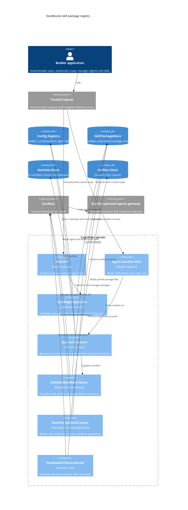
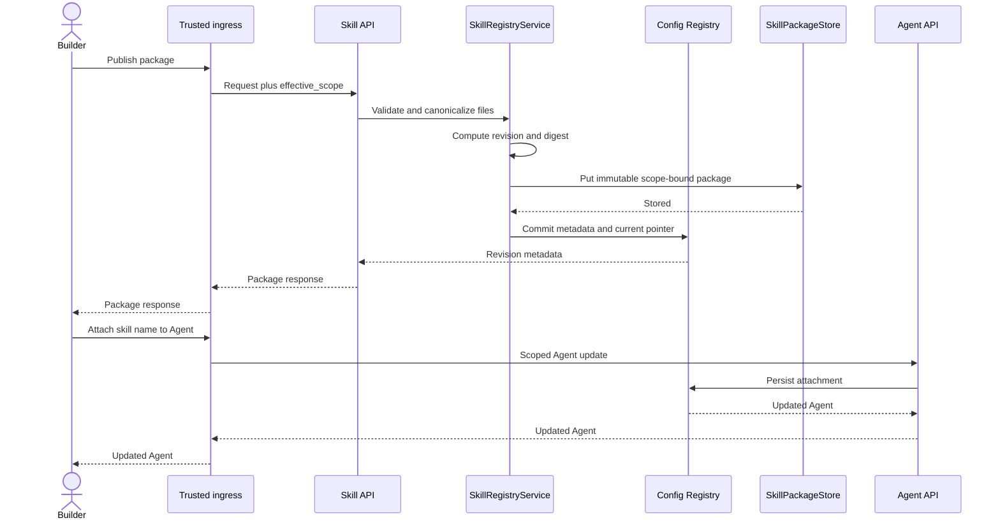
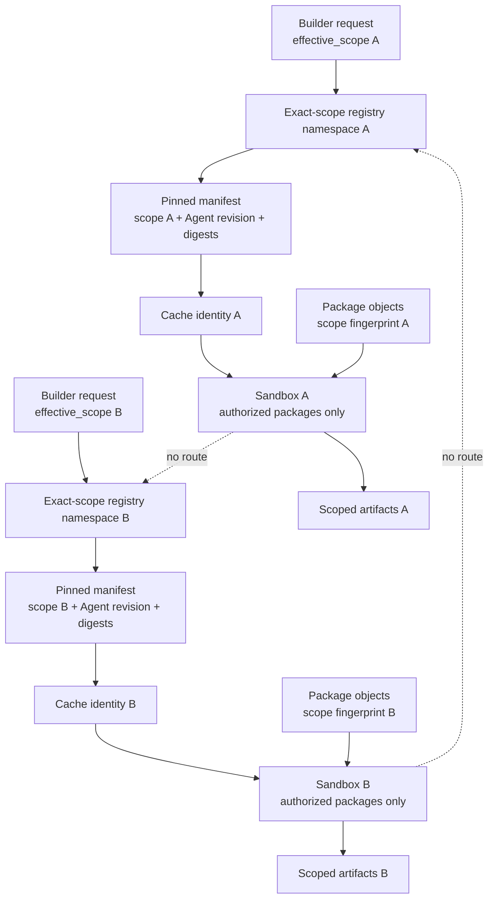

# Sandboxed Skill Package Registry

**Status:** Superseded by ADR-0003 and the sandbox-workspace Skills model
**Audience:** Maintainers, deployment operators, and builders  
**Last updated:** 2026-07-23

> This document is retained as rejected design history. v0.14 does not provide
> a standalone skill registry or name-based skill attachment.

This proposal would have made Cognition a bounded registry and runtime for executable
skill packages. A builder publishes scope-bound skills and attaches their names
to an Agent. Cognition stores immutable revisions, pins the revisions selected
for each run, and transfers only those packages into that run's sandbox.

The design is deliberately narrower than a skills platform. Cognition does not
own a marketplace, publishing interface, tenant administration, authorization
policy, dependency builds, or credential brokering. Those remain builder and
deployment responsibilities.

## Decision summary

- Select one skill package backend for each Cognition deployment.
- Keep skill metadata in the Config Registry and package bytes behind a
  `SkillPackageStore`.
- Preserve `Agent.skills: list[str]`; resolve each name to its current immutable
  revision when a run starts.
- Persist a digest-pinned manifest for the run before provisioning its sandbox.
- Transfer packages through the sandbox provider's file-transfer API and
  execute scripts only inside the sandbox.
- Treat `/skills/` as read-only. Scripts write results to a sandbox output path;
  Cognition collects selected results into scoped artifacts.
- Keep executable custom Tool CRUD and host-executed integrations outside this
  runtime option.

## Current state and problem

> **Superseded by the v0.14 sandbox workspace Skills contract.** Builders now
> mount selected standard Skill directories beneath the sandbox workspace and
> Cognition passes that directory directly to Deep Agents; it no longer provides
> a Skill registry or virtual Skills backend.

Historically, a `SkillDefinition` stored a path and optional `SKILL.md` content in the
Config Registry. The Skill API creates or replaces one mutable record, and
`ConfigRegistrySkillsBackend` exposes attached skills beneath
`/skills/api/`. `create_cognition_agent` routes that path through a Deep Agents
`CompositeBackend` while using the selected sandbox as the default backend.

This supports progressive disclosure of `SKILL.md`, but it does not store
sibling scripts, references, or assets as one package. A script held outside a
remote sandbox cannot be executed there until application code transfers it.
The current graph cache also identifies skills by attached names rather than
resolved package digests and can retain the backend captured when the graph was
compiled.

Deep Agents already provides the intended primitives:

- [Backends](https://docs.langchain.com/oss/python/deepagents/backends) route
  filesystem paths through state, store, filesystem, sandbox, or composite
  adapters.
- [Skills](https://docs.langchain.com/oss/python/deepagents/skills) may include
  scripts and supporting resources, and recommends middleware to synchronize
  externally stored skills into a sandbox.
- [Sandboxes](https://docs.langchain.com/oss/python/deepagents/sandboxes)
  distinguish agent filesystem tools from trusted application file-transfer
  APIs such as `upload_files`.

The proposed registry adds the missing package, revision, scope, and
materialization contracts around those primitives.

## Boundary: registry, not control plane

| Cognition owns | Builder or deployment owns |
| --- | --- |
| Scope-aware package CRUD | Authentication and authorization decisions |
| Immutable revisions and digests | Tenant, role, entitlement, and sharing policy |
| Agent-to-skill attachment resolution | Publishing and discovery user experience |
| Per-run manifests | Skill review and promotion workflow |
| Sandbox materialization and execution evidence | Sandbox and egress policy selection |
| Runtime isolation enforcement | External-service credentials and gateways |

Cognition accepts builder-authorized `effective_scope` from trusted ingress. It
does not let a model choose scope, storage locations, backend credentials, or
sandbox identity. Sharing a package across scopes is a builder operation that
publishes or projects it into each authorized scope; registry lookup does not
fall back to broader tenant records.

## Proposed component model



## Package and API contract

A package follows the Deep Agents skill layout:

```text
ticket-analysis/
├── SKILL.md
├── scripts/
│   └── analyze.py
├── references/
│   └── fields.md
└── assets/
    └── output-schema.json
```

The proposed create and update input adds `files: dict[str, str]`. The existing
`content` field remains shorthand for `{"SKILL.md": content}`. Existing Agent
definitions continue to attach skills by name:

```json
{
  "name": "ticket-analysis",
  "files": {
    "SKILL.md": "---\nname: ticket-analysis\n...",
    "scripts/analyze.py": "import json\n..."
  }
}
```

Package responses add:

| Field | Meaning |
| --- | --- |
| `revision` | Opaque immutable revision identifier |
| `digest` | SHA-256 digest of the canonical package |
| `file_count` | Number of package files |
| `size_bytes` | Total UTF-8 byte count |
| `validation_status` | Package validation result |

Package validation requires `SKILL.md`, valid frontmatter, safe relative POSIX
paths, unique normalized paths, and UTF-8 text. It rejects absolute paths,
`.`/`..` traversal, symlinks, unsupported encodings, and reserved runtime
paths. Binary inputs remain scoped artifacts referenced by scripts rather than
package contents.

Canonicalization sorts normalized paths and hashes each path, byte length, and
UTF-8 content. A content change creates a new revision and atomically advances
the skill's current pointer. Metadata-only enablement changes need not create a
new package revision. Deleting a skill removes its current availability but
retains revisions referenced by run manifests until retention permits garbage
collection.

Registration validates and stores files but never imports, compiles, or
executes scripts.

## Package backend configuration

The deployment operator selects one backend. Agent and Skill requests cannot
override it.

| Backend | Intended use | Behavior |
| --- | --- | --- |
| `config_registry` | Compatibility and simple deployments | Stores package content with existing durable configuration |
| `s3` | Multi-replica production deployments | Stores immutable objects in an operator-owned bucket; metadata remains in the Config Registry |
| `filesystem` | Explicit standalone development | Stores packages under one configured server path; never exposes that path to the agent |

Proposed settings:

```text
COGNITION_SKILLS_BACKEND=config_registry
COGNITION_SKILLS_FILESYSTEM_ROOT=/var/lib/cognition/skills
COGNITION_SKILLS_S3_BUCKET=cognition-skills
COGNITION_SKILLS_S3_PREFIX=packages/
COGNITION_SKILLS_S3_REGION=us-east-1
```

Only settings for the selected adapter apply. S3 uses ambient workload identity;
the proposal adds no access-key fields or secret-resolution surface.

`SkillPackageStore` is content-oriented rather than agent-facing. Its minimum
operations put, fetch, verify existence, and delete an immutable bundle by
trusted scope and digest. A separate read-only Deep Agents backend adapts
resolved packages to `/skills/`.

The `CompositeBackend` routes agent reads under `/skills/` to that read-only
adapter and routes `execute` to its default sandbox. The materializer uploads
the same paths through the current sandbox backend directly—not through the
composite route—so the shell can execute the sandbox copy without granting
write access to registry storage.

## Builder publication flow



If the package write succeeds but the metadata transaction fails, the object is
an unreferenced candidate for garbage collection. The current pointer changes
only after package persistence succeeds.

## Per-sandbox run lifecycle

```mermaid
sequenceDiagram
    actor Builder
    participant API as Run API
    participant Resolver as Run skill resolver
    participant Catalog as Config Registry
    participant State as Runtime Store
    participant Manager as Sandbox manager
    participant Packages as SkillPackageStore
    participant Sync as SkillSandboxMaterializer
    participant Runtime as Agent runtime
    participant Box as Sandbox
    participant Agent as Deep Agent
    participant Collector as SandboxArtifactCollector
    participant Artifacts as Artifact Store

    Builder->>API: Start run with trusted scope
    API->>Resolver: Resolve Agent and skills
    Resolver->>Catalog: Read exact-scope current revisions
    Catalog-->>Resolver: Revision metadata
    Resolver->>State: Persist digest-pinned manifest
    Resolver->>Manager: Provision sandbox
    Manager-->>Sync: Current sandbox handle
    Sync->>Packages: Fetch manifest digests
    Packages-->>Sync: Package bytes
    Sync->>Box: Upload files through provider API
    Sync->>Box: Verify digests and seal /skills

    alt Materialization succeeds
        Sync-->>Runtime: Materialization complete
        Runtime->>Agent: Invoke graph with pinned manifest
        Agent->>Box: Read SKILL.md and execute scripts
        Box-->>Agent: Script results
        Agent-->>Runtime: Run result
        Runtime->>Collector: Collect declared outputs
        Collector->>Box: Download output files
        Box-->>Collector: Output bytes
        Collector->>Artifacts: Persist with trusted scope
    else Missing, invalid, or mismatched package
        Sync->>State: Record failure before model execution
        Sync->>Manager: Terminate sandbox
    end
```

There is no `after_agent` write-back for `/skills/`. A run may alter its private
sandbox copy only if an adapter cannot enforce read-only files; it can never
mutate the immutable registry revision.

## Multi-tenant isolation



Package keys, manifests, cache identities, logs, and lifecycle events include a
canonical scope fingerprint. The fingerprint is derived from sorted trusted
scope entries; model input cannot supply or override it. Package access uses
exact scope rather than hierarchical fallback.

A graph cache key includes the scope fingerprint, Agent revision, package
backend identity, and ordered package digests. The compiled graph resolves the
current sandbox from trusted run context so a cache hit cannot retain another
session's backend handle.

General-purpose subagents inherit the parent's pinned package manifest. Custom
subagents receive only their explicitly resolved authorized subset.

## Sandbox-only operating model

Conforming Agents use Deep Agents filesystem tools and `execute` against the
selected sandbox. Registry Python tools, programmatic host tools, host-side web
utilities, package inspection, and host-side Model Context Protocol (MCP)
clients are not bound in this mode.

External capabilities are packaged as scripts or preinstalled command-line
clients. Scripts should accept JSON files or standard input, return structured
standard output or artifacts, and avoid interpolating model text into shell
commands. Dependencies belong in the approved sandbox image.

Network access is denied by default or constrained by the sandbox profile.
Authenticated calls use stable proxy aliases operated by the builder. The proxy
receives trusted scope and correlation separately, applies policy, and injects
credentials outside the sandbox. Raw provider credentials never enter the
package or sandbox.

Filesystem permissions help keep `/skills/` read-only, but arbitrary
`execute` commands are controlled by the sandbox's process, kernel, filesystem,
network, and resource boundaries—not by path validation alone.

## Failures and observability

| Condition | Required behavior |
| --- | --- |
| Scope mismatch or invisible skill | Deny without revealing another scope's metadata |
| Package store unavailable | Retry within policy, then fail before model execution |
| Missing object or digest mismatch | Emit materialization failure and terminate the sandbox |
| Partial upload | Discard the sandbox; never start the graph |
| Skill updated during a run | Continue using the pinned revision |
| Cache hit | Bind the current run's sandbox and manifest |
| Egress denial | Return a structured script failure and emit an attributed event |
| Teardown failure | Emit an operational error with sandbox and run correlation |

Metrics should cover publication failures, materialization latency and bytes,
digest failures, cache hits by backend, sandbox cleanup, and denied cross-scope
access without placing raw scope values in high-cardinality labels.

## Complexity

| Area | Complexity |
| --- | ---: |
| Package models, validation, and immutable revisions | 6/10 |
| Configurable package-store abstraction | 6/10 |
| S3 and compatibility adapters | 6/10 |
| Sandbox materialization and verification | 7/10 |
| Scope-safe runtime routing and caching | 8/10 |
| Removing host-executed paths from this mode | 6/10 |
| Controlled web and external-service access | 8/10 |
| Generic builder integration | 4/10 |
| **Overall** | **7.5/10 — Large** |

Estimated implementation effort is 5–8 Cognition engineer-weeks plus 1–2 weeks
for builder integration and hosted sandbox validation.

## Migration and adoption

1. Introduce package metadata and the `SkillPackageStore` behind current Skill
   CRUD. Convert each existing API skill into an initial immutable revision;
   preserve `content` and Agent skill-name attachments.
2. Add the `config_registry` adapter and digest-pinned run manifests without
   changing the selected sandbox.
3. Add sandbox materialization, read-only package paths, dynamic backend
   routing, events, and negative isolation tests.
4. Add S3 and explicit development filesystem adapters.
5. Enable sandbox-only resolution for selected deployments, then disable
   incompatible host-executed extensions there.

Migration is idempotent. Existing file-managed skills must be imported into the
configured package backend or retained only in explicitly unsafe development
deployments. A backend cutover copies and verifies every live revision before
the operator changes `COGNITION_SKILLS_BACKEND`; rollback requires the previous
backend to remain complete until the cutover observation window closes.

Implementation requires an accepted ADR, a full architectural ROADMAP entry,
and updates to the code-derived architecture. This proposal intentionally names
no target release.

## Acceptance criteria

- Agents cannot access Cognition host files, processes, environment variables,
  package-store credentials, or storage locations.
- Skill scripts and side effects execute only in the assigned sandbox.
- Every package operation and run manifest enforces exact trusted
  `effective_scope`.
- Runs cannot observe skill updates after their manifest is pinned.
- Cross-scope reads, cache reuse, and sandbox reuse fail closed.
- Invalid paths, missing packages, digest mismatches, and incomplete uploads
  prevent model execution.
- General and custom subagents receive only the packages defined by their
  inheritance rules.
- Unsafe filesystem storage and local execution require explicit development
  configuration and emit observable warnings.
- Hosted sandbox tests prove upload, execution, controlled egress, artifact
  retrieval, teardown, and absence of cross-run leakage.

## Related documentation

- [Proposal index](index.md)
- [Agent runtime architecture](../architecture/04-agent-runtime-components.md)
- [Execution and sandbox architecture](../architecture/06-execution-and-sandboxes.md)
- [Architecture governance](../architecture/09-governance-and-evolution.md)
- [Core versus application layer](../guides/core-vs-app-layer.md)
