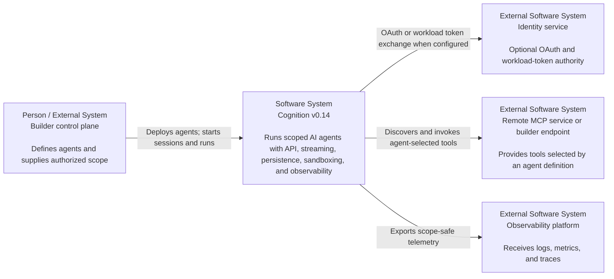
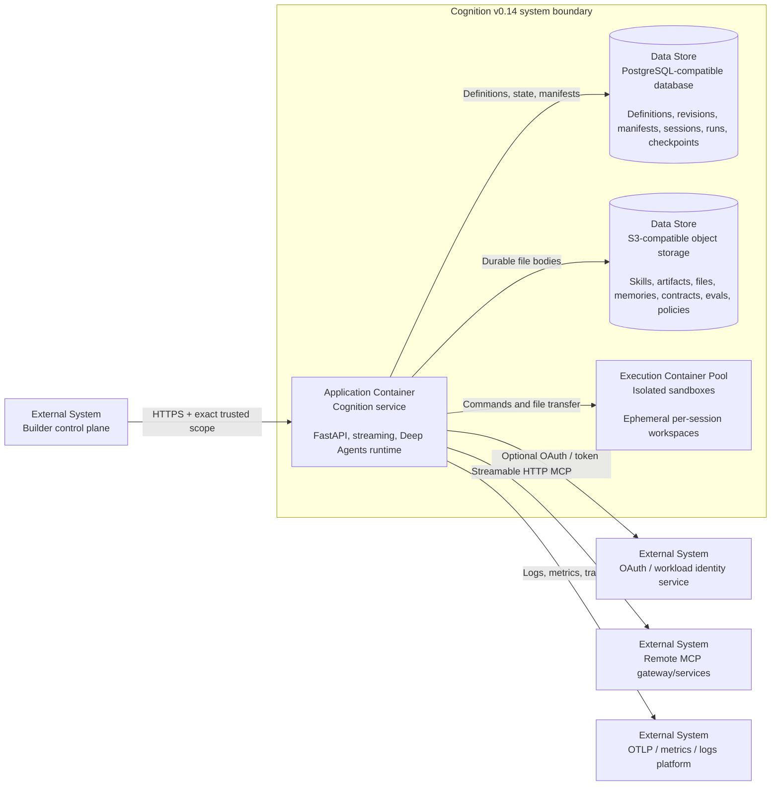
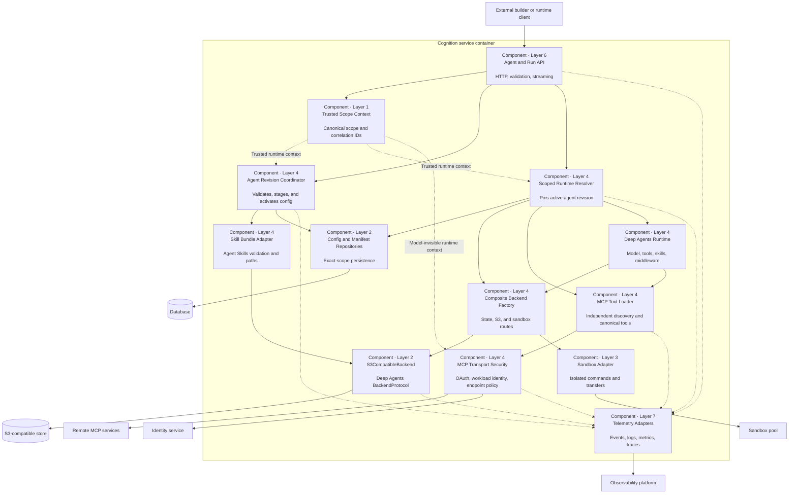
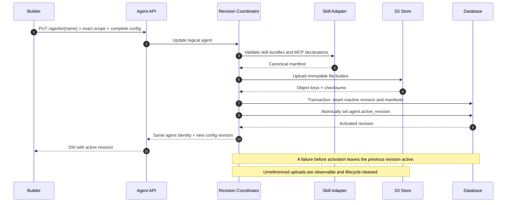
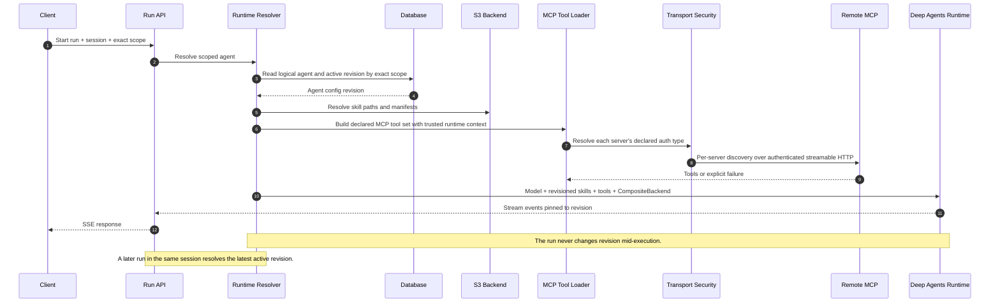
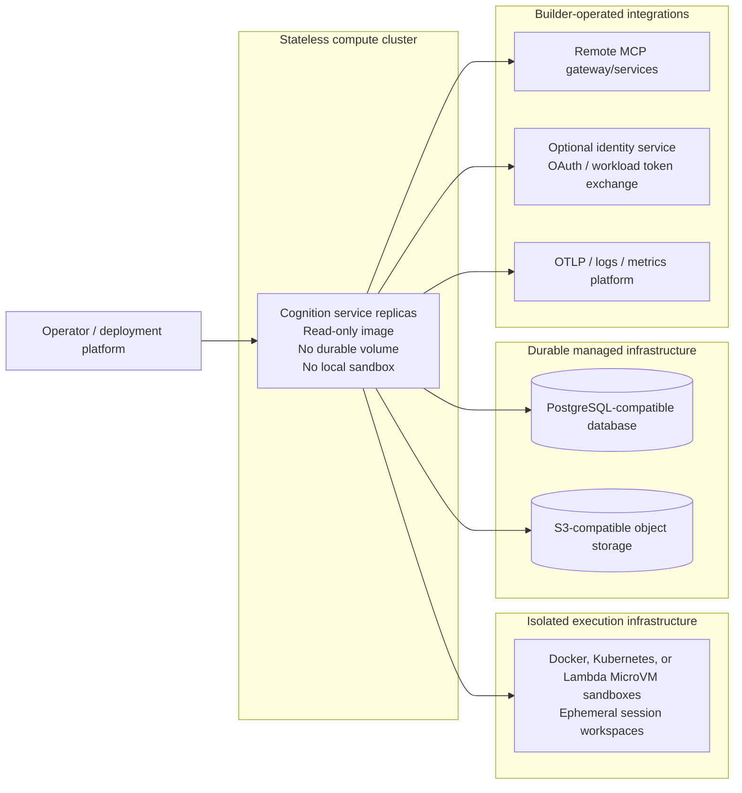
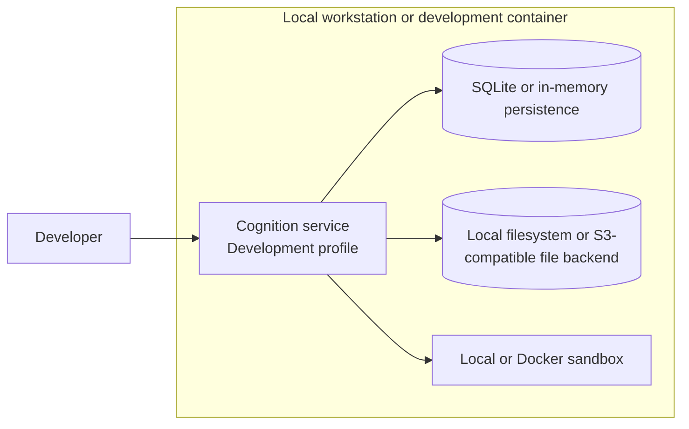

# v0.14.0 C4 Model: Agent Capabilities and Durable Storage

- **Status:** Revised draft proposal
- **Target:** v0.14.0
- **Date:** 2026-08-03
- **Audience:** Cognition maintainers, platform architects, security reviewers,
  and operators
- **Category:** Architectural change and feature
- **Layers:** 1 (Foundation), 2 (Persistence), 3 (Execution), 4 (Agent Runtime),
  6 (API & Streaming), and 7 (Observability)

## Purpose

This document uses the C4 model to describe the proposed v0.14.0 architecture:

1. Adopt Deep Agents 0.7.x and its current backend protocol.
2. Make Agent Skills bundles part of each agent's configuration.
3. Make remote MCP connections part of each agent's configuration and remove
   Cognition's global MCP-server subsystem.
4. Store durable records in the configured database and durable file bodies in
   S3-compatible storage. A production Cognition process must not persist runtime
   state on its host filesystem.

!!! important "One agent, versioned configuration"

    One logical agent exists per exact `effective_scope`. `PUT` and `PATCH`
    continue to update that agent. Each successful update creates an internal,
    immutable configuration revision that is activated atomically; it does not
    create another agent. A run pins the active revision at startup, and the next
    run uses the latest active revision.

!!! warning "Intentional breaking change"

    v0.14.0 does not provide dual-read, dual-write, compatibility endpoints,
    legacy MCP transport adapters, or automatic conversion of existing skill and
    MCP records. Builders must redeploy agents using the new configuration shape.

This is a proposal only. It does not authorize implementation, schema changes,
or dependency updates.

The detailed MCP schema, transport-security profiles, readiness states, and
executable security tests are defined in the
[v0.14.0 MCP Runtime and Authentication Contract](./v0.14.0-mcp-runtime-contract.md).

## C4 Scope and Notation

The document provides the five views relevant to this change:

| View | Question answered |
|---|---|
| Level 1: System context | Who uses Cognition, and which external systems does it use? |
| Level 2: Containers | Which deployable applications and data stores make up the solution? |
| Level 3: Components | Which major components inside the Cognition service implement it? |
| Dynamic | How do configuration activation and run startup behave over time? |
| Deployment | Where does each container run, and how is host persistence prevented? |

The diagrams use standard Mermaid shapes for compatibility with the existing
MkDocs renderer. C4 defines the abstraction and relationships; it does not
require a particular drawing notation. See the official C4 descriptions of
[system context](https://c4model.com/diagrams/system-context),
[container](https://c4model.com/diagrams/container),
[component](https://c4model.com/diagrams/component),
[dynamic](https://c4model.com/diagrams/dynamic), and
[deployment](https://c4model.com/diagrams/deployment) diagrams.

## Level 1: System Context



### System responsibilities

Cognition is responsible for:

- validating and serving complete agent configuration;
- carrying builder-authorized `effective_scope: dict[str, str]` unchanged;
- translating skill bundles into Deep Agents skill directories;
- loading only an agent's declared MCP tools;
- enforcing explicit MCP authentication and endpoint policy outside model
  control;
- routing production durable data to database or object storage;
- isolating execution in a non-host sandbox; and
- reporting configuration, storage, MCP, and runtime behavior explicitly.

Cognition is not responsible for builder IAM, tenant authorization, roles,
bindings, billing, entitlement logic, upstream provider credentials, or a
general credential vault. The builder establishes authority before calling
Cognition. Cognition may act as a standard MCP OAuth client or authenticate its
workload to a builder-controlled endpoint.

## Level 2: Container View

This logical view shows the production container set. The deployment views later
in the document define the supported local/dev substitutions.



### Container catalog

| Container | Responsibility | Scaling and tenancy |
|---|---|---|
| Cognition service | API, streaming, configuration activation, runtime assembly, policy enforcement | Stateless replicas; exact scope on every request and run |
| Database | Transactional metadata and LangGraph durability | Canonical scope stored with every runtime-owned record |
| S3-compatible store | Immutable durable file bodies | Opaque scope-derived key prefixes; manifest remains the authority |
| Sandbox pool | Code execution and temporary workspace | Isolated per session; never the durable source of record |

### Production data placement

| Data class | Production location |
|---|---|
| Agent identity, active revision, configuration manifests | Database |
| Sessions, runs, events, messages, checkpoints | Database |
| Encrypted MCP OAuth token state | Database |
| Skill, artifact, file, memory, contract, eval, and policy bodies | S3-compatible store |
| Deep Agents transient state | DB-backed checkpointer through `StateBackend` |
| Execution workspace | Ephemeral isolated sandbox |
| Telemetry | External stdout, OTLP, or metrics exporter |

## Level 3: Cognition Service Components



### Component responsibilities

| Component | Key contract |
|---|---|
| Agent and Run API | `PUT`/`PATCH` mutate one logical agent; run creation supplies exact scope |
| Trusted Scope Context | Runtime authority comes from trusted ingress, never model arguments |
| Agent Revision Coordinator | Publishes either the old complete revision or the new complete revision |
| Skill Bundle Adapter | Validates `SKILL.md`, regular files, paths, quotas, and subagent selection |
| Scoped Runtime Resolver | Resolves active revision once and pins it for the run |
| Composite Backend Factory | Builds upstream-aligned `StateBackend`, S3, and sandbox routing |
| MCP Tool Loader | Discovers each declared server independently and builds canonical tool identities |
| MCP Transport Security | Enforces endpoint-bound `none`, MCP OAuth, workload exchange, or local-only bearer policy for discovery and invocation |
| S3CompatibleBackend | Implements the current Deep Agents file protocol over DB manifests and S3 bodies |

## Dynamic View 1: Update One Agent



The public operation updates one agent. Immutable revisions are an internal
run-consistency, audit, and cache mechanism—not separate Agents or a public
historic-version selector. A builder rollback re-submits the desired complete
configuration and creates a new active snapshot.

## Dynamic View 2: Start a Run



Required MCP failures stop before model execution. Optional failures emit a
structured degraded-capability event and status. Authentication applies to both
discovery and later invocation; readiness is a freshness-qualified observation,
not authorization truth.

## Deployment Views

### Production: no host persistence



Production startup must reject SQLite, in-memory persistence, local durable-file
routes, local execution, workspace source watchers, runtime-created `.cognition`
directories, and file-based logs or checkpoints. Failure of the database or S3
store must never select a local or memory fallback.

### Local and development: host-backed storage is supported



SQLite, in-memory persistence, local file backends, and local sandbox execution
are supported for local and development setups. They do not require an "unsafe"
override. The selected deployment profile makes the boundary explicit:
development permits host-backed resources; production rejects them.

## Agent Configuration Mapping

The external shape remains one complete agent definition:

```yaml
name: support-agent
skills:
  support-policy:
    files:
      SKILL.md:
        text: |
          ---
          name: support-policy
          description: Apply the support escalation policy.
          ---
          Read references/escalation.md before escalating.
      references/escalation.md:
        text: "# Escalation policy"
mcp:
  servers:
    records:
      transport: streamable_http
      url: https://mcp.example.internal/api
      required: true
      auth:
        type: mcp_oauth
```

### Skills mapping

- `SKILL.md` is required and follows the Agent Skills frontmatter contract.
- Bundles may contain regular files under `scripts/`, `references/`, and
  `assets/`; symlinks, special files, traversal, and normalized duplicates are
  rejected.
- Scripts are builder-authored code and execute only in the selected session
  sandbox, never in the Cognition service process.
- Cognition materializes an active revision under a private virtual directory and
  passes that directory through `create_deep_agent(skills=[...])`.
- The general-purpose subagent inherits parent skills. A custom subagent selects
  bundle keys and cannot supply an arbitrary object-store path.
- Skill metadata and compiled-runtime caches include the configuration revision.

Shared skill catalogs and arbitrary host paths are deferred. The v0.14 contract
is deliberately agent-owned to preserve atomic deployment and exact-scope
isolation.

### MCP mapping

- Only servers declared by the active agent revision contribute tools.
- v0.14 supports remote `streamable_http` only. Legacy MCP SSE, local `stdio`,
  websocket, and stateful sessions are not accepted.
- Cognition uses the upstream `MultiServerMCPClient` and discovers each server
  independently so an optional failure cannot discard healthy tools.
- Canonical tool identity is `(server_alias, provider_tool_name)`. Visible name
  rendering is deterministic and not Agent-configurable; identity or rendering
  collisions fail before model execution.
- Production authentication types are `none`, `mcp_oauth`, and
  `workload_token_exchange`. `static_bearer` is a local/dev-only environment
  adapter and is rejected in production.
- Raw credentials, headers, API keys, custom authentication callbacks, URLs,
  audiences, scope, and server aliases never come from model-controlled values.
- Authentication covers discovery and invocation through Cognition's mandatory
  MCP client factory. LangChain interceptors provide runtime access but are not
  an optional Agent middleware security boundary.
- Workload exchange authenticates the Cognition service and exact target. A
  builder-controlled endpoint remains authoritative for live Agent-level
  authorization and upstream provider credentials.
- MCP resources and prompts are deferred; this release aligns the documented
  Deep Agents MCP-tools surface.

The complete schema, deployment profiles, context-projection rules, readiness
model, and acceptance tests are in the
[MCP Runtime and Authentication Contract](./v0.14.0-mcp-runtime-contract.md).

## Deep Agents Backend Composition

```python
CompositeBackend(
    default=StateBackend(runtime),
    routes={
        "/workspace/": sandbox_backend,
        "/skills/": scoped_s3_backend,
        "/artifacts/": scoped_s3_backend,
        "/files/": scoped_s3_backend,
        "/memories/": scoped_s3_backend,
        "/contracts/": scoped_s3_backend,
        "/evals/": scoped_s3_backend,
        "/policies/": scoped_s3_backend,
    },
)
```

The S3 backend uses database manifests and immutable object bodies. A write
uploads a body, verifies its checksum, and atomically advances the manifest.
`ls`, `glob`, and metadata filtering use the database index; bounded reads and
grep obtain eligible object bodies. `write` follows the Deep Agents 0.7 overwrite
contract, and `delete` is enabled only for routes whose policy permits it.

In local/dev, the routed S3 backend may be replaced by a local filesystem or
in-memory backend. The virtual paths, scope behavior, and Deep Agents protocol
remain the same across deployment profiles.

Every manifest stores canonical `effective_scope`, an opaque scope digest,
normalized path, media type, size, checksum, version, agent identity, resource
class, object key, and audit metadata. Knowledge of an object key is never
authorization.

## Architectural Decisions

| ID | Decision | Rationale |
|---|---|---|
| D1 | One scoped logical agent with immutable internal runtime snapshots | Atomic activation, run consistency, audit, and cache identity without a public historic-version selector |
| D2 | Agent-owned skill bundles | Matches Agent Skills and makes deployment complete and transactional |
| D3 | Per-agent remote MCP | Prevents global capability leakage and matches Deep Agents tool inputs |
| D4 | DB manifests plus immutable S3 bodies | Transactional metadata, scalable bodies, and atomic publication |
| D5 | `StateBackend` default with explicit S3 and sandbox routes | Aligns with Deep Agents and separates transient, durable, and execution data |
| D6 | Default-deny trusted runtime-context projection | Keeps authority outside model-controlled arguments and projects only deployment-approved fields |
| D7 | Deployment-profile storage policy | Production fails closed on host persistence; local/dev supports host-backed stores |
| D8 | No v0.13 compatibility surface | Removes dual behavior and makes the new agent contract authoritative |
| D9 | Standards-based MCP transport authentication | Direct MCP OAuth plus optional workload exchange avoids raw credentials and builder-installed code |

## Existing-to-Target Mapping

| Existing Cognition surface | v0.14 target |
|---|---|
| `AgentDefinition.skills: list[str]` registry attachments | Complete skill bundles in agent configuration |
| Single-string registered skill content | `SKILL.md` directory with supporting files in S3 |
| Standalone `/skills` as authoritative runtime source | Removed; builders redeploy skills inside agent configuration |
| Global `/mcp-servers` CRUD and ConfigRegistry entity | Removed |
| Runtime-wide `resolve_mcp_configs()` | Active agent revision's MCP declarations |
| Custom MCP connection models and translation | Upstream client plus mandatory transport-security and per-server discovery adapters |
| Scope injected into MCP tool arguments | Default-deny deployment-approved context from `request.runtime`; never model arguments |
| Artifact bodies in database | Manifest in database, body in S3-compatible storage |
| Host workspace watchers and `.cognition` runtime state | Supported in local/dev; explicitly rejected in production |

No automatic conversion maps global MCP or standalone skill records into agents.
Builders explicitly redeploy the desired capabilities in each v0.14 agent.

## Multi-Tenancy Invariants

1. Agent lookup and mutation use exact trusted scope.
2. Same-named agents in different scopes have distinct revisions, manifests,
   objects, MCP sets, checkpoints, caches, and sandboxes.
3. Builder-defined scope keys are preserved; no fixed user/org/project vocabulary
   is assumed.
4. Session and run scope is immutable. Each run also pins one agent revision.
5. Exact scope is checked before manifest access or object-store operations.
6. Scope is never model-supplied authority.
7. Read, list, update, delete, clone, export, cache, and administrative paths receive
   the same cross-scope tests as runtime reads.
8. Quotas cover skill bytes, object bytes, file count, MCP servers, discovered
   tools, and concurrent discovery attempts per exact scope and agent.

## Research Baseline

The dependency and behavior snapshot is dated 2026-08-03:

- [`deepagents` 0.7.1](https://pypi.org/project/deepagents/0.7.1/) is the latest
  published release; Cognition currently resolves 0.6.12.
- [Deep Agents skills](https://docs.langchain.com/oss/python/deepagents/skills)
  use Agent Skills directories and backend-relative paths.
- [Deep Agents MCP tools](https://docs.langchain.com/oss/python/deepagents/tools#mcp-tools)
  use `MultiServerMCPClient.get_tools()` and pass the result as agent tools.
- [LangChain MCP adapters](https://docs.langchain.com/oss/python/langchain/mcp)
  support streamable HTTP, standard authentication, per-server discovery, and
  runtime-aware tool interceptors.
- [MCP Authorization](https://modelcontextprotocol.io/specification/2026-07-28/basic/authorization)
  defines the standard direct-provider OAuth path and target-resource binding.
- [OAuth 2.0 Token Exchange](https://www.rfc-editor.org/rfc/rfc8693.html)
  defines the optional workload exchange used with builder-controlled endpoints.
- [Deep Agents backends](https://docs.langchain.com/oss/python/deepagents/backends)
  provide `StateBackend`, `StoreBackend`, `FilesystemBackend`,
  `CompositeBackend`, and the public backend protocol.
- The [Deep Agents 0.7 changelog](https://docs.langchain.com/oss/python/releases/changelog#deepagents-v0-7-0)
  removes compatibility shims, changes write semantics, exposes delete when
  supported, and tightens file-result contracts.
- [`langchain-mcp-adapters` 0.3.1](https://pypi.org/project/langchain-mcp-adapters/0.3.1/)
  is the current adapter release; Cognition currently resolves 0.3.0.

The target constraints should be compatible-minor ranges:

```toml
deepagents = "~=0.7.1"
langchain-mcp-adapters = "~=0.3.1"
```

Cognition's skills and artifact backends use legacy compatibility methods, so
they must be adapted to the 0.7 protocol before the lock update. The repository
also has a pre-existing duplicate `docs` optional-dependency key in
`pyproject.toml`; fixing that parser error is Phase 0 but outside this proposal.

## Delivery and Upgrade Boundary

| Phase | Outcome |
|---|---|
| Phase 0 | Fix project parsing, approve the C4 and MCP contracts, and finalize OpenAPI fields and deployment profiles |
| Wave 1 | Upgrade Deep Agents and MCP adapters; implement current backend contracts without shims |
| Wave 2 | Add per-agent MCP, explicit auth types, per-server discovery, readiness, canonical tool identity, and remove global MCP logic |
| Wave 3 | Add manifests, S3 backend, durable routes, storage health, and zero-host startup checks |
| Wave 4 | Add agent-owned skill bundles, subagent selection, and metadata invalidation |
| Wave 5 | Run isolation, deployment-profile, breaking-surface, and release-image gates |

v0.14 has no runtime or data compatibility contract with the removed skill and
MCP configuration surfaces:

1. `/skills` mutation, `/mcp-servers`, global MCP resolution, legacy MCP SSE, and
   their registry entities are removed without adapters or dual reads.
2. Existing skill and MCP records are not loaded or converted automatically.
3. Builders deploy complete agent definitions using the new v0.14 schema.
4. The database schema change may remove or archive obsolete records, but the
   v0.14 runtime never consumes them.
5. Operators that may need to return to v0.13 must take a database and object
   store backup before upgrading.

Internal snapshots provide run consistency but are not a public rollback or
historic-selection API. A builder restores an earlier definition by submitting
it again, which creates a new active snapshot. A release rollback to v0.13
requires restoring the v0.13 application and its backup; v0.14 does not emulate
the old data model.

## Observability

Logs, metrics, events, and traces must cover:

- agent revision validation, activation, and cache invalidation;
- skill upload, manifest commit, load, and metadata refresh;
- object-store latency, bytes, checksum failures, health, and orphan cleanup;
- MCP discovery, readiness, tool count, required failure, and optional
  degradation;
- rejection of removed configuration fields and endpoints; and
- startup rejection of host-backed production configuration.

Logs and traces may contain bounded correlation identifiers, configuration
revision, resource class, server alias, authentication type, and opaque scope
digest. Metrics use low-cardinality dimensions only; session, run, agent,
revision, server, and scope identifiers must never become metric labels. Signals
must not contain raw scope values, file or skill bodies, OAuth payloads, MCP
headers, credentials, tool arguments, or tool results. Readiness signals include
the observation timestamp so stale discovery cannot appear current.

## Risks and Mitigations

| Risk | Mitigation |
|---|---|
| Deep Agents 0.7 breaks existing adapters | Complete Wave 1 backend contract tests before configuration work |
| An agent update exposes partial S3 state | Upload immutable bodies, then atomically activate the database manifest |
| A cached graph retains old capabilities | Include the active configuration revision in cache identity |
| Global MCP removal changes tool availability | Document the break and require explicit per-agent redeployment |
| Model content changes endpoint, identity, or authorization | Bind transport to validated agent configuration and trusted runtime context; never accept transport controls from tool arguments |
| Shared workload identity is mistaken for Agent isolation | Treat it as workload authentication only; require live builder authorization and separate workload identities where cryptographic Agent or tenant isolation is required |
| Revocation is delayed by cached workload tokens | Use short expiry, prohibit refresh-token persistence for this mode, and authorize every invocation at the builder endpoint |
| OAuth discovery expands the egress or redirect surface | Pin the configured MCP origin, validate redirects and metadata, and apply deployment DNS and egress policy |
| Object keys expose tenant vocabulary | Use opaque keyed scope digests and authorize through manifests |
| Database or S3 outage causes local fallback | Fail explicitly; production has no fallback backend |
| Broad delete removes durable data | Exact-scope checks, route permissions, immutable bodies, delayed cleanup |

## Acceptance Criteria

- One exact-scope logical agent is updated atomically; revisions are internal
  configuration snapshots, not additional agents.
- A run pins one revision, while the next run in an existing session uses the
  latest active revision.
- Deep Agents discovers `SKILL.md` and supporting files from the routed backend;
  custom-subagent selection matches upstream behavior.
- Only per-agent MCP servers contribute tools. Required failure stops execution;
  optional failure produces visible degraded status.
- Every MCP server declares exactly one supported authentication type: `none`,
  `mcp_oauth`, `workload_token_exchange`, or local/dev-only `static_bearer`.
  Production rejects static bearer configuration and all raw-header or raw-secret
  injection shapes.
- Authentication is applied uniformly to independent per-server discovery and
  invocation. Canonical tool identity is `(server_alias, provider_tool_name)`,
  and duplicate identities fail configuration or discovery.
- Direct MCP OAuth follows the server's standard authorization flow. Builder
  workload exchange uses only an opaque deployment profile and trusted,
  model-invisible runtime context; externally revoked authorization denies the
  next invocation even during a pinned run.
- Optional server failure preserves tools from healthy servers. Required server
  failure stops before model execution with a typed, redacted error. Readiness
  becomes stale or unknown without being represented as authorization truth.
- All executable criteria in the
  [MCP Runtime and Authentication Contract](./v0.14.0-mcp-runtime-contract.md)
  are release-blocking.
- Scope and correlation metadata comes from trusted runtime context and is absent
  from model-visible tool schemas and arguments.
- The global MCP routes, registry entity, runtime resolver, and custom connection
  translation layer are removed.
- Production writes no durable runtime state to the Cognition host and refuses to
  start with a non-compliant persistence, file, watcher, logging, or sandbox
  configuration.
- Local and development profiles support SQLite, in-memory persistence, local
  file backends, and local sandbox execution without an unsafe override.
- Production database and S3 failures are explicit and never fall back locally.
- Cross-scope tests cover agent CRUD, revisions, skills, files, caches,
  checkpoints, MCP, listing, and deletion for arbitrary scope keys.
- Removed APIs, registry records, legacy SSE, and global resolution have no
  compatibility handler, dual-read path, or automatic conversion.
- API, runtime, deployment, upgrade, security, and capability documentation is
  updated, and the category-specific Definition of Done in `AGENTS.md` is met.

## Non-Goals

- Multiple agent records for configuration history
- Backward compatibility or automatic conversion for v0.13 skill and MCP records
- Cognition-managed IAM, authorization, roles, billing, or entitlements
- A general credential vault, arbitrary secret-reference API, raw credential or
  header injection, or provider-specific identity implementation
- Experimental OAuth delegation or a claim that one shared workload identity
  provides cryptographic Agent-level isolation
- Shared skill catalogs or arbitrary production host paths
- MCP resources, prompts, local stdio, or stateful sessions
- Durable execution workspaces on the Cognition host
- Provider-specific storage abstractions beyond the S3-compatible contract

## Decision Requested

Approve this C4 model and its
[MCP Runtime and Authentication Contract](./v0.14.0-mcp-runtime-contract.md) as
the v0.14.0 architecture baseline. After approval, the next planning artifact
should define the final OpenAPI schemas, breaking-change notice, implementation
issues, ownership, and release branch schedule. No implementation should begin
before approval.
