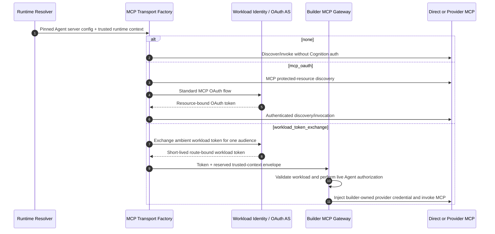

# v0.14.0 MCP Runtime and Authentication Contract

- **Status:** Implementing
- **Target:** v0.14.0
- **Date:** 2026-08-03
- **Audience:** Cognition maintainers, builders, security reviewers, and operators
- **Parent:** [v0.14.0 C4 Model](./v0.14.0-deep-agents-skills-mcp-storage.md)

## Outcome

Remote Model Context Protocol (MCP) servers belong to an Agent revision.
Cognition removes its global MCP-server subsystem and uses the upstream MCP SDK
through LangChain's MCP adapter.

Cognition provides four authentication types:

```python
MCPAuthType = Literal[
    "none",
    "mcp_oauth",
    "workload_token_exchange",
    "static_bearer",
]
```

| Type | Primary use | Credential authority |
|---|---|---|
| `none` | Public or infrastructure-protected endpoint | None or external infrastructure |
| `mcp_oauth` | Direct protected MCP endpoint | Cognition's exact-scope OAuth token store |
| `workload_token_exchange` | Builder-controlled gateway or service mesh | Builder identity and gateway infrastructure |
| `static_bearer` | Environment-backed bearer authentication | Builder deployment environment |

`static_bearer` is supported but not recommended because a long-lived bearer
token has weaker lifecycle, scoping, and revocation properties than MCP OAuth or
workload token exchange. Cognition does not infer a deployment's environment or
reject the mode based on a production or multi-tenant flag; the builder owns
that policy decision.

Raw headers, API keys, bearer values, provider credentials, and custom Python
authentication callbacks are never valid Agent configuration.

The durable authentication decision is recorded in
[ADR-0004](../architecture/decisions/0004-mcp-transport-authentication-and-builder-authorization.md).

## Agent Configuration

Each server is declared inside the complete Agent definition:

```yaml
mcp:
  servers:
    github:
      transport: streamable_http
      url: https://mcp-egress.internal/mcp/github
      required: true
      auth:
        type: workload_token_exchange
        profile: production_egress
```

The server alias is configuration identity, not a model argument. The URL is a
builder-authored endpoint. Cognition canonicalizes it before selecting transport
authentication and binds discovery and invocation to the resulting endpoint.

| Field | Contract |
|---|---|
| `transport` | `streamable_http` in v0.14 |
| `url` | Builder-authored HTTP/HTTPS endpoint; URL credentials are invalid |
| `required` | Required failure stops execution; optional failure degrades only that server |
| `auth.type` | One of the four supported authentication types |
| `auth.profile` | Opaque deployment-profile name, required only for `workload_token_exchange` |
| `auth.env` | Environment-variable name, required only for `static_bearer` |

Agent configuration cannot define a token endpoint, subject-token source,
audience, arbitrary scope, header name, header value, OAuth client secret,
provider callback, or provider credential.

## Authentication Types

### `none`

```yaml
auth:
  type: none
```

Cognition adds no credential, workload identity, or trusted-context header.
Infrastructure may still protect the endpoint outside Cognition. An unexpected
authentication challenge is a typed failure; Cognition does not silently select
another authentication mode.

### `mcp_oauth`

```yaml
auth:
  type: mcp_oauth
```

Cognition follows the standard MCP HTTP authorization flow supplied by the
upstream MCP SDK: protected-resource metadata, authorization-server discovery,
OAuth 2.1, Proof Key for Code Exchange (PKCE), resource indicators, issuer and
audience validation, refresh, and scope challenges.

Tokens are isolated by:

```text
exact effective_scope + immutable Agent identity + canonical server URI
```

Persistent OAuth state uses an encrypted database token store. OAuth tokens and
refresh tokens never use local files or S3 and never appear in Agent
definitions, model context, API projections, events, logs, metrics, or traces.
If authorization or token persistence is unavailable, the server fails with a
typed, redacted error; it never downgrades to `none`.

The builder owns the user-facing authorization experience around any interactive
OAuth step. The remaining OpenAPI design must expose the upstream
authorization-required state and completion boundary without making Cognition
the builder's account-connection UI; this proposal does not prescribe that UI.

### `workload_token_exchange`

```yaml
auth:
  type: workload_token_exchange
  profile: production_egress
```

`profile` is an opaque reference to deployment configuration, not a credential
or executable extension. Cognition provides a built-in OAuth token-exchange
client; builders do not install Python authentication callbacks.

```yaml
mcp_auth_profiles:
  production_egress:
    type: oauth_token_exchange
    token_endpoint: https://identity.internal/token
    subject_token_source: workload_identity
    audience: canonical_server_uri
```

The ambient workload identity is read from the projected file named by
`COGNITION_MCP_WORKLOAD_IDENTITY_TOKEN_FILE`; an environment token is a
supported fallback. When the token endpoint requires client authentication,
the deployment profile may select `client_secret_basic` with a non-secret
`client_id` and `client_secret_env` reference. These are deployment inputs, not
Agent fields.

The profile owns the identity-system endpoint and subject-token source. The
symbolic `canonical_server_uri` audience resolves to the canonical URL of the
selected MCP server. A profile may instead define a builder-selected exact
audience when its authorization server requires another stable identifier. The
Agent and model cannot override either value.

Cognition obtains an ambient workload identity, exchanges it for a short-lived
token, and sends that token only to the configured MCP endpoint. The exchange
requests one audience/resource. Sender constraint through mTLS or DPoP is
supported when the builder's identity system and gateway support it.

The token authenticates the Cognition workload and restricts its destination.
For a shared Cognition workload, it does not cryptographically authenticate one
logical Agent:

```text
sub = Cognition service account or workload
aud = exact builder-selected MCP gateway resource
Agent identity = separate trusted, model-invisible runtime context
```

Cognition does not require a particular claim layout, identity provider, token
exchange product, or support for experimental OAuth delegation. It does not
claim `sub = Agent` or manufacture an Agent subject from Agent configuration.

The builder-controlled gateway validates the workload token and performs live
authorization using the trusted runtime context. It may then resolve and inject
the upstream provider credential. Cognition never receives that provider
credential. A builder that requires cryptographic Agent- or tenant-level
identity must deploy separate workload identities at that execution boundary.

An exchanged workload token may be cached in memory until its bounded expiry.
The cache key includes the profile and exact audience/resource. The cached token
must not contain a frozen Agent authorization decision; the gateway re-evaluates
mutable Agent authorization on the next discovery or invocation.

### `static_bearer`

```yaml
auth:
  type: static_bearer
  env: LOCAL_MCP_TOKEN
```

Cognition reads the named environment variable at transport construction and
does not persist or project its value. The token is applied to discovery and
invocation. This mode is supported but not recommended. Cognition does not
decide which deployment environments may use it; builders own that choice and
its risk.

## Builder-Owned Deployment Policy

Cognition does not define or infer a global `production` posture. Builders own:

- which endpoints and authentication modes are admitted;
- whether `static_bearer` is acceptable;
- token-exchange profiles, identity providers, audiences, mTLS, and DPoP;
- network egress, DNS, redirect, and private-network policy;
- gateway authorization, bindings, authorization generation, and revocation;
- upstream provider credentials and their lifecycle; and
- whether workload identity is shared, per tenant, or per Agent.

Cognition implements the selected configuration and provides structural
guarantees: authentication is not model-controlled, configured credentials are
not persisted outside their defined store, and one server's authentication is
not reused for another canonical server identity.

## Trusted Runtime Context

Only `workload_token_exchange` projects trusted Cognition runtime context. The
context is a fixed, versioned Cognition envelope constructed after Agent and run
resolution. It carries the immutable Agent identity and revision, exact
builder-authorized `effective_scope`, server alias, canonical server URI,
runtime correlation identifiers, and request deadline.

The envelope is not an Agent-configurable header dictionary. Cognition
overwrites all reserved fields at send time. Model-supplied tool arguments,
prompts, MCP results, inbound client headers, and Agent-authored skills cannot
alter:

- authorization or proof-of-possession material;
- canonical endpoint, redirect, target, resource, or audience;
- token-exchange profile or subject-token source;
- server alias or provider tool name;
- Agent identity, revision, or `effective_scope`; or
- required/optional server policy.

The version 1 envelope uses a fixed header set:

| Header | Source |
|---|---|
| `X-Cognition-Context-Version` | Constant `1` |
| `X-Cognition-Agent-ID` | Immutable resolved Agent name |
| `X-Cognition-Agent-Revision` | Pinned revision |
| `X-Cognition-Effective-Scope` | Canonical JSON from trusted ingress scope |
| `X-Cognition-MCP-Server-Alias` | Pinned server alias |
| `X-Cognition-MCP-Server-URI` | Canonical configured endpoint |
| `X-Cognition-Session-ID` | Active runtime context, when available |
| `X-Cognition-Run-ID` | Active runtime context, when available |
| `X-Cognition-Request-Deadline` | Unix milliseconds, when a deadline exists |

No other Agent-, model-, or interceptor-supplied header survives the mandatory
workload-context projection.

A gateway must accept the envelope only together with the authenticated
Cognition workload request and must strip equivalent fields at untrusted
ingress. The envelope supplies authorization context; it does not replace live
builder authorization.

## Runtime Flow



Transport authentication applies to both tool discovery and tool invocation.
It is installed by Cognition's mandatory MCP transport factory, not by optional
Agent middleware. LangChain MCP interceptors may expose runtime context to the
transport adapter but are not independently configurable as the security
boundary.

## Discovery, Tool Identity, and Readiness

Cognition discovers each server independently through the upstream per-server
client operation. One optional server failure cannot remove tools already
discovered from healthy servers.

The canonical tool identity is:

```text
(server_alias, provider_tool_name)
```

Visible tool-name rendering is deterministic but is not canonical identity.
Duplicate canonical identities or visible-name collisions fail activation or
discovery before model execution.

Readiness is a freshness-qualified runtime observation, never authorization
truth. Each server reports required/optional status, last observation time,
freshness deadline, discovered tool count/schema digest, and a typed redacted
failure category. The builder gateway still evaluates authorization on the next
operation even when the latest readiness observation is `ready`.

## Security and Observability Invariants

1. Authentication failures are typed and redacted; no protected mode retries
   anonymously.
2. OAuth tokens are exact-scope, Agent, and canonical-server partitioned.
3. Workload-exchange tokens are short-lived and limited to one configured
   audience/resource.
4. Builder gateways perform live Agent authorization on every discovery and
   invocation; pinned Agent configuration never freezes mutable authorization.
5. Cognition never receives a gateway's upstream provider credential.
6. Credentials, tokens, authentication headers, OAuth payloads, tool arguments,
   tool results, and raw scope values never enter persistence or telemetry.
7. High-cardinality Agent, session, run, scope, revision, profile, and server
   identifiers never become metric labels.
8. MCP callbacks and errors do not log raw remote messages or result bodies.

## Executable Acceptance Criteria

1. `none` adds no credential, identity, or trusted-context header.
2. Direct MCP OAuth tokens for the same canonical server are isolated across
   exact scopes and Agent identities.
3. MCP OAuth discovery, PKCE, resource indicators, refresh, and scope challenges
   use the upstream SDK contract; failure never downgrades to anonymous.
4. A workload profile resolves its configured subject-token source and exactly
   one canonical audience/resource without Agent/model override.
5. A shared-workload exchange token authenticates Cognition, not a fabricated
   logical Agent subject.
6. Two scoped Agents using the same server alias can receive different live
   gateway authorization without credential or authorization-result cross-use.
7. Revocation during an already-pinned run denies the next gateway operation.
8. Model-supplied authorization, URL, redirect, scope, server alias, profile,
   audience, resource, or target cannot affect transport.
9. `static_bearer` reads only the configured environment variable and never
   persists or returns its value; Cognition performs no environment classifier.
10. Optional-server failure preserves healthy tools; required-server failure
    stops execution with a typed redacted error.
11. Duplicate canonical identities and visible-name collisions fail before
    model execution.
12. Authentication applies to discovery and invocation.
13. No credential, token, authentication header, OAuth payload, raw scope value,
    tool argument, or tool result appears in persistence or telemetry.
14. High-cardinality identifiers never become metric labels.
15. Readiness becomes stale/unknown after its freshness deadline and is never
    presented as authorization truth.

## Non-Goals

- Identity-provider-specific configuration or claims
- Cognition-managed Agent IAM, roles, bindings, authorization generations, or
  entitlements
- A builder-installed Python authentication callback or public `httpx.Auth`
  extension contract
- A general credential vault or arbitrary secret-reference/header API
- Experimental OAuth impersonation or manufactured Agent delegation
- A claim that shared workload identity provides cryptographic Agent isolation
- Cognition enforcement of a builder's production/security posture
- MCP resources, prompts, local `stdio`, or stateful sessions in v0.14

## Standards and Upstream References

- [Deep Agents MCP tools](https://docs.langchain.com/oss/python/deepagents/tools#mcp-tools)
- [LangChain MCP adapters and authentication](https://docs.langchain.com/oss/python/langchain/mcp)
- [MCP Authorization](https://modelcontextprotocol.io/specification/2026-07-28/basic/authorization)
- [OAuth Token Exchange, RFC 8693](https://www.rfc-editor.org/rfc/rfc8693.html)
- [OAuth Security Best Current Practice, RFC 9700](https://www.rfc-editor.org/rfc/rfc9700.html)
- [Resource Indicators, RFC 8707](https://www.rfc-editor.org/rfc/rfc8707.html)
- [OAuth Protected Resource Metadata, RFC 9728](https://www.rfc-editor.org/rfc/rfc9728.html)
