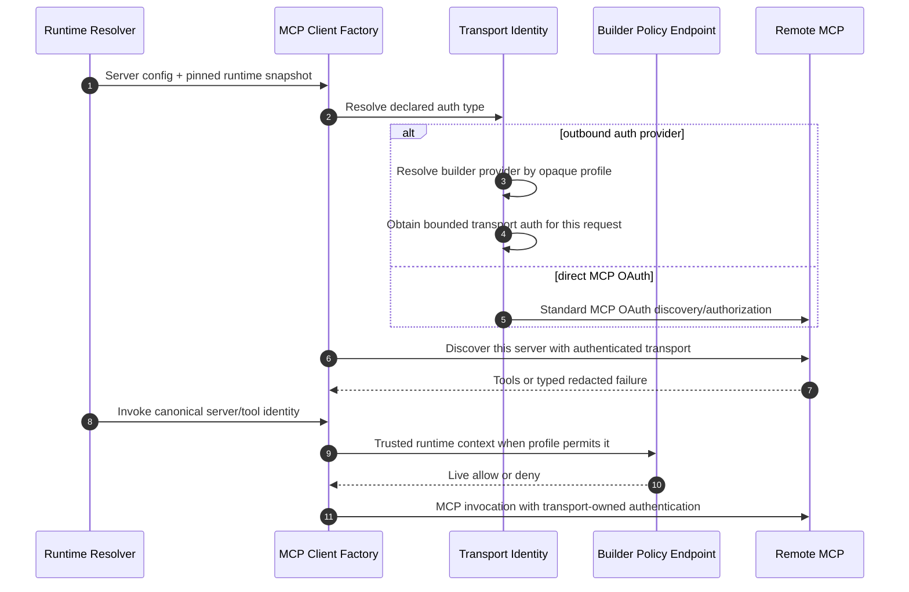

# v0.14.0 MCP Runtime and Authentication Contract

- **Status:** Draft proposal
- **Target:** v0.14.0
- **Date:** 2026-08-03
- **Audience:** Cognition maintainers, builders, security reviewers, and operators
- **Parent:** [v0.14.0 C4 Model](./v0.14.0-deep-agents-skills-mcp-storage.md)

## Outcome

v0.14 makes remote Model Context Protocol (MCP) servers part of an Agent
revision and removes Cognition's global MCP-server subsystem. Cognition uses the
upstream LangChain MCP client and exposes four explicit authentication types:

| Type | Intended use | Credential authority |
|---|---|---|
| `none` | Public or infrastructure-protected endpoint | None or external infrastructure |
| `mcp_oauth` | Direct protected MCP endpoint | Standard MCP OAuth flow, scoped token store |
| `outbound_auth_provider` | Builder-controlled protected endpoint | Builder-installed transport auth provider |
| `static_bearer` | Local development only | Local operator environment |

The first three are production-capable. `static_bearer` is rejected by the
production deployment profile. Raw headers, API keys, bearer values, provider
credentials, and custom Python authentication callbacks are never valid Agent
configuration.

## Agent Configuration

Each server is declared inside the complete Agent definition:

```yaml
mcp:
  servers:
    github:
      transport: streamable_http
      url: https://mcp.example.com/github
      required: true
      auth:
        type: mcp_oauth
```

The server alias is `github`. It is configuration identity, not a model
argument. Production activation canonicalizes the URL, checks it against
deployment egress policy, and binds the canonical endpoint to its selected
authentication type.

The following common fields are supported:

| Field | Contract |
|---|---|
| `transport` | Must be `streamable_http` in v0.14 |
| `url` | Builder-authored HTTPS endpoint; canonicalized before policy matching |
| `required` | Required failure stops execution; optional failure degrades only that server |
| `auth.type` | One of the four explicit authentication types |
| `auth.profile` | Opaque authentication-profile name, required only for `outbound_auth_provider` |
| `auth.env` | Environment-variable name, required only for local/dev `static_bearer` |

Tool prefixes and raw connection headers are not configurable. Cognition owns
the deterministic visible tool-name rendering.

## Authentication Types

### `none`

`none` sends no Cognition-managed credential:

```yaml
auth:
  type: none
```

Infrastructure may still protect the endpoint outside Cognition. An unexpected
authentication challenge is surfaced as a typed, redacted failure; Cognition
does not silently switch authentication modes.

### `mcp_oauth`

`mcp_oauth` is the direct-provider path:

```yaml
auth:
  type: mcp_oauth
```

Cognition follows the standard MCP HTTP authorization flow supported by the
upstream MCP SDK, including protected-resource metadata, OAuth authorization
server discovery, Proof Key for Code Exchange (PKCE), resource indicators,
scope challenges, and audience validation.

OAuth tokens are namespaced by exact `effective_scope`, immutable Agent
identity, and canonical server URI. Production persistence uses an encrypted
database token store whose encryption authority comes from deployment
configuration or ambient workload identity. Tokens never use host files or S3,
and never appear in Agent definitions, model context, API projections, events,
logs, metrics, or traces.

If the required OAuth capability, encrypted token store, or authorization state
is unavailable, the server is not ready. Cognition does not downgrade to
`none`.

### `outbound_auth_provider`

This optional type supports builders that put a policy enforcement point,
gateway, service mesh, connection service, or token exchange in front of
remote MCP providers:

```yaml
auth:
  type: outbound_auth_provider
  profile: production_egress
```

The profile is a selector, not a credential. Cognition looks up a builder-
installed `OutboundAuthProvider`; it does not resolve a secret, know an identity
provider, or persist the provider's configuration. The provider receives only
the immutable Cognition Agent identity, pinned runtime snapshot, server alias,
trusted runtime context, and request deadline. It returns `httpx.Auth` or
bounded allowlisted headers, token expiry, and a redacted failure category.

The provider cannot return data to model context, API responses, persisted
configuration, logs, traces, or readiness projections. It may keep an
expiry-bounded in-memory token cache. Cognition validates the provider's header
allowlist and owns no client, realm, role, claim, token-exchange, or credential
logic.

A builder may implement short-lived OAuth token exchange behind this interface.
For example, it can exchange the Cognition workload identity for exactly one
audience-bound gateway token. That token proves the workload and constrains its
destination; it does not manufacture cryptographic identity for a logical
Agent. The builder endpoint must therefore make fail-closed, live Agent
authorization decisions on each discovery and invocation using Cognition's
trusted, model-invisible runtime context.

### `static_bearer`

`static_bearer` exists only for local development:

```yaml
auth:
  type: static_bearer
  env: LOCAL_MCP_TOKEN
```

The environment variable name may be persisted, but its value may not. The
value is read into bounded process memory and is excluded from every projection
and telemetry path. Production startup and production Agent activation reject
this type.

## Runtime Components and Flow

Authentication is transport security, not optional Agent middleware. Cognition's
MCP client factory installs it for discovery, readiness probes, and invocation.
The LangChain MCP interceptor is used for invocation-time runtime access and
request overrides, but it is not independently configurable or removable by an
Agent.



For a builder-controlled endpoint, the policy endpoint and MCP endpoint may be
the same external system. Cognition does not model the builder's internal
gateway, connection, credential, or authorization-service hierarchy.

## Trusted Runtime Context

Context projection is default-deny and deployment-controlled. It may include
only fixed Cognition-owned fields selected by the profile. Agent configuration
cannot define header names or values.

The transport layer overwrites reserved headers from trusted runtime context.
Model-supplied tool arguments, prompts, MCP results, inbound client headers, and
Agent-authored skill content cannot affect:

- `Authorization` or proof-of-possession material;
- canonical server URI, redirect target, target parameter, or audience;
- server alias or provider tool name;
- Agent identity, runtime snapshot, or `effective_scope`; or
- required/optional server policy.

The receiving endpoint must trust projected context only when the request is
authenticated as the configured Cognition workload. External ingress must strip
the same reserved headers. A shared workload identity provides logical Agent
isolation only; cryptographic Agent or tenant isolation requires separate
workload execution identities.

## Discovery, Tool Identity, and Readiness

Cognition discovers each server independently with
`MultiServerMCPClient.get_tools(server_name=alias)` or an equivalent upstream
per-server operation. Independent tasks may run concurrently, but one server's
failure cannot discard tools discovered from healthy optional servers.

The canonical tool identity is the tuple:

```text
(server_alias, provider_tool_name)
```

Visible tool-name rendering is deterministic but is not canonical identity.
Duplicate canonical identities or rendered-name collisions fail activation or
discovery before model execution.

Readiness is a freshness-qualified runtime observation, never authorization
truth. Each server reports:

- `ready`, `degraded`, `unavailable`, `unknown`, or `stale`;
- required/optional status;
- last observation time and freshness deadline;
- discovered tool count and schema digest; and
- a typed, redacted failure category.

Authorization is still evaluated at the next discovery or invocation even when
the latest readiness observation is `ready`.

## Security and Observability Invariants

1. Production endpoints use HTTPS, exact canonical endpoint policy, bounded
   redirects, and network egress controls. OAuth metadata URLs receive the same
   server-side request forgery protections.
2. `mcp_oauth` tokens are exact-scope and server partitioned.
3. Workload-exchange tokens are short-lived, single-target, and have no refresh
   token. Sender constraint through mTLS or DPoP is used when the deployment
   supports and verifies it.
4. Builder endpoints perform fail-closed live Agent authorization on every
   discovery and invocation; a pinned Agent revision never preserves a revoked
   authorization decision.
5. Cognition never receives the builder endpoint's upstream provider credential.
6. Authentication failures are typed and redacted. Cognition never retries a
   protected request anonymously.
7. Credentials, token values, authentication headers, raw scope values, tool
   arguments, tool results, and OAuth payloads never enter persistence or
   telemetry.
8. High-cardinality Agent, session, run, scope, revision, and server identifiers
   never become metric labels. Redacted identifiers may appear in bounded logs
   and trace attributes when operationally required.
9. Callback handlers do not log raw MCP server messages or result bodies.
10. A configuration or code path that constructs an MCP client without the
    mandatory transport-security factory fails review and testing.

## Executable Acceptance Criteria

1. Two scoped Agents using the same server alias resolve different live upstream
   provider authorization when their builder bindings differ, without cross-use.
   They may share a workload route token only when it carries no Agent authority.
2. Agent configuration, skills, tools, and models cannot add non-allowlisted
   transport headers.
3. A model-supplied `Authorization`, URL, redirect, scope, server alias, auth
   profile, or target value cannot affect discovery or invocation transport.
4. Revoking an Agent or binding during an already-pinned run denies the next
   discovery or invocation.
5. One optional server failing does not remove tools from healthy servers.
6. One required server failing stops execution before the model runs with a
   typed, redacted error.
7. Duplicate canonical tool identities and rendered-name collisions fail
   configuration activation or discovery.
8. No credential, token, authentication header, raw scope value, tool argument,
   tool result, or OAuth payload appears in persistence or telemetry.
9. High-cardinality identifiers never become metric labels.
10. Readiness becomes `stale` or `unknown` after its freshness deadline and is
    never presented as authorization truth.
11. Direct OAuth tokens for the same canonical server are isolated across exact
    scopes and Agent identities.
12. `mcp_oauth` failure never downgrades to anonymous transport.
13. An outbound auth provider cannot add non-allowlisted headers and fails
    closed on profile, endpoint, or policy mismatch.
14. Provider credential revocation is bounded by its expiry; Agent-level
    revocation is checked live on the next operation.
15. Authentication applies to both tool discovery and tool invocation.
16. Production startup and activation reject `static_bearer`; local/dev reads the
    configured environment value without persisting or projecting it.
17. Production endpoint, OAuth metadata, DNS, private-network, and redirect
    policies prevent unapproved server-side requests while allowing explicitly
    admitted internal endpoints.
18. MCP callbacks and errors remain redacted even when a remote server emits
    credential-shaped or high-cardinality content.

## Non-Goals

- Identity-provider-specific configuration or claims, including Keycloak
  configuration
- Cognition-managed Agent IAM, roles, bindings, or entitlements
- A general credential vault or arbitrary secret-reference API
- Raw authentication headers or custom `httpx.Auth` objects in Agent definitions
- Experimental OAuth impersonation or delegation
- Cryptographic isolation between logical Agents sharing one Cognition workload
- MCP resources, prompts, local `stdio`, or stateful sessions in v0.14

## Standards and Upstream References

- [LangChain MCP adapters](https://docs.langchain.com/oss/python/langchain/mcp)
- [MCP Authorization](https://modelcontextprotocol.io/specification/2026-07-28/basic/authorization)
- [MCP Security Best Practices](https://modelcontextprotocol.io/docs/2026-07-28/tutorials/security/security_best_practices)
- [OAuth 2.0 Token Exchange, RFC 8693](https://www.rfc-editor.org/rfc/rfc8693.html)
- [OAuth 2.0 Security Best Current Practice, RFC 9700](https://www.rfc-editor.org/rfc/rfc9700.html)
