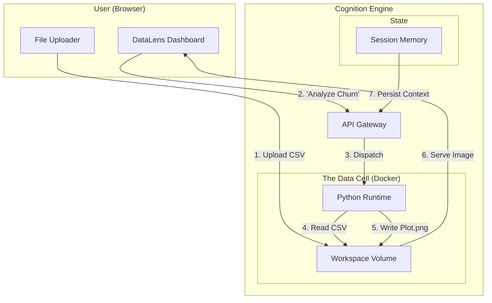

# Blueprint: Headless Data Scientist ("DataLens")

> **Use Case: Autonomous Data Analysis & Visualization**

This blueprint demonstrates the canonical use case for the Cognition Substrate: building a secure, "Code Interpreter" style platform for business users.

## The Challenge

Business analysts have data (CSVs, Excel, SQL dumps), but they lack the coding skills to perform advanced statistical analysis or cleanup. Existing "Chat with Data" tools are often hallucinations wrappers that can't actually *compute* anything.

**The Hard Requirements:**
1.  **Real Computation:** The AI must run actual Python code (`pandas`, `scikit-learn`) to get mathematically correct answers.
2.  **Artifact Generation:** The output isn't just text; it's Charts (PNG), Reports (PDF), and Cleaned Data (CSV).
3.  **Security:** Running AI-generated code is remote code execution (RCE). It **must** be isolated from the host infrastructure.

## The Solution: DataLens

DataLens is a web application where users upload datasets and an AI Agent acts as their dedicated Data Scientist.

### Architecture



### Key Components

#### 1. The Data Cell
DataLens uses a **Docker Cell** image pre-loaded with the standard data science stack:
*   `pandas`, `numpy`, `matplotlib`, `seaborn`, `scikit-learn`.
*   **Restricted Network:** The container has NO internet access. This ensures that even if the AI generates code to upload the CSV to a remote server, it will fail.

#### 2. The Artifact Loop
The Agent doesn't just "talk." It "does."
*   **User:** "Visualize the correlation between Age and Spend."
*   **Agent (Thought):** "I need to write a script to load the data and plot a scatter chart."
*   **Tool Call:** `write_file("plot_analysis.py", code)`
*   **Tool Call:** `execute("python plot_analysis.py")`
*   **Result:** The script saves `correlation_scatter.png` to the workspace.
*   **Final Response:** "I've generated the chart. [Link to Image]"

#### 3. Stateful Refinement
Because of Cognition's **Thread** persistence, the user can iterate.
*   **User:** "Remove outliers where Spend > $10k and re-run."
*   **Agent:** Loads the previous context, modifies the script, and regenerates the artifact.

### Implementation Example

**System Prompt:**
```text
You are DataLens, an expert Python Data Scientist.
You have access to a dataset at `/workspace/data.csv`.

RULES:
1. Always write Python code to answer questions. Never guess.
2. Save all plots as PNG files in `/workspace/outputs/`.
3. If the data is messy, write a script to clean it first.
```

**Workflow Trace:**

1.  **Ingest:** User uploads `churn_data.csv`.
2.  **Instruction:** "What is the average LTV by cohort?"
3.  **Agent Action:**
    *   `execute("head -n 5 data.csv")` → Checks schema.
    *   `write_file("analyze.py")` → Writes pandas aggregation logic.
    *   `execute("python analyze.py")` → Runs the math.
4.  **Output:** `{"LTV": {"2023-Q1": 450, "2023-Q2": 480}}`
5.  **Response:** "The 2023-Q2 cohort has the highest LTV ($480). Here is the breakdown..."

## Why Cognition?

*   **Security:** Building a secure RCE environment for Python is incredibly difficult. Cognition's **Cell** primitive solves this out of the box.
*   **Trust:** The **Audit Trace** allows the user to see the *exact* Python code used to generate the metric, building confidence in the result.
