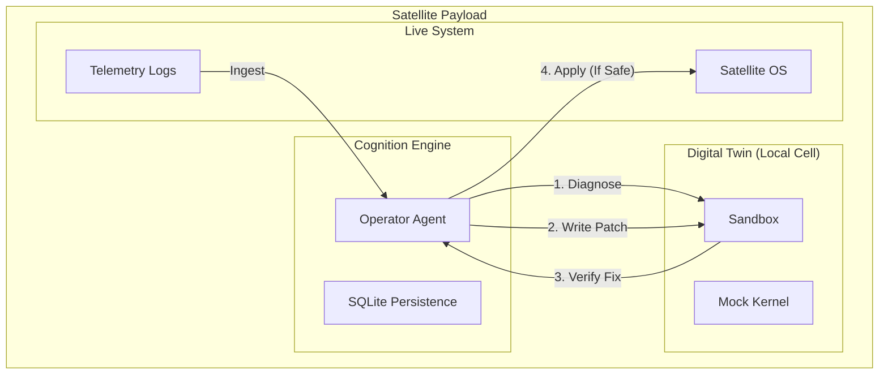

# Blueprint: The Orbital Administrator ("StarKeep")

> **Use Case: Space Operations & Edge Computing**

This blueprint demonstrates deploying the Cognition Substrate in an extreme edge environment: a satellite constellation with intermittent connectivity.

## The Challenge

Satellites are sophisticated computers floating in a hostile environment. If software glitches occur, there is no SSH access for 45 minutes (orbital darkness). Ground control needs an autonomous operator capable of diagnosing and patching systems *onboard*.

**The Hard Requirements:**
1.  **Autonomy:** The agent must operate without internet/ground connection.
2.  **Zero-Error Tolerance:** You cannot brick the main computer.
3.  **Simulation-First:** Any fix must be verified in a "Digital Twin" before being applied to the OS.

## The Solution: StarKeep

StarKeep is a lightweight instance of Cognition running on the satellite's payload processor.

### Architecture

### Key Components

#### 1. The Edge Runtime
Cognition runs in a lightweight, air-gapped configuration.
*   **LLM:** A small, quantized model (e.g., Llama-3-8B-4bit) hosted locally on the satellite's inference accelerator.
*   **Persistence:** `SQLite` backend ensures the Agent's thought process survives radiation-induced reboots.

#### 2. The Digital Twin (Local Cell)
The **Sandbox** acts as a simulator.
*   The Agent creates a mock environment that mimics the failing system state.
*   It writes a C++ or Python patch and compiles it *inside* the Sandbox.
*   It runs unit tests against the patch inside the Sandbox.
*   Only if 100% of tests pass does it request permission (or wait for Ground signal) to apply to `Live System`.

#### 3. The Black Box (Trace)
When the satellite reconnects with Ground Station, it doesn't just download logs. It downloads the **Trace**. Engineers can replay the Agent's logic step-by-step to understand *how* it solved the problem.

### Example Workflow

1.  **Event:** Telemetry shows a memory leak in the Guidance module. Connection lost.
2.  **Wake:** StarKeep wakes up.
3.  **Analysis:** "Logs indicate heap fragmentation in `guidance_ctrl.cpp`."
4.  **Simulation:**
    *   Agent creates a test case reproducing the leak in the **Sandbox**.
    *   Agent writes a patch to free memory correctly.
    *   Agent compiles and runs the patch in the **Sandbox**. Leak resolved.
5.  **Action:** Agent patches the live binary in memory (hot patch).
6.  **Reconnect:** "Ground Control, I detected anomaly X. I have applied Patch Y. System nominal. Here is the Trace."

## Why Cognition?

*   **Pragmatism:** "Agents" in space sound sci-fi, but it's just automated problem solving. Cognition provides the **Runtime** to execute that solving safely.
*   **Isolation:** The Sandbox is the difference between "Autonomous Repair" and "Accidental De-orbit."
