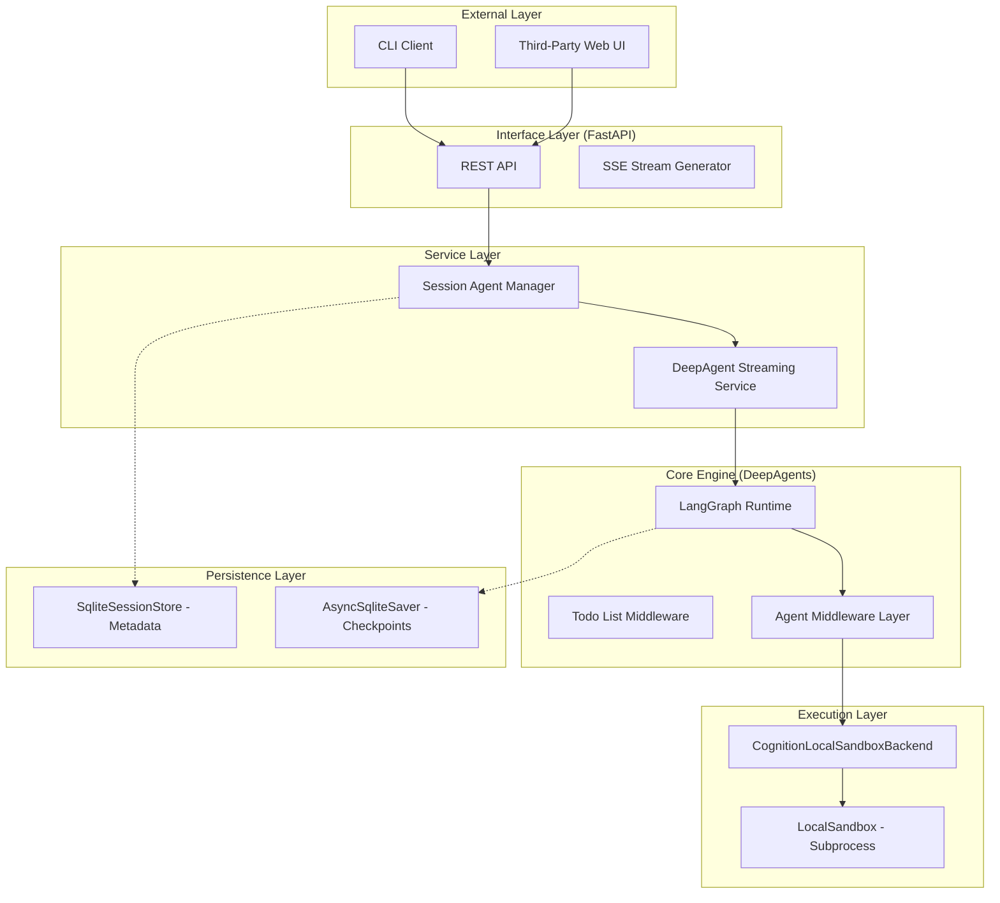

# Technical Architecture

> **Inside the Engine: Component Interaction, Data Flow, and State Management.**

Cognition is built as a modular, asynchronous engine. It separates the concerns of API orchestration, agent reasoning, and isolated execution to ensure that the platform remains stable, auditable, and extensible.

## System Overview

The engine follows a layered architecture where each layer communicates through well-defined protocols.



## 1. The Interface Layer (REST + SSE)

Cognition exposes its functionality through a standard REST API. Unlike traditional WebSocket-based agents, Cognition uses **Server-Sent Events (SSE)** for response streaming.

- **Request:** `POST /sessions/{id}/messages`
- **Response:** `text/event-stream`
- **Event Types:**
    - `token`: Incremental LLM tokens for UI rendering.
    - `tool_call`: Metadata about a tool the agent is about to execute.
    - `tool_result`: The raw output from the sandbox.
    - `usage`: Final token counts and cost estimation.
    - `done`: Signal that the ReAct loop has finished.

## 2. The Service Layer (DeepAgent Service)

The `DeepAgentStreamingService` is the heartbeat of the engine. It transforms the linear request-response of HTTP into the iterative, multi-step lifecycle of an autonomous agent.

### The ReAct Loop
When a message is received, the service enters an automatic **ReAct (Reason + Act)** loop:
1.  **Reason:** The LLM analyzes the conversation history and the new message.
2.  **Act:** If a tool call is required, the loop pauses reasoning and dispatches to the **Execution Layer**.
3.  **Observe:** The tool output is fed back into the LLM context.
4.  **Repeat:** The loop continues until the LLM provides a final textual response or reaches the iteration limit.

## 3. The Execution Layer (Hybrid Sandbox)

Execution safety is provided by the `CognitionLocalSandboxBackend`. It implements a hybrid model designed for the local development environment:

*   **Native File I/O:** Inherits from `FilesystemBackend`. It uses native Python `os` and `pathlib` calls for reading and writing files. This provides maximum OS compatibility and performance.
*   **Isolated Shell:** Uses a `LocalSandbox` wrapper around `subprocess`. It executes shell commands (e.g., `pytest`, `git`) with the `cwd` (Current Working Directory) strictly locked to the workspace root.

## 4. Unified StorageBackend Protocol

Cognition implements a unified storage protocol (`StorageBackend`) that abstracts sessions, messages, and checkpoints behind a single interface. This enables pluggable persistence with support for SQLite (default) and PostgreSQL.

### Storage Architecture
```
StorageBackend (Protocol)
├── SessionStore - Session metadata and scoping
├── MessageStore - Message history with pagination
└── Checkpointer - LangGraph checkpoint persistence
```

### A. Session Metadata with Scoping
Managed by `SessionStore` implementations (SQLite or Postgres). Sessions now support multi-dimensional scoping via `X-Cognition-Scope-*` headers.
*   **Fields:** `id`, `title`, `thread_id`, `status`, `message_count`, `scopes`.
*   **Scoping:** Filter sessions by user, project, team, or custom dimensions.

### B. Message Persistence
Managed by `MessageStore`. All messages are persisted with pagination support.
*   **Features:** CRUD operations, pagination, session-scoped queries.
*   **Schema:** `id`, `session_id`, `role`, `content`, `parent_id`, `created_at`.

### C. Agent Checkpoints (The Brain)
Managed by `AsyncSqliteSaver` (from LangGraph) or database-specific checkpointer.
*   **Purpose:** If the server process is killed mid-turn, the agent loads the latest checkpoint and resumes its exact internal state.
*   **Durability:** PostgreSQL backend for production deployments.

## 5. Middleware Layer (The Hooks)

Between the Agent Runtime and the Execution Backend lies the **Middleware Layer**. This is where Cognition-specific logic is injected without modifying the core ReAct loop.

Cognition includes several built-in middlewares:
- **`MemoryMiddleware`:** Loads `AGENTS.md` and injects it into the system prompt.
- **`SkillsMiddleware`:** Discovers and manages on-demand agent skills.
- **`CognitionObservabilityMiddleware`:** Records LLM and tool metrics.
- **`CognitionStreamingMiddleware`:** Pushes "Thinking" status events to the client.

## 6. Trust & Observability

Every internal component is instrumented with **OpenTelemetry**.

1.  **Trace Context Propagation:** The Trace ID is passed from the FastAPI request down into the LangGraph execution.
2.  **Granular Spans:** Every tool execution and LLM call is recorded as a nested span.
3.  **Audit Trail:** The result is a complete, auditable waterfall in Jaeger or Grafana showing exactly how the engine arrived at a conclusion.

---

## Technical Specs

- **Language:** Python 3.11+
- **Framework:** FastAPI, LangGraph, DeepAgents
- **Database:** SQLite (via aiosqlite)
- **Observability:** OpenTelemetry (OTLP Protocol)
- **Networking:** HTTP/1.1 (REST) + EventSource (SSE)
