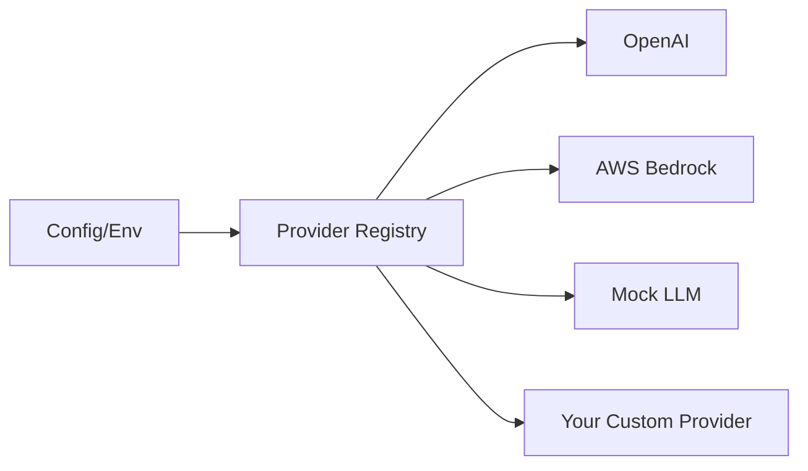

# Extensibility ("The Plug")

> **The Substrate is a foundation, not a cage. Build your specialized domain logic without modifying the core.**

Every industry has unique requirements. A BioTech platform needs protein folding simulations; a FinTech platform needs stock market APIs; a Security platform needs malware sandboxes.

Cognition is designed with a **"Convention-over-Configuration"** pluggability model. It allows you to inject domain logic, custom tools, and specialized workflows through a layered architecture.

## The Philosophy: Pluggable by Design

Cognition provides four primary extension points that allow you to customize an Agent's behavior from simple prompt injection to complex multi-agent orchestration.

### 1. Memory (The Context)
The most lightweight way to extend an agent. By placing an `AGENTS.md` file in the project workspace, the Agent automatically loads it into its system prompt.
- **Mechanism:** `MemoryMiddleware`
- **Use Case:** Project-specific conventions, coding standards, and mission objectives.

### 2. Skills (The Library)
Skills are reusable "Action Templates" that the Agent can discover on-demand. Unlike standard tools, Skills use **Progressive Disclosure**: the agent only sees the metadata (name, description) until it decides to use the skill, keeping the context window clean.
- **Mechanism:** `SkillsMiddleware`
- **Location:** `.cognition/skills/` directory.
- **Use Case:** Reusable workflows like "Deploy to Kubernetes," "Run Security Audit," or "Refactor Component."

### 3. Subagents (The Delegation)
For complex tasks, a single Agent can delegate to specialized subagents. These subagents run in isolated context windows, preventing context bloat and specialized "hallucinations."
- **Mechanism:** `SubAgentMiddleware`
- **Use Case:** A "Senior Developer" agent spawning a "Test Runner" subagent to debug a specific failure.

### 4. Middleware (The Hooks)
The most powerful extension point. Middleware allows you to intercept every step of the agent's lifecycle (before model call, around tool execution, etc.).
- **Mechanism:** `AgentMiddleware` (Python Class)
- **Use Case:** Observability tracking, custom streaming events, rate limiting, and human-in-the-loop approval gates.

---

## Extension Point Comparison

| Extension Point | Primary Mechanism | Complexity | Effort | No-Code? |
| :--- | :--- | :--- | :--- | :--- |
| **Memory** | `AGENTS.md` file | Low | Low | ✅ Yes |
| **Skills** | `SKILL.md` template | Low-Medium | Low | ✅ Yes |
| **Subagents** | YAML Configuration | Medium | Medium | ✅ Yes |
| **Tools** | Python Function | Medium | Medium | ❌ No |
| **Middleware** | Python Class | High | High | ❌ No |

## The Provider Registry

LLM providers themselves are pluggable. Cognition uses a **Provider Registry** that allows you to swap or add new models (local or cloud) without changing a single line of application logic.

## When to use which?

1.  **Need the agent to know about a specific project rule?** Use **Memory**.
2.  **Need the agent to perform a complex, reusable 5-step task?** Use a **Skill**.
3.  **Need to isolate a task with a massive context (like 100 log files)?** Use a **Subagent**.
4.  **Need to add a simple API call (like "get stock price")?** Use a **Tool**.
5.  **Need to add custom observability or security checks?** Use **Middleware**.
