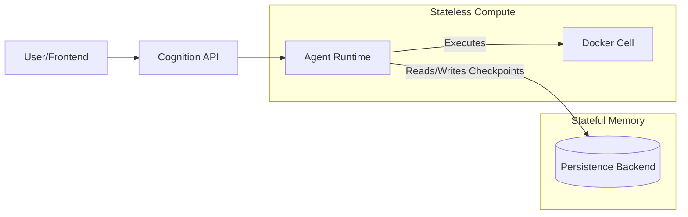

# Session Persistence ("The Thread")

> **Intelligence requires Memory.**

A "Chatbot" has a short memory; if the server restarts, the conversation dies.
A "Platform" requires long-running, resilient workflows that can span days or weeks.

Cognition implements **"The Thread"**—a continuous, stateful execution log that persists independently of the compute layer.

## The Architecture of State

Cognition separates **State** (The Thread) from **Compute** (The Cell).



This separation allows for:
1.  **Resilience:** You can redeploy the Cognition Engine (update the container) in the middle of a 24-hour job. The new container will load the Thread from the DB and resume exactly where the old one left off.
2.  **Scalability:** Since agents are stateless, you can run 10 Cognition nodes behind a load balancer. Any node can handle the next step of any Thread.

## Pluggable Backends

Cognition uses a `PersistenceBackend` interface, allowing you to swap the storage engine based on your deployment scale.

### 1. SQLite Backend (Local / Single-Node)
**Best for:** Dev, Edge, Air-Gapped Single Server.

*   **Config:** `COGNITION_PERSISTENCE_BACKEND=sqlite`
*   **Mechanism:** Stores state in a `.cognition/state.db` file within the Workspace volume.
*   **Benefit:** Zero external dependencies. "Git-style" portability (copy the folder, copy the memory).

### 2. PostgreSQL Backend (Cloud / Scale)
**Best for:** Production Platforms, Kubernetes.

*   **Config:** `COGNITION_PERSISTENCE_BACKEND=postgres`
*   **Mechanism:** Connects to an external Postgres database (e.g., RDS, Supabase).
*   **Benefit:** High concurrency, centralized backup, allows horizontal scaling of the Agent Runtime.

## Checkpointing Explained

Cognition doesn't just save "Chat History." It saves the **Full Stack Frame** of the agent (Checkpoints).

When an Agent stops to wait for user input (or a long-running tool), it saves a Checkpoint. This includes:
*   The conversation history.
*   The current variables in scope.
*   The status of the last tool execution.
*   The "Next Step" the agent was planning.

This enables **"Time Travel"** capabilities for your platform:
*   **Resume:** Continue a task after a crash.
*   **Fork:** Branch a conversation from a previous point to try a different strategy.
*   **Rewind:** "Undo" the last tool action and try again.

## Managing Sessions

The API exposes Threads as **Sessions**.

```typescript
// Create a new Thread (Session)
const session = await api.createSession({
  title: "Investigation #99"
});

// Resume an existing Thread (even after server restart)
const history = await api.getMessages(session.id);
```
